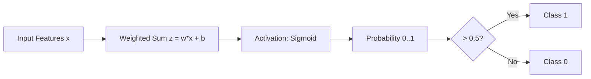

# Logistic Regression (Binary Classification)

## 1. Executive Summary
Despite its name, **Logistic Regression** is a **classification** algorithm, not a regression one. It is used to estimate the probability that an instance belongs to a particular class (e.g., "Spam" or "Not Spam").

If the estimated probability is greater than 50%, the model predicts that the instance belongs to that class (label 1), otherwise it predicts that it does not (label 0). This makes it a binary classifier.

In this module, we implement **Logistic Regression** from scratch to separate two distinct clusters of data.

---

## 2. Historical Context
*   **The Logistic Function:** Introduced by **Pierre François Verhulst** in 1838 to model population growth (limiting growth as resources become scarce), correcting the exponential growth model of Malthus.
*   **The Regression Model:** The statistical model was developed by **David Cox** in 1958. It became the standard method for binary data analysis in fields like medicine (e.g., predicting if a patient has a disease based on symptoms).
*   **Significance:** It introduced the concept of the **Sigmoid** (or Logistic) activation function, which is the grandfather of activation functions in modern Neural Networks.

---

## 3. Real-World Analogy
### The Club Bouncer
Imagine a bouncer at a club entrance. He looks at various features of a person (Age, Dress Code Score).
*   **The Score:** He calculates a weighted score based on these features ($z = \theta^T x$).
*   **The Probability:** He converts this score into a probability of being allowed in using a mental "S-curve" (Sigmoid). A very high score gives 99% probability, a very low score gives 1%.
*   **The Decision:** If the probability is > 50%, he opens the door (Class 1). If < 50%, he blocks entry (Class 0).

---

## 4. Mathematical Foundation

### A. The Sigmoid Activation
We need a function that squashes any output number into a range between 0 and 1 (probability).
$$ \sigma(z) = \frac{1}{1 + e^{-z}} $$

### B. The Model (Hypothesis)
$$ \hat{y} = h_\theta(x) = \sigma(\theta^T x) $$
$$ h_\theta(x) = \frac{1}{1 + e^{-(\theta_0 + \theta_1 x_1 + ...)}} $$

### C. The Cost Function (Log Loss)
We cannot use Mean Squared Error (MSE) here because the Sigmoid function makes the MSE "non-convex" (it has many local valleys). Instead, we use **Log Loss** (Binary Cross-Entropy):
$$ J(\theta) = -\frac{1}{m} \sum_{i=1}^{m} [y^{(i)}\log(h_\theta(x^{(i)})) + (1-y^{(i)})\log(1-h_\theta(x^{(i)}))] $$
*   If $y=1$: We want $h_\theta(x) \approx 1$ (Cost $\to 0$). If $h_\theta(x) \to 0$, Cost $\to \infty$.
*   If $y=0$: We want $h_\theta(x) \approx 0$ (Cost $\to 0$).

### D. Gradient Descent
Surprisingly, the derivative of the Log Loss with respect to the Sigmoid function results in the **exact same update rule** as Linear Regression!
$$ \frac{\partial J}{\partial \theta_j} = \frac{1}{m} \sum_{i=1}^{m} (h_\theta(x^{(i)}) - y^{(i)}) x_j^{(i)} $$

---

## 5. Architecture Diagram

---

## 6. Implementation Results & Visualization

### A. The Decision Boundary
The line separates the two classes (Blue vs Red).

*Figure 1: The decision boundary is the line where the probability is exactly 0.5. Points on one side are classified as 0, and on the other as 1.*

### B. The Sigmoid Function
This is the function responsible for the "S" shape probability curve.

*Figure 2: The Sigmoid function maps any real number to the (0, 1) interval.*

### C. Convergence

*Figure 3: The Log Loss decreases over time as the model learns to separate the classes.*

### D. Framework Comparison

| Implementation | Final Loss | Accuracy | Visualization |
| :--- | :--- | :--- | :--- |
| **Scratch** | ~0.10 | 100% | [View](assets/decision_boundary.png) |
| **TensorFlow** | ~0.10 | 100% |  |
| **PyTorch** | ~0.10 | 100% |  |

---

## 7. References
*   Cox, D. R. (1958). *The regression analysis of binary sequences*.
*   Verhulst, P. F. (1838). *Notice sur la loi que la population suit dans son accroissement*.
