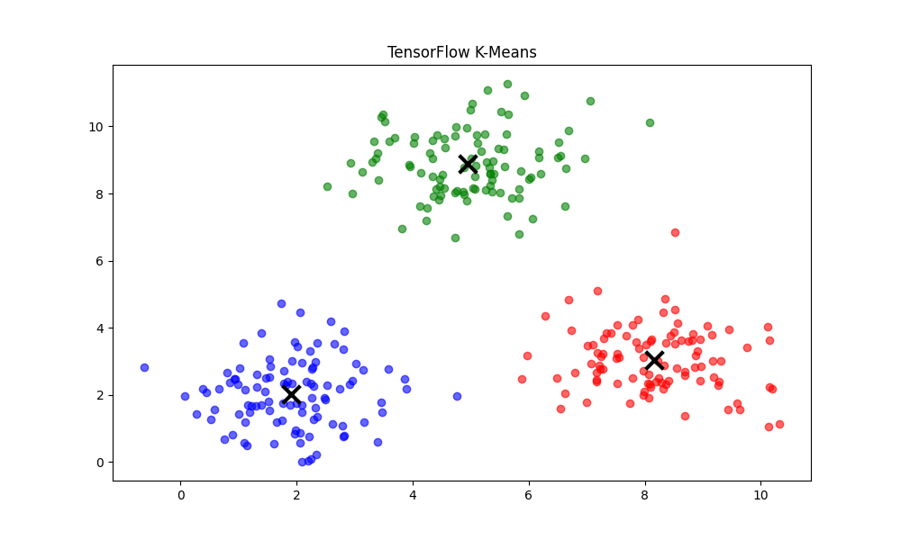
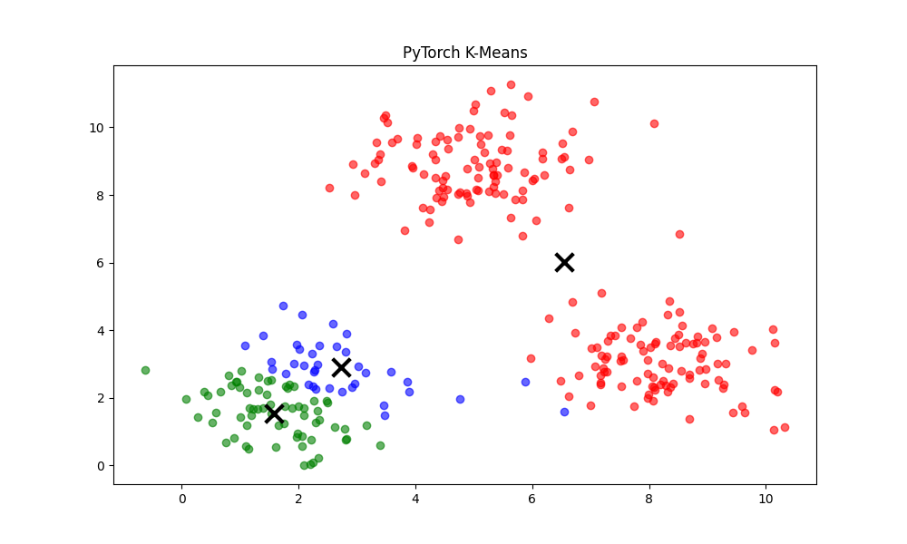

# K-Means Clustering

## 1. Executive Summary
**K-Means** is the most popular **Unsupervised Learning** algorithm. Unlike Supervised Learning (Regression/Classification), there are no labels ($y$). The algorithm must find structure in the data on its own.

The goal is to partition $m$ data points into $K$ distinct clusters, where each point belongs to the cluster with the nearest mean (centroid).

---

## 2. Historical Context
*   **The Inventors:** The algorithm has a rich history with multiple independent discoveries.
    *   **Hugo Steinhaus (1956):** Polish mathematician who proposed the principle.
    *   **Stuart Lloyd (1957):** Proposed the standard iterative algorithm at Bell Labs for pulse-code modulation (signal processing). It was published much later in 1982.
    *   **J.B. MacQueen (1967):** Coined the term "K-Means".
*   **Significance:** It is the foundation of vector quantization and is used everywhere from image compression to customer segmentation.

---

## 3. Real-World Analogy
### The Wedding Seating Plan
Imagine you are organizing a wedding reception. You have 100 guests (data points) and 10 tables (clusters). You want to seat people so that everyone is sitting close to their friends.

1.  **Initialization:** You randomly place "Table Captains" (Centroids) in the room.
2.  **Assignment:** You ask every guest to walk to the nearest Captain.
3.  **Update:** Once everyone is gathered around a Captain, you move the table to the exact center of that group.
4.  **Repeat:** You ask guests to check if another table is now closer. If so, they move. You repeat this until nobody moves anymore.

---

## 4. Mathematical Foundation

### A. The Objective (Inertia)
We want to minimize the **Within-Cluster Sum of Squares (WCSS)**, also known as Inertia.
$$ J = \sum_{i=1}^{m} \sum_{k=1}^{K} w_{ik} || x^{(i)} - \mu_k ||^2 $$
*   $x^{(i)}$: Data point.
*   $\mu_k$: Centroid of cluster $k$.
*   $w_{ik}$: 1 if point $i$ belongs to cluster $k$, else 0.

### B. The Algorithm (Expectation-Maximization)
1.  **Initialize:** Choose $K$ random points as centroids $\mu_1, ..., \mu_K$.
2.  **Expectation (E-Step):** Assign each point to the closest centroid.
    $$ c^{(i)} := \text{argmin}_k || x^{(i)} - \mu_k ||^2 $$
3.  **Maximization (M-Step):** Move each centroid to the mean of its assigned points.
    $$ \mu_k := \frac{1}{|C_k|} \sum_{x \in C_k} x $$
4.  **Converge:** Repeat until centroids stop moving.

---

## 5. Architecture Diagram

```mermaid
graph TD
    A[Start: Random Centroids] --> B[Assign Points to Nearest Centroid]
    B --> C[Calculate New Centroids (Mean)]
    C --> D{Centroids Changed?}
    D -- Yes --> B
    D -- No --> E[Stop: Convergence]
```

---

## 6. Implementation Results & Visualization

### A. The Clusters
The algorithm successfully separates the data into distinct groups.


*Figure 1: The colored points represent the clusters found by the algorithm. The large 'X' markers are the final centroids.*

### B. Framework Comparison

| Implementation | Approach | Visualization |
| :--- | :--- | :--- |
| **Scratch** | NumPy Loop | [View](assets/kmeans_clusters.png) |
| **TensorFlow** | Custom Loop with `tf.math` |  |
| **PyTorch** | Custom Loop with `torch.cdist` |  |

---

## 7. References
*   Lloyd, S. (1982). *Least squares quantization in PCM*.
*   Steinhaus, H. (1956). *Sur la division des corps matériels en parties*.
