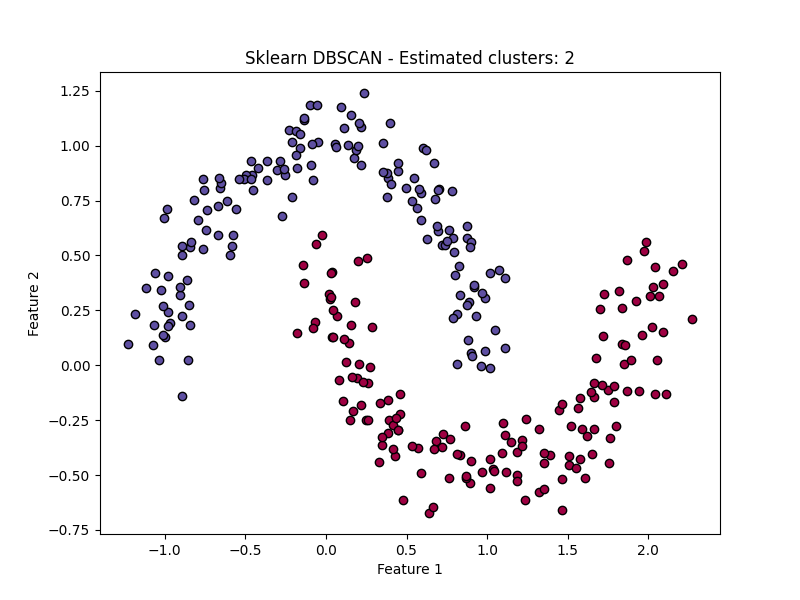

# DBSCAN (Density-Based Spatial Clustering of Applications with Noise)

## 1. Executive Summary
DBSCAN is a clustering algorithm that groups together points that are closely packed together (points with many nearby neighbors), marking as outliers points that lie alone in low-density regions. Unlike K-Means, it does not require specifying the number of clusters $k$ beforehand, and it can find clusters of arbitrary shapes (e.g., crescents, rings).

## 2. Historical Context
DBSCAN was proposed by **Martin Ester, Hans-Peter Kriegel, Jörg Sander, and Xiaowei Xu** in **1996**. It received the "Test of Time Award" at KDD 2014, acknowledging its lasting impact on the data mining community. It was designed to solve the limitations of partitioning methods (like K-Means) which assume spherical clusters.

## 3. Real-World Analogy
Think of **Islands in an Ocean**.
*   **Core Points**: People standing on solid ground (high density of land).
*   **Border Points**: People standing on the beach (close to the solid ground, but near the water).
*   **Noise**: A person swimming alone in the middle of the ocean (far from any island).
*   DBSCAN walks from person to person. If you can reach someone by taking a small step (distance `eps`), you are on the same island. If you can't reach anyone, you are swimming alone (Noise).

## 4. Key Concepts

1.  **Epsilon ($\epsilon$)**: The maximum distance between two samples for one to be considered as in the neighborhood of the other.
2.  **MinPts (min_samples)**: The number of samples (or total weight) in a neighborhood for a point to be considered as a core point.
3.  **Core Point**: A point that has at least `MinPts` neighbors within radius $\epsilon$.
4.  **Border Point**: A point that is within $\epsilon$ of a core point but has fewer than `MinPts` neighbors.
5.  **Noise Point**: A point that is neither a core point nor a border point.

## 5. Algorithm Steps

1.  Pick an arbitrary point $p$ that has not been visited.
2.  Retrieve its $\epsilon$-neighborhood.
3.  If $|Neighborhood| < MinPts$, mark $p$ as **Noise** (can be changed later).
4.  If $|Neighborhood| \ge MinPts$, create a new cluster $C$ and assign $p$ to it. Then, expand the cluster:
    *   Check every point $q$ in the neighborhood.
    *   If $q$ is unvisited, mark it as visited. If $q$ is also a core point, add its neighbors to the queue.
    *   If $q$ is not yet member of any cluster, add it to cluster $C$.

## 6. Implementation Details

1.  **`00_scratch.py`**:
    *   Implements `DBSCANScratchRefined` class.
    *   Uses a simple nested loop and list expansion to find connected components.
    *   Calculates Euclidean distance matrix (implicitly via loop).
2.  **`01_sklearn.py`**: Reference implementation using `sklearn.cluster.DBSCAN`.

## 7. Results

### Scratch Implementation


*The algorithm successfully identifies the two crescent shapes (moons) as separate clusters and marks outliers in black.*

### Sklearn Implementation


## 8. How to Run

```bash
python 00_scratch.py
python 01_sklearn.py
```
