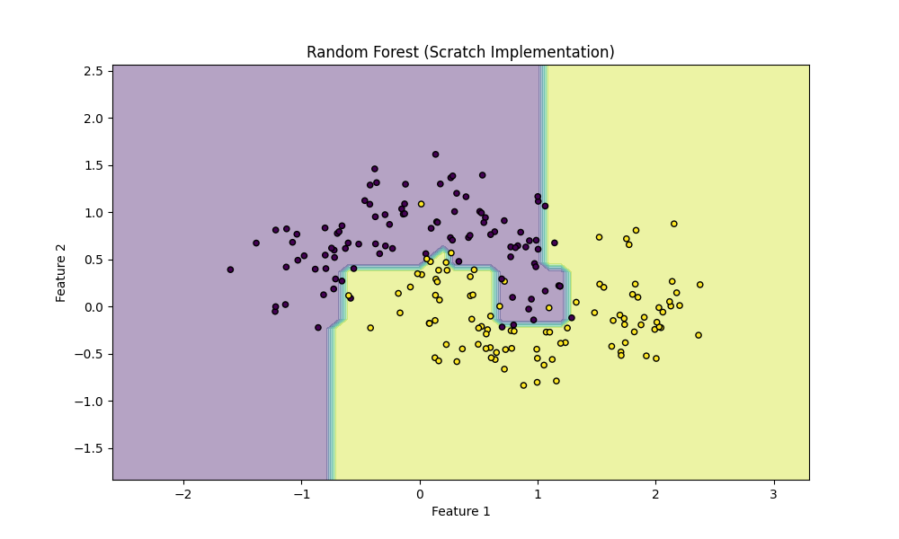

# Random Forest

## 1. Teoria (Theory)

**Random Forest (Las Losowy)** to metoda zespołowa (ensemble method), która buduje wiele drzew decyzyjnych i łączy ich wyniki, aby uzyskać bardziej stabilną i dokładną predykcję.

### Kluczowe koncepcje:

1.  **Bagging (Bootstrap Aggregating)**:
    *   Dla każdego drzewa tworzymy nowy zbiór treningowy, losując próbki z oryginalnego zbioru **ze zwracaniem** (bootstrap sample).
    *   Dzięki temu każde drzewo widzi nieco inne dane, co zmniejsza wariancję modelu (overfitting).

2.  **Losowość Cech (Feature Randomness)**:
    *   Podczas budowania każdego drzewa, przy każdym podziale węzła, bierzemy pod uwagę tylko **losowy podzbiór cech** (a nie wszystkie).
    *   To wymusza różnorodność drzew (dekorrelacja).

3.  **Głosowanie (Voting)**:
    *   **Klasyfikacja**: Każde drzewo oddaje głos na klasę. Wygrywa klasa z największą liczbą głosów (Majority Voting).
    *   **Regresja**: Wynikiem jest średnia z predykcji wszystkich drzew.

### Matematyka

Niech $T_1, T_2, ..., T_B$ będą drzewami decyzyjnymi.
Dla nowego punktu $x$:

$$ \hat{y} = \text{mode} \{ T_1(x), T_2(x), ..., T_B(x) \} $$

Gdzie $B$ to liczba drzew (n_estimators).

## 2. Implementacja (Implementation)

1.  **`00_scratch.py`**: Implementacja Lasu Losowego od podstaw. Zawiera uproszczoną klasę `DecisionTree` oraz klasę `RandomForest`, która implementuje bootstrapping i agregację wyników.
2.  **`01_sklearn.py`**: Implementacja referencyjna używająca `RandomForestClassifier` z `scikit-learn`.

### Wyniki

#### Scratch Implementation (Random Forest Boundary)


#### Sklearn Implementation (Random Forest Boundary)


## 3. Uruchomienie

```bash
python 00_scratch.py
python 01_sklearn.py
```
