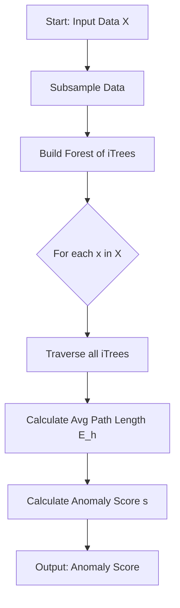
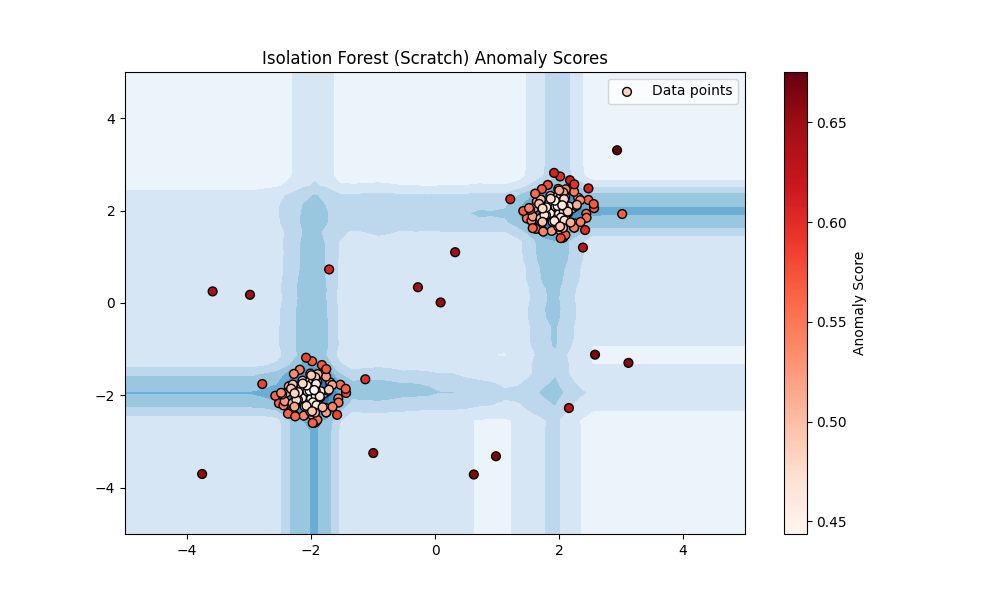

# Isolation Forest for Anomaly Detection

## 1. Executive Summary
**Isolation Forest** is an unsupervised learning algorithm designed specifically for anomaly detection. Unlike traditional methods that model the "normal" data distribution (like Gaussian Mixture Models) and identify outliers as deviations, Isolation Forest explicitly attempts to **isolate** anomalies.

The core premise is that anomalies are "few and different." This makes them easier to isolate (require fewer random splits) than normal points, which are "many and similar" (clustered together).

In this module, we implement **Isolation Forest** from scratch to understand the mechanics of random partitioning and path length calculations.

---

## 2. Historical Context
*   **The Inventors:** Proposed by **Fei Tony Liu, Kai Ming Ting, and Zhi-Hua Zhou** in 2008 (ICDM).
*   **The Shift:** Prior algorithms relied on distance or density measures (e.g., KNN, LOF), which often scaled poorly ($O(n^2)$). Isolation Forest introduced a purely tree-based approach with linear time complexity ($O(n)$), making it highly effective for high-dimensional and large datasets.

---

## 3. Real-World Analogy
### The "Random Slicing" Analogy
Imagine a large sheet of paper with a cluster of dots in the center (normal data) and a few dots scattered far away at the edges (anomalies).

*   **The Strategy:** You randomly draw straight lines across the paper to separate the dots.
*   **Anomalies:** It is very easy to separate a lone dot at the edge. You might only need one or two random lines to isolate it from everything else.
*   **Normal Points:** It is very hard to isolate a specific dot inside the dense cluster. You would need to draw many lines to separate it from its neighbors.

In this algorithm, the "number of lines" corresponds to the path length in the tree.
*   **Short Path** = Easy to isolate = **Anomaly**.
*   **Long Path** = Hard to isolate = **Normal**.

---

## 4. Mathematical Foundation

### A. Isolation Tree (iTree)
An iTree is a binary tree built by recursively:
1.  Randomly selecting a feature.
2.  Randomly selecting a split value between the max and min of that feature.
3.  Stopping when the tree reaches a height limit or a node has only one instance.

### B. Anomaly Score
The score $s(x, n)$ for an instance $x$ is defined as:
$$ s(x, n) = 2^{-\frac{E(h(x))}{c(n)}} $$

Where:
*   $h(x)$: Path length of point $x$ (number of edges from root to leaf).
*   $E(h(x))$: Average path length across a forest of trees.
*   $c(n)$: Average path length of an unsuccessful search in a Binary Search Tree (BST) with $n$ nodes (used for normalization).

**Interpretation:**
*   $s \to 1$: High probability of being an anomaly (Short path).
*   $s \to 0$: Normal observation (Long path).
*   $s \approx 0.5$: No distinct anomaly.

---

## 5. Architecture Diagram



---

## 6. Implementation Details
*   **Scratch (`00_scratch.py`)**:
    *   `IsolationTree` class: Handles the recursive building of trees and path length calculation.
    *   `IsolationForestScratch` class: Manages the ensemble of trees, subsampling, and score aggregation.
    *   Uses harmonic number estimation for the normalization factor $c(n)$.
*   **Sklearn (`01_sklearn.py`)**:
    *   Uses `sklearn.ensemble.IsolationForest`.
    *   Demonstrates the standard production-ready implementation.

---

## 7. How to Run
Run the following commands in your terminal to execute the scripts:

```bash
# Run the scratch implementation
python 00_scratch.py

# Run the Scikit-Learn implementation
python 01_sklearn.py
```

---

## 8. Implementation Results & Visualization

### A. Scratch vs. Sklearn Comparison
We implemented the algorithm from scratch and compared it with the Scikit-Learn version.

| Implementation | Library | Visualization |
| :--- | :--- | :--- |
| **Scratch** | NumPy |  |
| **Sklearn** | Scikit-Learn |  |

### B. Analysis
*   **Scratch Implementation:** The heatmap shows the anomaly score. Darker red points indicate high anomaly scores (outliers), while the blue regions represent the "normal" clusters. The decision boundary effectively wraps around the two central clusters.
*   **Sklearn Implementation:** The decision function produces a similar contour. The red points (outliers) are correctly identified outside the central white/green clusters.

---

## 9. References
*   Liu, F. T., Ting, K. M., & Zhou, Z. H. (2008). *Isolation Forest*. In Proceedings of the 2008 Eighth IEEE International Conference on Data Mining (pp. 413-422). IEEE.
*   Scikit-Learn Documentation: [Isolation Forest](https://scikit-learn.org/stable/modules/generated/sklearn.ensemble.IsolationForest.html)
