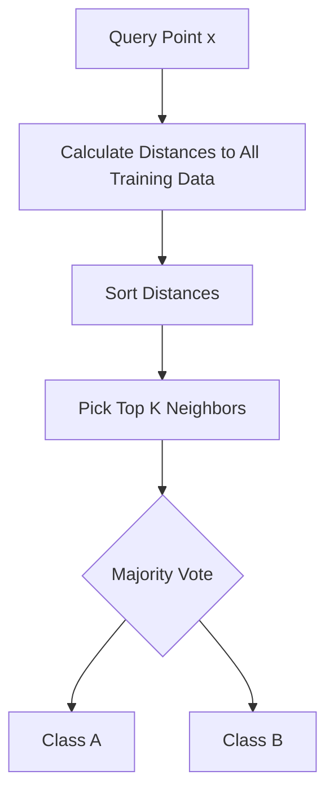
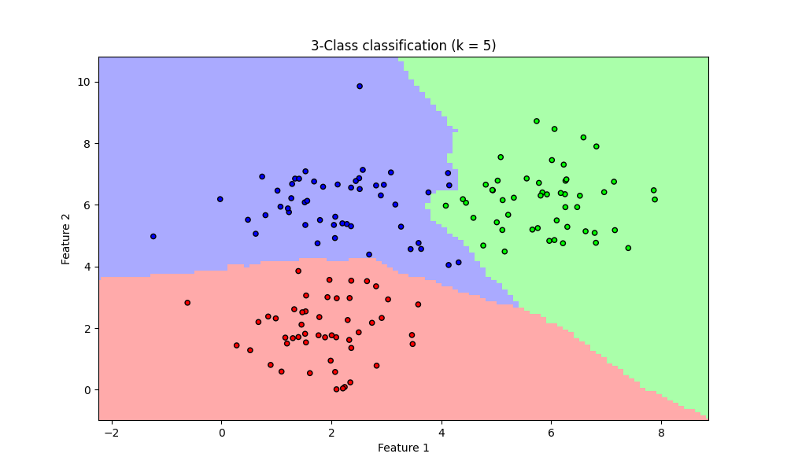
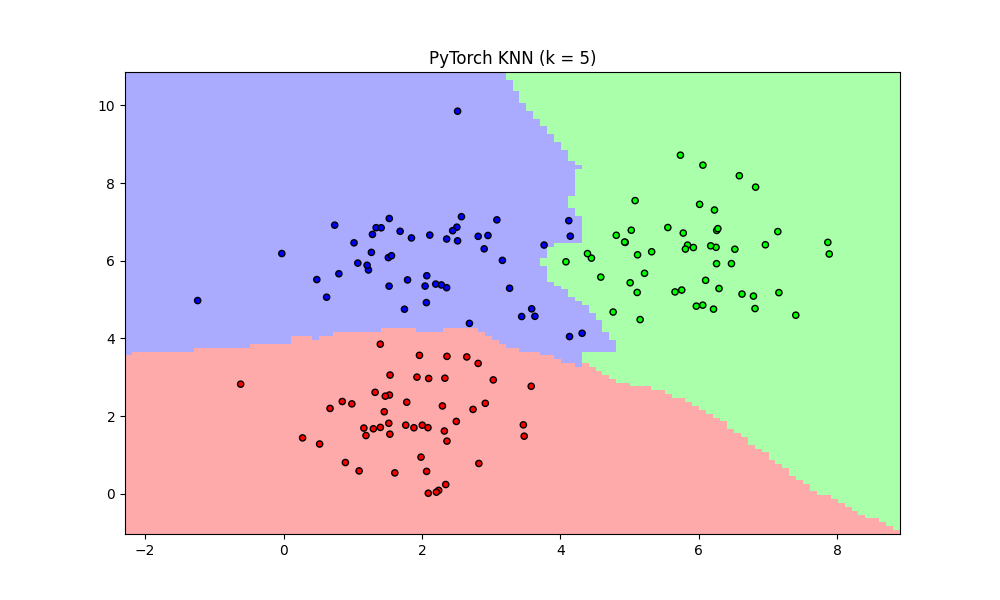

# K-Nearest Neighbors (KNN)

## 1. Executive Summary
**K-Nearest Neighbors (KNN)** is a simple, non-parametric, **lazy learning** algorithm.
*   **Non-parametric:** It makes no assumptions about the underlying data distribution (unlike Linear Regression which assumes linearity).
*   **Lazy Learning:** It does not "learn" a model during a training phase. Instead, it memorizes the entire training dataset. Predictions are made only when a query is asked, by searching through the memory.

It is used for both Classification (voting) and Regression (averaging). Here, we focus on **Classification**.

---

## 2. Historical Context
*   **The Inventors:** Developed by **Evelyn Fix** and **Joseph Hodges** in 1951 while working for the US Air Force School of Aviation Medicine.
*   **The Context:** They were trying to distinguish between different types of aircraft based on radar signals.
*   **Significance:** It was one of the first pattern recognition algorithms. Despite its age and simplicity, it remains a powerful baseline, especially for irregular decision boundaries.

---

## 3. Real-World Analogy
### "Tell me who your friends are..."
...and I will tell you who you are.

Imagine you move to a new neighborhood. You want to know if it's a "Party Neighborhood" or a "Quiet Neighborhood".
1.  You knock on the doors of the **K** nearest houses (e.g., K=5).
2.  3 neighbors say they love partying.
3.  2 neighbors say they prefer quiet.
4.  **Conclusion:** You classify your location as a "Party Neighborhood" (Majority Vote).

---

## 4. Mathematical Foundation

### A. Distance Metric (Euclidean)
To find the "nearest" neighbors, we need to measure distance. The most common metric is **Euclidean Distance** (straight line):
$$ d(p, q) = \sqrt{\sum_{i=1}^{n} (q_i - p_i)^2} $$
*   $p, q$: Two data points.
*   $n$: Number of features (dimensions).

### B. The Algorithm
1.  **Calculate** the distance between the query point $x$ and *every* point in the training set.
2.  **Sort** the distances in ascending order.
3.  **Select** the top $K$ points.
4.  **Vote:** Return the most frequent class among these $K$ points.

---

## 5. Architecture Diagram

---

## 6. Implementation Results & Visualization

### A. The Decision Boundary
KNN creates highly flexible, non-linear decision boundaries.

*Figure 1: The background color represents the decision region. Notice how the boundary curves around the data clusters. K determines the smoothness: low K = jagged boundary (overfitting), high K = smooth boundary (underfitting).*

### B. Framework Comparison
Since KNN is instance-based, "training" is instant (0 seconds). The cost is in "prediction".

| Implementation | Approach | Visualization |
| :--- | :--- | :--- |
| **Scratch** | NumPy Broadcasting & Sorting | [View](assets/knn_boundary.png) |
| **TensorFlow** | `tf.norm` & `tf.math.top_k` |  |
| **PyTorch** | `torch.cdist` & `torch.topk` |  |

---

## 7. References
*   Fix, E., & Hodges, J. L. (1951). *Discriminatory Analysis. Nonparametric Discrimination: Consistency Properties*.
