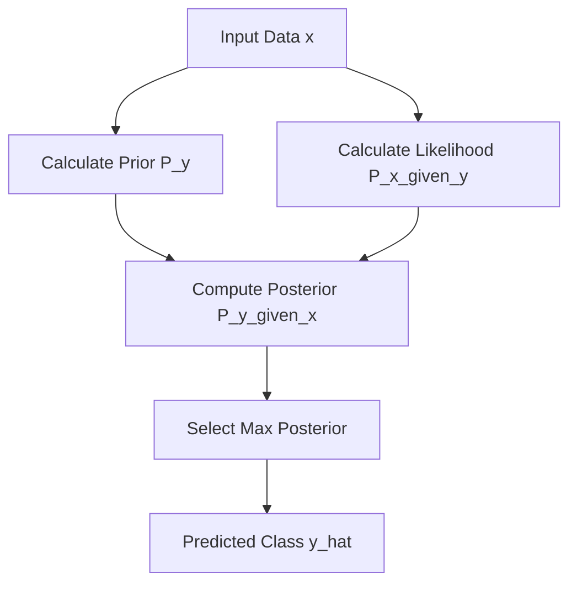

# Naive Bayes Classifier

## 1. Executive Summary
**Naive Bayes** is a family of probabilistic algorithms based on **Bayes' Theorem**. It is called "Naive" because it makes a strong assumption: that all features are **independent** of each other given the class label.

Despite this often unrealistic assumption, it performs surprisingly well, especially for text classification (spam filtering) and medical diagnosis. It is fast, scalable, and requires little training data.

---

## 2. Historical Context
*   **The Theorem:** The mathematical foundation comes from **Thomas Bayes** (1701–1761), an English statistician and minister. His theorem describes the probability of an event based on prior knowledge of conditions that might be related to the event.
*   **The Application:** The application of Naive Bayes to text classification (specifically for information retrieval) was pioneered by **M.E. Maron** in **1961**. It became the standard for spam filtering in the 1990s.

---

## 3. Real-World Analogy
### Medical Diagnosis
Think of a doctor diagnosing a patient.
*   **Symptoms (Features)**: Fever, Cough, Headache.
*   **Disease (Class)**: Flu.
*   **Prior Knowledge**: You know that 10% of people have the Flu in winter ($P(Flu)$).
*   **Likelihood**: You know that *if* someone has the Flu, there is an 80% chance they have a Fever ($P(Fever|Flu)$).
*   **Naive Assumption**: We assume that having a Fever is independent of having a Cough (which isn't strictly true biologically, but simplifies the math).
*   **Prediction**: We combine the Prior and the Likelihoods of all symptoms to calculate the probability of the Flu.

---

## 4. Mathematical Foundation

### A. Bayes' Theorem
$$ P(y|x) = \frac{P(x|y)P(y)}{P(x)} $$
*   $P(y|x)$: **Posterior** (Probability of class $y$ given features $x$).
*   $P(x|y)$: **Likelihood** (Probability of features $x$ given class $y$).
*   $P(y)$: **Prior** (Probability of class $y$).
*   $P(x)$: **Evidence** (Probability of features $x$).

Since $P(x)$ is constant for all classes, we maximize the numerator:
$$ \hat{y} = \operatorname*{argmax}_y P(y) \prod_{i=1}^{n} P(x_i|y) $$

### B. Gaussian Naive Bayes
For continuous data, we assume the likelihood $P(x_i|y)$ follows a Gaussian (Normal) distribution:
$$ P(x_i|y) = \frac{1}{\sqrt{2\pi\sigma_y^2}} \exp\left(-\frac{(x_i - \mu_y)^2}{2\sigma_y^2}\right) $$
Where $\mu_y$ is the mean and $\sigma_y^2$ is the variance of feature $i$ for class $y$.

### C. Log-Probabilities
To avoid numerical underflow (multiplying many small probabilities results in 0), we work in log-space:
$$ \log(P(y|x)) \propto \log(P(y)) + \sum_{i=1}^{n} \log(P(x_i|y)) $$

---

## 5. Architecture Diagram



---

## 6. Implementation Details
*   **Scratch (`00_scratch.py`)**:
    *   `GaussianNaiveBayesScratch` class.
    *   **Fit**: Calculates mean and variance for each feature per class.
    *   **Predict**: Uses the Gaussian PDF formula to calculate likelihoods and selects the class with the highest posterior.
    *   Uses log-probabilities for numerical stability.
*   **Sklearn (`01_sklearn.py`)**:
    *   Uses `sklearn.naive_bayes.GaussianNB`.
    *   Standard implementation for comparison.

---

## 7. How to Run
Run the following commands in your terminal to execute the scripts:

```bash
# Run the scratch implementation
python 00_scratch.py

# Run the Scikit-Learn implementation
python 01_sklearn.py
```

---

## 8. Implementation Results & Visualization

### A. Decision Boundary
The decision boundary of Gaussian Naive Bayes is typically quadratic (curved), as it depends on the variances of the classes.

| Implementation | Accuracy | Visualization |
| :--- | :--- | :--- |
| **Scratch** | ~0.97 |  |
| **Sklearn** | ~0.97 |  |

### B. Analysis
Both implementations achieve similar accuracy and produce nearly identical decision boundaries, validating the correctness of the scratch implementation. The slight differences might be due to floating-point precision or internal optimizations in Scikit-Learn.

---

## 9. References
*   Maron, M. E. (1961). *Automatic Indexing: An Experimental Inquiry*. Journal of the ACM (JACM).
*   Scikit-Learn Documentation: [Gaussian Naive Bayes](https://scikit-learn.org/stable/modules/naive_bayes.html#gaussian-naive-bayes)
