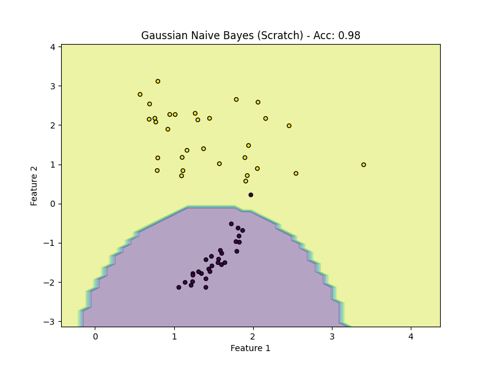

# Naive Bayes Classifier

## 1. Executive Summary
Naive Bayes is a family of probabilistic algorithms based on **Bayes' Theorem**. It is called "Naive" because it makes a strong assumption: that all features are **independent** of each other given the class label. Despite this often unrealistic assumption, it performs surprisingly well, especially for text classification (spam filtering) and medical diagnosis.

## 2. Historical Context
The mathematical foundation comes from **Thomas Bayes** (1701–1761), an English statistician and minister. His theorem describes the probability of an event based on prior knowledge of conditions that might be related to the event.
However, the application of Naive Bayes to text classification (specifically for information retrieval) was pioneered by **M.E. Maron** in **1961**. It became the standard for spam filtering in the 1990s.

## 3. Real-World Analogy
Think of a **Medical Diagnosis**.
*   **Symptoms (Features)**: Fever, Cough, Headache.
*   **Disease (Class)**: Flu.
*   **Prior Knowledge**: You know that 10% of people have the Flu in winter ($P(Flu)$).
*   **Likelihood**: You know that *if* someone has the Flu, there is an 80% chance they have a Fever ($P(Fever|Flu)$).
*   **Naive Assumption**: We assume that having a Fever is independent of having a Cough (which isn't strictly true biologically, but simplifies the math).
*   **Prediction**: We combine the Prior and the Likelihoods of all symptoms to calculate the probability of the Flu.

## 4. Key Concepts

1.  **Prior Probability $P(y)$**: How common is the class in the general population?
2.  **Likelihood $P(x|y)$**: If the class is $y$, how likely is it to see feature $x$?
3.  **Posterior Probability $P(y|x)$**: Given the features $x$, how likely is the class $y$?
4.  **Evidence $P(x)$**: The probability of seeing the features (constant for all classes, so we ignore it during comparison).

## 5. Mathematics

### Bayes' Theorem
$$ P(y|x) = \frac{P(x|y)P(y)}{P(x)} $$

Since $P(x)$ is the same for all classes, we maximize the numerator:
$$ \hat{y} = \operatorname*{argmax}_y P(y) \prod_{i=1}^{n} P(x_i|y) $$

### Gaussian Naive Bayes
For continuous data, we assume the likelihood $P(x_i|y)$ follows a Gaussian (Normal) distribution:

$$ P(x_i|y) = \frac{1}{\sqrt{2\pi\sigma_y^2}} \exp\left(-\frac{(x_i - \mu_y)^2}{2\sigma_y^2}\right) $$

Where $\mu_y$ is the mean and $\sigma_y^2$ is the variance of feature $i$ for class $y$.

### Log-Probabilities
To avoid numerical underflow (multiplying many small probabilities results in 0), we work in log-space:
$$ \log(P(y|x)) \propto \log(P(y)) + \sum_{i=1}^{n} \log(P(x_i|y)) $$

## 6. Implementation Details

1.  **`00_scratch.py`**: Implementation of Gaussian Naive Bayes from scratch.
    *   **Fit**: Calculates mean and variance for each feature per class.
    *   **Predict**: Uses the Gaussian PDF formula to calculate likelihoods and selects the class with the highest posterior.
2.  **`01_sklearn.py`**: Reference implementation using `sklearn.naive_bayes.GaussianNB`.

## 7. Results

### Scratch Implementation


### Sklearn Implementation


## 8. How to Run

```bash
python 00_scratch.py
python 01_sklearn.py
```
