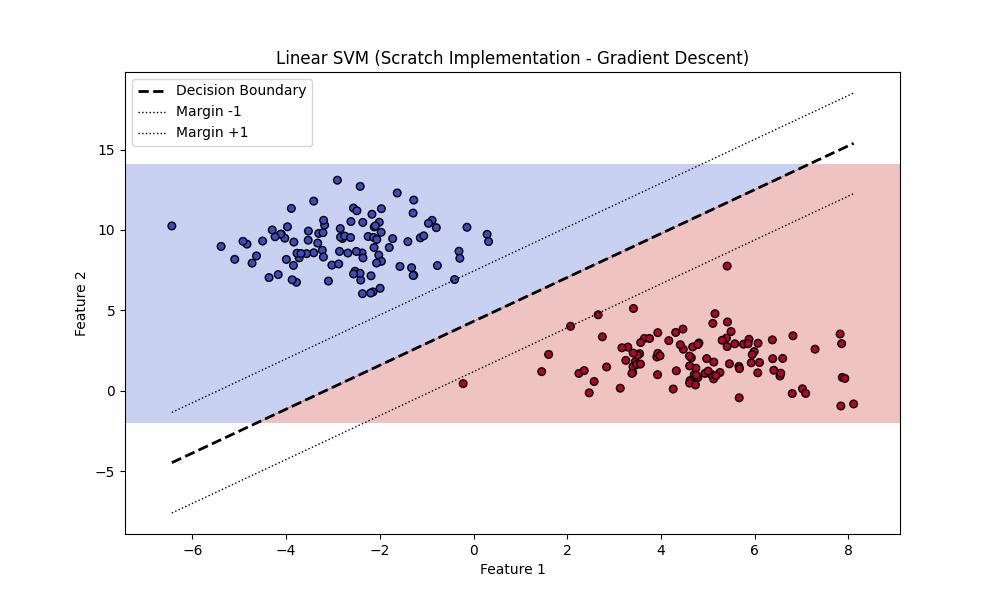
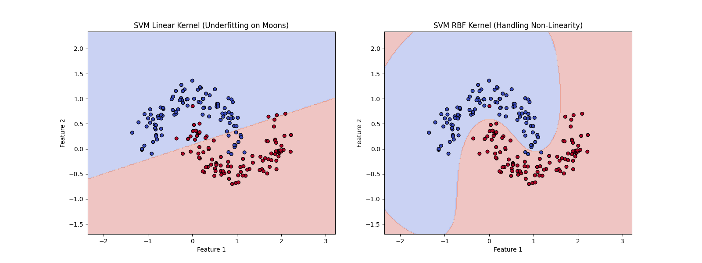

# Support Vector Machines (SVM)

## 1. Executive Summary
**Support Vector Machine (SVM)** is a powerful supervised learning algorithm used for classification and regression. Unlike other classifiers that might just find *any* boundary separating classes, SVM finds the **optimal** hyperplane that maximizes the **margin** (distance) between the nearest data points of different classes.

This "wide margin" approach makes SVM robust and effective, especially in high-dimensional spaces.

---

## 2. Historical Context
*   **The Origins:** The foundations were laid by **Vladimir Vapnik** and **Alexey Chervonenkis** in 1963 with the "Generalized Portrait" algorithm.
*   **The Breakthrough:** The modern version, which introduced the **Kernel Trick** to handle non-linear data, was developed by Vapnik, Boser, and Guyon at AT&T Bell Labs in **1992**.
*   **Significance:** For a long time, SVM was considered the state-of-the-art algorithm for many tasks (like handwriting recognition) before the Deep Learning resurgence in 2012.

---

## 3. Real-World Analogy
### The Widest Road
Imagine a road separating two groups of houses (Class A and Class B).
*   You could draw many lines (roads) to separate them.
*   However, the safest road is the widest one—the one that keeps the maximum distance from the houses on both sides.
*   **SVM** tries to build this "widest possible road" (maximum margin).
*   The houses closest to the road are the **Support Vectors**—if you move other houses, the road doesn't change, but if you move these specific houses, the road's position shifts.

---

## 4. Mathematical Foundation

### A. Key Concepts
1.  **Hyperplane**: The decision boundary. In 2D, it's a line; in 3D, a plane. Equation: $w \cdot x - b = 0$.
2.  **Margin**: The distance between the hyperplane and the nearest data points. SVM maximizes this.
3.  **Support Vectors**: The data points closest to the hyperplane. They define the margin.
4.  **Kernel Trick**: A method to map data into a higher-dimensional space where it becomes linearly separable (e.g., using RBF kernel).

### B. The Cost Function (Hinge Loss)
We want to minimize the norm of the weight vector $||w||$ (maximizing margin) while penalizing misclassifications.

$$ J(w, b) = \frac{1}{2} ||w||^2 + C \sum_{i=1}^{n} \max(0, 1 - y_i(w \cdot x_i - b)) $$

Where:
*   $y_i \in \{-1, 1\}$ are class labels.
*   $C$ is the regularization parameter (balance between margin width and classification errors).

### C. Gradient Descent Update Rule
For each example $i$:
*   If $y_i(w \cdot x_i - b) \ge 1$ (correctly classified with margin):
    $$ w = w - \alpha (2\lambda w) $$
*   If $y_i(w \cdot x_i - b) < 1$ (error or inside margin):
    $$ w = w - \alpha (2\lambda w - y_i x_i) $$
    $$ b = b - \alpha (y_i) $$

*(Note: In the scratch implementation, we use $\lambda = 1/C$)*

---

## 5. Architecture Diagram

```mermaid
graph TD
    A[Input Data X] --> B[Initialize Weights w, b]
    B --> C{For each epoch}
    C --> D{For each sample x_i}
    D --> E[Check Condition: y_i * (w.x_i - b) >= 1]
    E -- Yes --> F[Update w (Regularization only)]
    E -- No --> G[Update w, b (Regularization + Loss)]
    F --> D
    G --> D
    D --> H[Converged?]
    H -- No --> C
    H -- Yes --> I[Final Model w, b]
```

---

## 6. Implementation Details
*   **Scratch (`00_scratch.py`)**:
    *   Implements Linear SVM using Gradient Descent.
    *   Minimizes Hinge Loss.
    *   Visualizes the decision boundary, hyperplane, and margins.
*   **Sklearn (`01_sklearn.py`)**:
    *   Uses `sklearn.svm.SVC`.
    *   Compares **Linear Kernel** (underfits non-linear data) vs. **RBF Kernel** (handles non-linear data).

---

## 7. How to Run
Run the following commands in your terminal to execute the scripts:

```bash
# Run the scratch implementation
python 00_scratch.py

# Run the Scikit-Learn implementation
python 01_sklearn.py
```

---

## 8. Implementation Results & Visualization

### A. Linear SVM (Scratch)
The scratch implementation successfully finds the optimal hyperplane separating two blobs of data.



### B. Linear vs. Non-Linear SVM (Sklearn)
This comparison demonstrates the power of the Kernel Trick. The Linear Kernel fails to separate the "Moons" dataset, while the RBF Kernel adapts perfectly.



| Kernel | Dataset | Result |
| :--- | :--- | :--- |
| **Linear** | Moons (Non-linear) | Underfitting (Straight line) |
| **RBF** | Moons (Non-linear) | Good Fit (Curved boundary) |

---

## 9. References
*   Cortes, C., & Vapnik, V. (1995). *Support-vector networks*. Machine learning, 20(3), 273-297.
*   Scikit-Learn Documentation: [Support Vector Machines](https://scikit-learn.org/stable/modules/svm.html)
