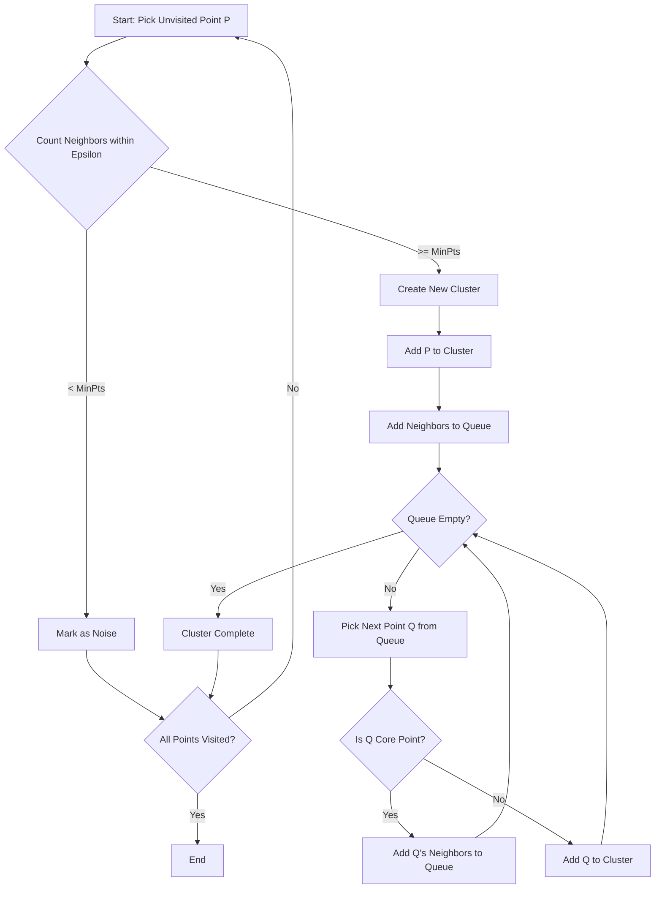

# DBSCAN (Density-Based Spatial Clustering of Applications with Noise)

## 1. Executive Summary
**DBSCAN** is a density-based clustering algorithm. Unlike K-Means, which assumes spherical clusters and requires specifying the number of clusters ($k$) beforehand, DBSCAN groups together points that are closely packed together (high density) and marks points in low-density regions as outliers (noise).

It is particularly powerful for discovering clusters of arbitrary shapes (e.g., crescents, rings) and handling noise.

---

## 2. Historical Context
*   **The Inventors:** Proposed by **Martin Ester, Hans-Peter Kriegel, Jörg Sander, and Xiaowei Xu** in **1996**.
*   **Significance:** It received the "Test of Time Award" at KDD 2014, acknowledging its lasting impact on the data mining community. It was designed to solve the limitations of partitioning methods (like K-Means) and hierarchical methods.

---

## 3. Real-World Analogy
### Islands in an Ocean
Think of an archipelago.
*   **Core Points**: People standing on solid ground (high density of land).
*   **Border Points**: People standing on the beach (close to the solid ground, but near the water).
*   **Noise**: A person swimming alone in the middle of the ocean (far from any island).
*   **The Process**: DBSCAN walks from person to person. If you can reach someone by taking a small step (distance $\epsilon$), you are on the same island. If you can't reach anyone, you are swimming alone (Noise).

---

## 4. Mathematical Foundation

### A. Key Concepts
1.  **Epsilon ($\epsilon$)**: The maximum distance between two samples for one to be considered as in the neighborhood of the other.
2.  **MinPts (min_samples)**: The minimum number of samples in a neighborhood for a point to be considered as a core point.
3.  **Core Point**: A point that has at least `MinPts` neighbors within radius $\epsilon$.
4.  **Border Point**: A point that is within $\epsilon$ of a core point but has fewer than `MinPts` neighbors.
5.  **Noise Point**: A point that is neither a core point nor a border point.

### B. Algorithm Logic
1.  Pick an arbitrary point $p$ that has not been visited.
2.  Retrieve its $\epsilon$-neighborhood.
3.  If $|Neighborhood| < MinPts$, mark $p$ as **Noise** (can be changed later if found to be a border point).
4.  If $|Neighborhood| \ge MinPts$, create a new cluster $C$ and assign $p$ to it. Then, **expand the cluster**:
    *   Check every point $q$ in the neighborhood.
    *   If $q$ is unvisited, mark it as visited. If $q$ is also a core point, add its neighbors to the queue.
    *   If $q$ is not yet a member of any cluster, add it to cluster $C$.

---

## 5. Architecture Diagram



---

## 6. Implementation Details
*   **Scratch (`00_scratch.py`)**:
    *   Implements `DBSCANScratchRefined` class.
    *   Uses a simple nested loop and list expansion to find connected components.
    *   Calculates Euclidean distance matrix (implicitly via loop).
*   **Sklearn (`01_sklearn.py`)**:
    *   Uses `sklearn.cluster.DBSCAN`.
    *   Standard implementation for comparison.

---

## 7. How to Run
Run the following commands in your terminal to execute the scripts:

```bash
# Run the scratch implementation
python 00_scratch.py

# Run the Scikit-Learn implementation
python 01_sklearn.py
```

---

## 8. Implementation Results & Visualization

### A. Clustering Arbitrary Shapes
DBSCAN excels at separating non-linearly separable clusters, such as the "Moons" dataset.

| Implementation | Visualization |
| :--- | :--- |
| **Scratch** |  |
| **Sklearn** |  |

### B. Analysis
Both implementations correctly identify the two crescent shapes as separate clusters (colored dots) and identify the outliers (black dots). This demonstrates DBSCAN's advantage over K-Means, which would likely split the moons in half linearly.

---

## 9. References
*   Ester, M., Kriegel, H. P., Sander, J., & Xu, X. (1996). *A density-based algorithm for discovering clusters in large spatial databases with noise*. KDD-96.
*   Scikit-Learn Documentation: [DBSCAN](https://scikit-learn.org/stable/modules/clustering.html#dbscan)
