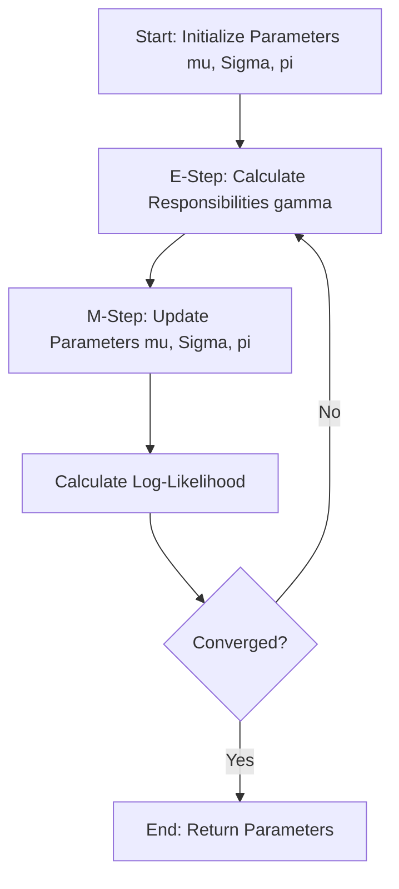
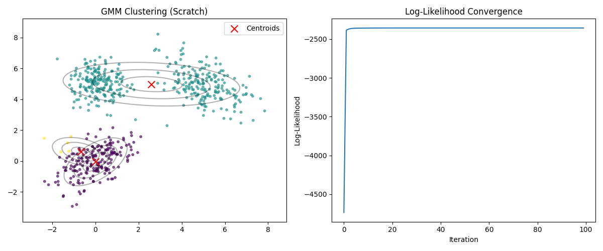
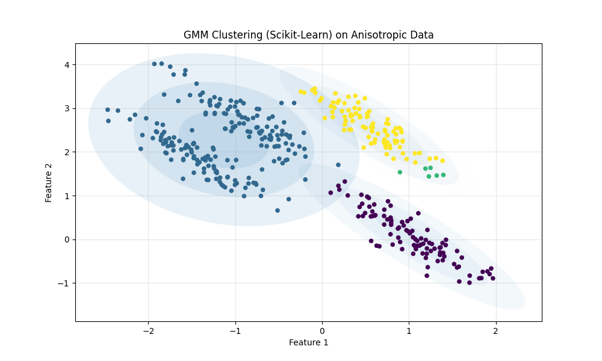
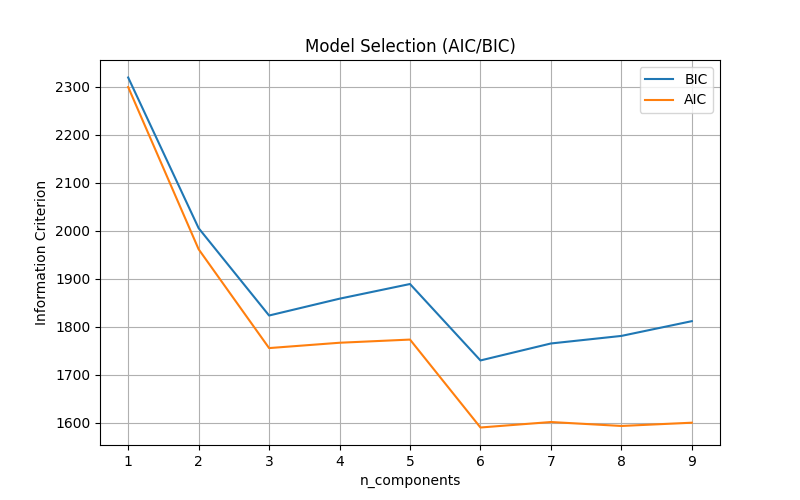

# Gaussian Mixture Models (GMM)

## 1. Executive Summary
**Gaussian Mixture Models (GMM)** is a probabilistic clustering algorithm. Unlike K-Means, which performs "hard clustering" (assigning each point to exactly one cluster) and assumes spherical clusters, GMM performs **soft clustering** (assigning probabilities of belonging to each cluster) and can model elliptical clusters.

It assumes that the data is generated from a mixture of a finite number of Gaussian distributions with unknown parameters.

---

## 2. Historical Context
*   **The Origins:** The concept of mixture models dates back to the late 19th century with **Karl Pearson** (1894), who used them to analyze crab measurements.
*   **The Algorithm:** The **Expectation-Maximization (EM)** algorithm, which is the standard method for fitting GMMs, was formalized by **Arthur Dempster, Nan Laird, and Donald Rubin** in **1977**. This paper is one of the most cited in statistics.

---

## 3. Real-World Analogy
### The "Voice in a Crowd" Analogy
Imagine you are at a cocktail party. There are 3 distinct groups of people talking in different corners of the room.
*   **The Data:** You record the sound of the entire room (a mixture of all voices).
*   **The Goal:** You want to separate the recording into 3 distinct tracks, one for each group.
*   **Soft Clustering:** A person standing in the middle of the room might be heard 60% by Group A's microphone and 40% by Group B's. They don't belong 100% to one group.
*   **GMM:** GMM tries to figure out the characteristics (mean pitch, variance/volume) of each group and the probability that any specific sound fragment belongs to that group.

---

## 4. Mathematical Foundation

### A. The Model
A GMM is defined by a weighted sum of $K$ Gaussian component densities:
$$ P(x) = \sum_{k=1}^{K} \pi_k \mathcal{N}(x | \mu_k, \Sigma_k) $$

Where:
*   $\pi_k$: Mixing coefficient (weight) for cluster $k$, $\sum \pi_k = 1$.
*   $\mathcal{N}(x | \mu_k, \Sigma_k)$: Multivariate Gaussian density with mean $\mu_k$ and covariance $\Sigma_k$.

### B. Expectation-Maximization (EM) Algorithm
Since we don't know the labels, we can't calculate parameters directly. We iterate:

1.  **E-Step (Expectation)**: Calculate the "responsibility" $\gamma(z_{nk})$ (probability that point $n$ belongs to cluster $k$).
    $$ \gamma(z_{nk}) = \frac{\pi_k \mathcal{N}(x_n | \mu_k, \Sigma_k)}{\sum_{j=1}^{K} \pi_j \mathcal{N}(x_n | \mu_j, \Sigma_j)} $$

2.  **M-Step (Maximization)**: Update parameters using the current responsibilities.
    *   **New Means:** $\mu_k^{new} = \frac{1}{N_k} \sum_{n=1}^{N} \gamma(z_{nk}) x_n$
    *   **New Covariances:** $\Sigma_k^{new} = \frac{1}{N_k} \sum_{n=1}^{N} \gamma(z_{nk}) (x_n - \mu_k^{new})(x_n - \mu_k^{new})^T$
    *   **New Weights:** $\pi_k^{new} = \frac{N_k}{N}$
    *   Where $N_k = \sum_{n=1}^{N} \gamma(z_{nk})$ is the effective number of points in cluster $k$.

---

## 5. Architecture Diagram



---

## 6. Implementation Details
*   **Scratch (`00_scratch.py`)**:
    *   Implements the EM algorithm manually using `numpy`.
    *   Uses `scipy.stats.multivariate_normal` for stable PDF calculation.
    *   Visualizes the convergence of Log-Likelihood.
*   **Sklearn (`01_sklearn.py`)**:
    *   Uses `sklearn.mixture.GaussianMixture`.
    *   Demonstrates how GMM handles anisotropic (stretched) blobs, which K-Means fails at.
    *   Uses **AIC (Akaike Information Criterion)** and **BIC (Bayesian Information Criterion)** to select the optimal number of clusters.

---

## 7. How to Run
Run the following commands in your terminal to execute the scripts:

```bash
# Run the scratch implementation
python 00_scratch.py

# Run the Scikit-Learn implementation
python 01_sklearn.py
```

---

## 8. Implementation Results & Visualization

### A. Scratch Implementation (EM Algorithm)
The scratch implementation successfully fits 3 Gaussians to the data. The Log-Likelihood plot shows the algorithm converging (maximizing the probability of the data).



### B. Sklearn Implementation (Anisotropic Data)
This example highlights GMM's strength. K-Means would try to fit circles, failing to capture the stretched shapes. GMM adapts its covariance matrix to fit the ellipses perfectly.



### C. Model Selection (AIC/BIC)
How do we know $K=4$ is the best choice? We look for the minimum AIC or BIC score.



---

## 9. References
*   Dempster, A. P., Laird, N. M., & Rubin, D. B. (1977). *Maximum likelihood from incomplete data via the EM algorithm*. Journal of the Royal Statistical Society.
*   Scikit-Learn Documentation: [Gaussian Mixture Models](https://scikit-learn.org/stable/modules/mixture.html)
