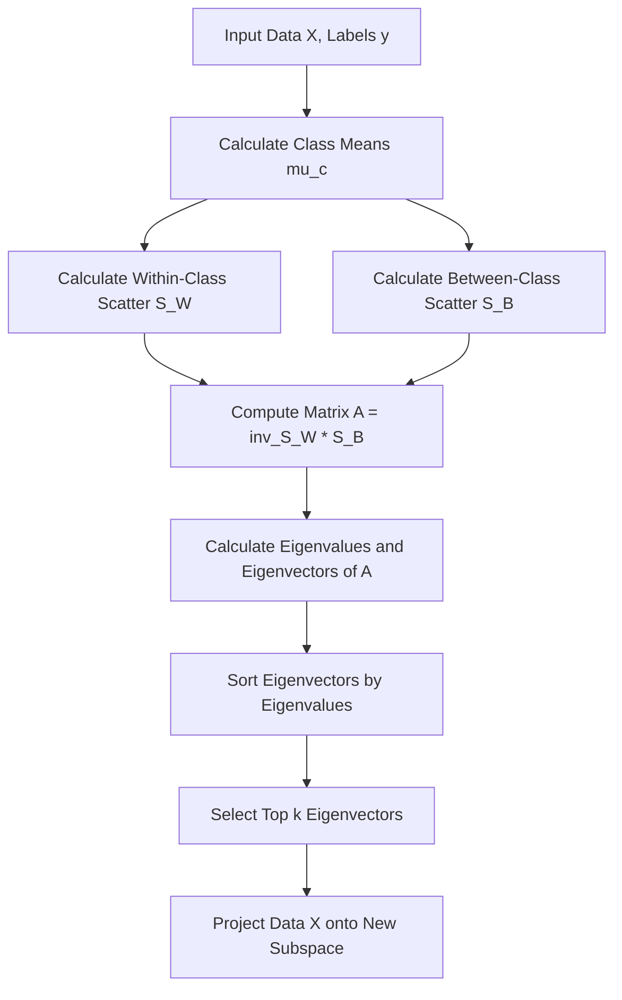
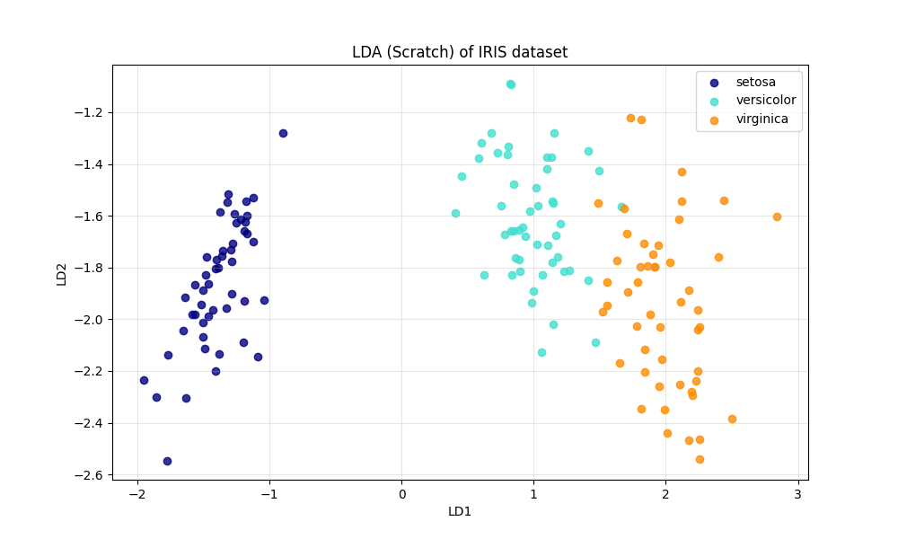
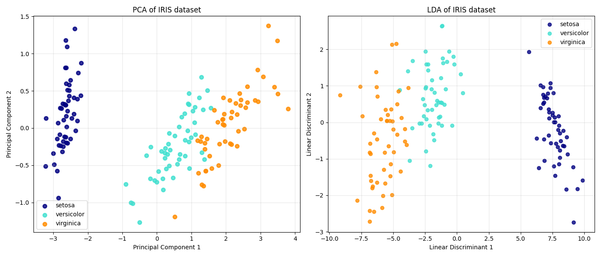

# Linear Discriminant Analysis (LDA)

## 1. Executive Summary
**Linear Discriminant Analysis (LDA)** is a **supervised** dimensionality reduction technique. While Principal Component Analysis (PCA) focuses on maximizing the variance of the data (ignoring class labels), LDA focuses on maximizing the **separability** between known classes.

It projects the data onto a lower-dimensional space where the classes are as distinct as possible.

---

## 2. Historical Context
*   **The Inventor:** **Ronald A. Fisher** formulated the method in **1936** for a two-class problem ("The Use of Multiple Measurements in Taxonomic Problems").
*   **Generalization:** It was later generalized to multi-class problems by **C.R. Rao** in **1948** as Multiple Discriminant Analysis.
*   **Significance:** It remains a fundamental technique for pattern recognition and machine learning preprocessing.

---

## 3. Real-World Analogy
### The "Best Angle" for a Photo
Imagine you are taking a group photo of two basketball teams (Team Red and Team Blue).
*   **PCA Approach:** You want to take the photo from an angle where the group looks "widest" (maximum spread), regardless of who is standing where.
*   **LDA Approach:** You want to take the photo from an angle where Team Red is clearly on the left and Team Blue is clearly on the right, with minimal overlap between them. You don't care about the total width; you care about the *separation*.

---

## 4. Mathematical Foundation

### A. The Objective (Fisher's Criterion)
We want to find a projection vector $w$ that maximizes the ratio of "Between-Class Variance" to "Within-Class Variance".
$$ J(w) = \frac{w^T S_B w}{w^T S_W w} $$

### B. Scatter Matrices
1.  **Within-Class Scatter Matrix ($S_W$)**: Measures how compact each class is.
    $$ S_W = \sum_{c} \sum_{x \in D_c} (x - \mu_c)(x - \mu_c)^T $$
2.  **Between-Class Scatter Matrix ($S_B$)**: Measures how far the class means are from the overall mean.
    $$ S_B = \sum_{c} N_c (\mu_c - \mu)(\mu_c - \mu)^T $$

### C. The Solution
The optimal projection vectors are the eigenvectors of the matrix $S_W^{-1} S_B$ corresponding to the largest eigenvalues.

---

## 5. Architecture Diagram



---

## 6. Implementation Details
*   **Scratch (`00_scratch.py`)**:
    *   Implements the calculation of $S_W$ and $S_B$ manually.
    *   Solves the eigenvalue problem using `numpy.linalg.eig`.
    *   Projects the Iris dataset (4D) down to 2D.
*   **Sklearn (`01_sklearn.py`)**:
    *   Uses `sklearn.discriminant_analysis.LinearDiscriminantAnalysis`.
    *   Compares the projection results with PCA.

---

## 7. How to Run
Run the following commands in your terminal to execute the scripts:

```bash
# Run the scratch implementation
python 00_scratch.py

# Run the Scikit-Learn implementation (LDA vs PCA)
python 01_sklearn.py
```

---

## 8. Implementation Results & Visualization

### A. LDA Projection (Scratch)
The scratch implementation successfully projects the 4-dimensional Iris dataset into 2 dimensions. Notice how well-separated the three classes are.



### B. LDA vs. PCA Comparison
This comparison illustrates the fundamental difference between the two methods.
*   **PCA:** Preserves the global structure and spread of the data. The classes overlap slightly more because PCA doesn't "know" about the labels.
*   **LDA:** Explicitly pushes the classes apart. The separation between the green and orange classes is much clearer in the LDA plot.



---

## 9. References
*   Fisher, R. A. (1936). *The use of multiple measurements in taxonomic problems*. Annals of Eugenics.
*   Scikit-Learn Documentation: [Linear Discriminant Analysis](https://scikit-learn.org/stable/modules/lda_qda.html)
