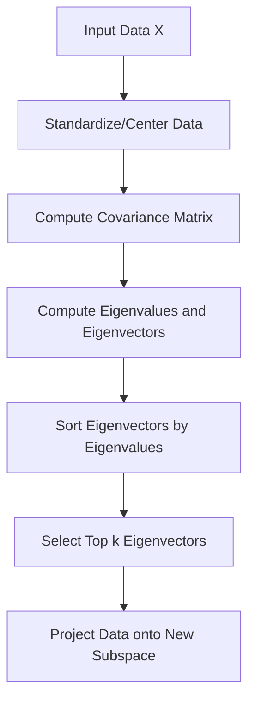
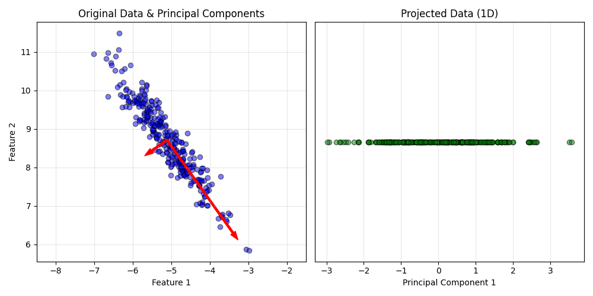
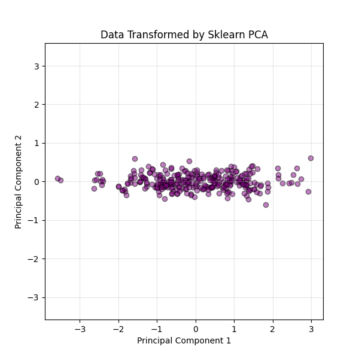

# Principal Component Analysis (PCA)

## 1. Executive Summary
**Principal Component Analysis (PCA)** is a linear dimensionality reduction technique. It transforms the data into a new coordinate system where the axes (Principal Components) are ordered by the amount of variance they explain.

The goal is to reduce the number of variables (features) while preserving as much information (variance) as possible. It is widely used for data compression, visualization, and noise reduction.

---

## 2. Historical Context
*   **The Inventors:** Invented by **Karl Pearson** in **1901** as an analogue of the principal axis theorem in mechanics.
*   **Development:** It was later independently developed and named by **Harold Hotelling** in the 1930s.
*   **Significance:** It is one of the oldest and most widely used techniques in multivariate analysis and statistics.

---

## 3. Real-World Analogy
### Taking a Photo of a Teapot
*   **The Object:** A teapot is a 3D object (3 dimensions).
*   **The Photo:** A photo is a 2D projection (2 dimensions).
*   **The Goal:** You want to choose the angle that captures the most information about the teapot's shape (handle, spout, lid).
*   **Bad Projection:** If you take a photo from the top, it might just look like a circle (low variance, information lost).
*   **Good Projection:** If you take it from the side, you see the unique shape (high variance, information preserved).
*   **PCA:** Automatically finds the "best angle" (Principal Components) to project the data onto.

---

## 4. Mathematical Foundation

### A. Key Concepts
1.  **Variance**: A measure of the spread of data. PCA assumes that features with higher variance contain more information.
2.  **Covariance**: Measures how two variables change together.
3.  **Eigenvectors**: The directions of the axes of the new coordinate system (Principal Components).
4.  **Eigenvalues**: The magnitude of variance in the direction of the corresponding eigenvector.

### B. The Algorithm
1.  **Center the Data**: Subtract the mean from each feature.
2.  **Compute Covariance Matrix**:
    $$ \Sigma = \frac{1}{n-1} X^T X $$
3.  **Eigendecomposition**: Solve for eigenvalues $\lambda$ and eigenvectors $v$:
    $$ \Sigma v = \lambda v $$
4.  **Sort and Select**: Sort eigenvectors by eigenvalues in descending order. Pick the top $k$ eigenvectors to form a matrix $W$.
5.  **Project**:
    $$ Z = X W $$

---

## 5. Architecture Diagram



---

## 6. Implementation Details
*   **Scratch (`00_scratch.py`)**:
    *   Implements PCA using `numpy.linalg.eig`.
    *   Calculates the covariance matrix manually.
    *   Visualizes the Principal Components as vectors on top of the original data.
*   **Sklearn (`01_sklearn.py`)**:
    *   Uses `sklearn.decomposition.PCA`.
    *   Standard implementation for comparison.

---

## 7. How to Run
Run the following commands in your terminal to execute the scripts:

```bash
# Run the scratch implementation
python 00_scratch.py

# Run the Scikit-Learn implementation
python 01_sklearn.py
```

---

## 8. Implementation Results & Visualization

### A. Principal Components (Scratch)
The red arrows represent the Principal Components found by the algorithm. The longer arrow (PC1) aligns with the direction of maximum spread (variance) in the data.



### B. Transformed Data (Sklearn)
After projection, the data is rotated so that the axes align with the principal components. PC1 becomes the x-axis, and PC2 becomes the y-axis.



---

## 9. References
*   Pearson, K. (1901). *On lines and planes of closest fit to systems of points in space*. Philosophical Magazine.
*   Hotelling, H. (1933). *Analysis of a complex of statistical variables into principal components*. Journal of Educational Psychology.
