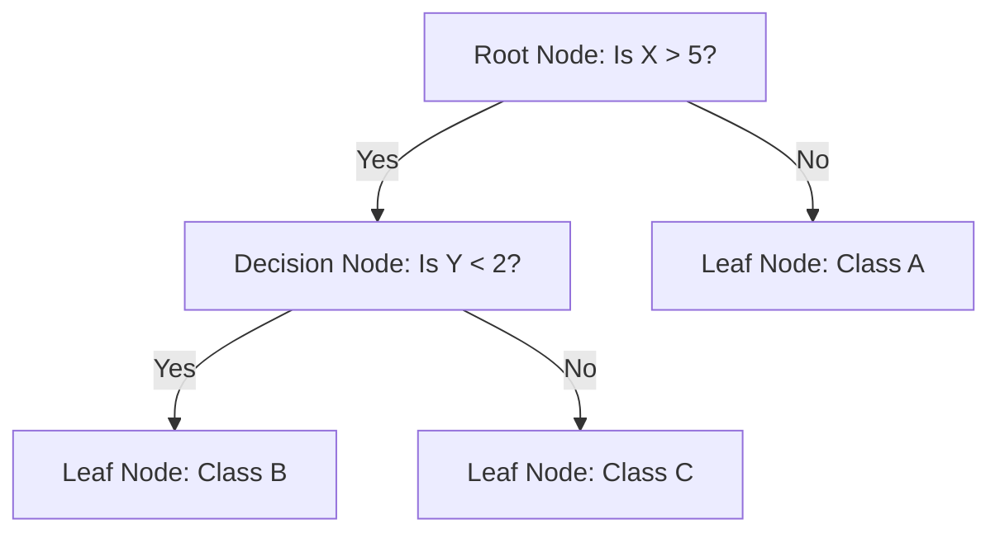

# Decision Trees

## 1. Executive Summary
**Decision Trees** are a versatile supervised learning method used for both classification and regression. The model predicts the value of a target variable by learning simple decision rules inferred from the data features.

It mimics human decision-making by breaking down a complex decision into a series of simpler choices, resulting in a tree-like structure.

---

## 2. Historical Context
*   **The Origins:** The development of Decision Trees is largely attributed to **Leo Breiman** and colleagues who introduced **CART** (Classification and Regression Trees) in **1984**.
*   **Parallel Development:** Around the same time, **Ross Quinlan** developed **ID3** (1986) and later **C4.5** (1993), which became standard algorithms for generating decision trees.
*   **Significance:** These methods revolutionized machine learning by providing interpretable models ("white box") in contrast to "black box" models like neural networks.

---

## 3. Real-World Analogy
### The Game of "20 Questions"
*   **The Goal:** You want to guess what object someone is thinking of.
*   **The Strategy:** You ask a series of Yes/No questions to narrow down the possibilities.
    *   "Is it alive?" (Yes) -> Eliminates all non-living things.
    *   "Is it an animal?" (Yes) -> Eliminates plants.
    *   "Does it bark?" (Yes) -> Likely a dog.
*   **The Tree:** A Decision Tree does exactly this. It asks the most informative questions first (at the top of the tree) to split the data into purer groups as quickly as possible.

---

## 4. Mathematical Foundation

### A. Key Concepts
1.  **Root Node**: Represents the entire population or sample.
2.  **Splitting**: Dividing a node into two or more sub-nodes.
3.  **Decision Node**: When a sub-node splits into further sub-nodes.
4.  **Leaf (Terminal) Node**: Nodes that do not split (contain the final prediction).

### B. Splitting Criteria (Impurity Metrics)
To decide the best split, we need a metric to measure how "mixed" or "impure" a node is.

#### 1. Entropy (Information Gain)
Measures the disorder in a dataset.
$$ H(S) = - \sum_{i=1}^{c} p_i \log_2 p_i $$
*   $p_i$: Probability of class $i$.
*   **Information Gain**: The reduction in entropy after splitting. We choose the split that maximizes this gain.

#### 2. Gini Impurity
Measures the probability of misclassifying a randomly chosen element if it were randomly labeled according to the distribution of labels in the node.
$$ Gini = 1 - \sum_{i=1}^{c} (p_i)^2 $$
*   Often computationally faster than entropy because it avoids log calculations.

---

## 5. Architecture Diagram



---

## 6. Implementation Details
*   **Scratch (`00_scratch.py`)**:
    *   Implements a `DecisionTreeScratch` class.
    *   Uses **Entropy** and **Information Gain** to find the best splits.
    *   Recursively builds the tree until a stopping criterion (max depth, min samples) is met.
*   **Sklearn (`01_sklearn.py`)**:
    *   Uses `sklearn.tree.DecisionTreeClassifier`.
    *   Standard implementation for comparison.

---

## 7. How to Run
Run the following commands in your terminal to execute the scripts:

```bash
# Run the scratch implementation
python 00_scratch.py

# Run the Scikit-Learn implementation
python 01_sklearn.py
```

---

## 8. Implementation Results & Visualization

### A. Decision Boundary
Decision Trees create orthogonal (axis-aligned) decision boundaries. This results in a "blocky" or "staircase" appearance when separating non-linear data like the Moons dataset.

| Implementation | Visualization |
| :--- | :--- |
| **Scratch** |  |
| **Sklearn** |  |

### B. Analysis
Both implementations successfully capture the non-linear structure of the data. The boundaries are very similar, confirming that the scratch implementation correctly applies the recursive splitting logic based on information gain.

---

## 9. References
*   Breiman, L., Friedman, J., Stone, C. J., & Olshen, R. A. (1984). *Classification and regression trees*. CRC press.
*   Quinlan, J. R. (1986). *Induction of decision trees*. Machine learning.
