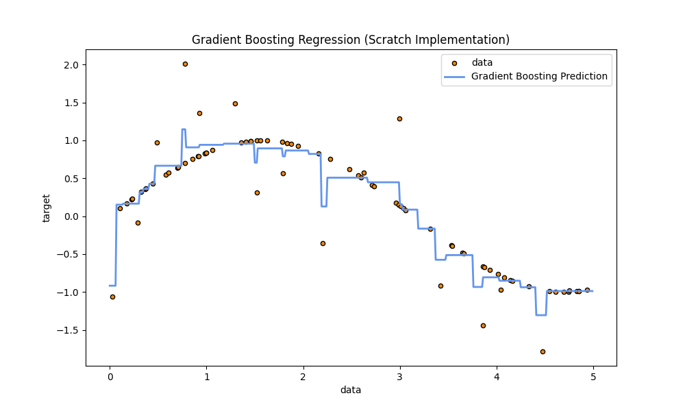

# Gradient Boosting

## 1. Teoria (Theory)

**Gradient Boosting** to technika zespołowa, która buduje model w sposób sekwencyjny. W przeciwieństwie do Random Forest (gdzie drzewa są niezależne), tutaj każde kolejne drzewo stara się naprawić błędy popełnione przez poprzednie.

### Kluczowe koncepcje:

1.  **Boosting**: Łączenie słabych modeli (weak learners) w jeden silny model.
2.  **Sekwencyjność**: Drzewa są dodawane jedno po drugim.
3.  **Reszty (Residuals)**: Kluczowa idea. Zamiast uczyć się bezpośrednio etykiety $y$, każde kolejne drzewo uczy się przewidywać **błąd** (resztę) poprzedniego modelu.
    $$ r_i = y_i - F_{m-1}(x_i) $$
    Gdzie $F_{m-1}$ to predykcja modelu po $m-1$ iteracjach.
4.  **Learning Rate (Współczynnik uczenia)**: Skaluje wkład każdego drzewa, aby zapobiec przeuczeniu (overfitting).
    $$ F_m(x) = F_{m-1}(x) + \nu \cdot h_m(x) $$

### Algorytm (Gradient Boosting Regressor)

1.  Zainicjuj model stałą wartością (np. średnią): $F_0(x) = \bar{y}$.
2.  Dla $m = 1$ do $M$:
    a. Oblicz tzw. pseudo-reszty: $r_{im} = - [\frac{\partial L(y_i, F(x_i))}{\partial F(x_i)}]_{F=F_{m-1}}$.
       (Dla błędu średniokwadratowego MSE, reszta to po prostu $y_i - F_{m-1}(x_i)$).
    b. Dopasuj słabe drzewo decyzyjne $h_m(x)$ do reszt $r_{im}$.
    c. Zaktualizuj model: $F_m(x) = F_{m-1}(x) + \nu h_m(x)$.

## 2. Implementacja (Implementation)

W tym przykładzie skupiamy się na **Regresji** (przewidywanie wartości ciągłej), ponieważ najlepiej ilustruje ona ideę dopasowywania do reszt.

1.  **`00_scratch.py`**: Implementacja Gradient Boosting Regressor od podstaw. Model uczy się przybliżać funkcję sinus z szumem.
2.  **`01_sklearn.py`**: Implementacja referencyjna używająca `GradientBoostingRegressor` z `scikit-learn`.

### Wyniki

#### Scratch Implementation (Fitting Sine Wave)


#### Sklearn Implementation (Fitting Sine Wave)


## 3. Uruchomienie

```bash
python 00_scratch.py
python 01_sklearn.py
```
