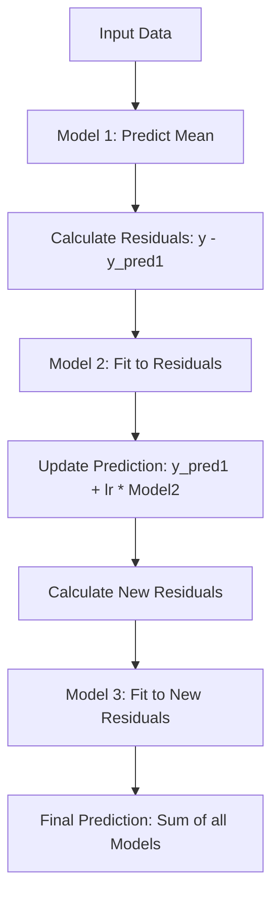

# Gradient Boosting

## 1. Executive Summary
**Gradient Boosting** is a powerful ensemble technique that builds a model in a sequential manner. Unlike Random Forest, where trees are built independently, Gradient Boosting builds trees one at a time, where each new tree tries to correct the errors (residuals) made by the previous ones.

It is widely used in machine learning competitions (e.g., Kaggle) due to its high predictive accuracy.

---

## 2. Historical Context
*   **The Origins:** The idea of "boosting" (combining weak learners into a strong one) was first proposed by **Michael Kearns** (1988) and **Valiant**.
*   **AdaBoost:** The first practical boosting algorithm, **AdaBoost**, was developed by **Yoav Freund and Robert Schapire** in **1995**.
*   **Gradient Boosting:** The generalization to arbitrary loss functions using gradient descent was formulated by **Jerome Friedman** in **1999**. This laid the foundation for modern libraries like XGBoost, LightGBM, and CatBoost.

---

## 3. Real-World Analogy
### The Golf Analogy
Imagine you are playing golf and want to hit the ball into the hole.
1.  **Shot 1 (Model 1):** You hit the ball, but it lands 50 meters short of the hole.
2.  **Shot 2 (Model 2):** You don't go back to the start. You walk to where the ball landed and try to hit it the remaining 50 meters. You hit it, but overshoot by 10 meters.
3.  **Shot 3 (Model 3):** You putt the ball back 10 meters towards the hole.
4.  **Result:** The sum of all your shots gets the ball into the hole. Each shot corrected the error of the previous state.

---

## 4. Mathematical Foundation

### A. Key Concepts
1.  **Weak Learner**: A simple model (usually a shallow decision tree) that performs slightly better than random guessing.
2.  **Residuals**: The difference between the actual value and the predicted value ($y - \hat{y}$).
3.  **Learning Rate ($\nu$)**: A scaling factor (e.g., 0.1) applied to each tree's contribution to prevent overfitting.

### B. The Algorithm (Gradient Boosting Regressor)
1.  **Initialize**: Start with a constant prediction (e.g., the mean of $y$).
    $$ F_0(x) = \bar{y} $$
2.  **Iterate** for $m = 1$ to $M$:
    *   **Compute Residuals**: Calculate the error of the current model.
        $$ r_{im} = y_i - F_{m-1}(x_i) $$
    *   **Fit Tree**: Train a decision tree $h_m(x)$ to predict these residuals $r_{im}$.
    *   **Update Model**: Add the new tree to the ensemble, scaled by the learning rate.
        $$ F_m(x) = F_{m-1}(x) + \nu \cdot h_m(x) $$

---

## 5. Architecture Diagram



---

## 6. Implementation Details
*   **Scratch (`00_scratch.py`)**:
    *   Implements `GradientBoostingRegressorScratch`.
    *   Uses `sklearn.tree.DecisionTreeRegressor` as the weak learner.
    *   Demonstrates the sequential fitting process on a noisy sine wave.
*   **Sklearn (`01_sklearn.py`)**:
    *   Uses `sklearn.ensemble.GradientBoostingRegressor`.
    *   Standard implementation for comparison.

---

## 7. How to Run
Run the following commands in your terminal to execute the scripts:

```bash
# Run the scratch implementation
python 00_scratch.py

# Run the Scikit-Learn implementation
python 01_sklearn.py
```

---

## 8. Implementation Results & Visualization

### A. Fitting a Sine Wave
The model learns to approximate a non-linear function (sine wave) by summing up the predictions of many simple trees.

| Implementation | Visualization |
| :--- | :--- |
| **Scratch** |  |
| **Sklearn** |  |

### B. Analysis
Both implementations produce a smooth curve that fits the noisy data points well. The "step-like" nature of the curve comes from the underlying decision trees (which make constant predictions in regions).

---

## 9. References
*   Friedman, J. H. (2001). *Greedy function approximation: a gradient boosting machine*. Annals of statistics.
*   Scikit-Learn Documentation: [Gradient Boosting](https://scikit-learn.org/stable/modules/ensemble.html#gradient-boosting)
