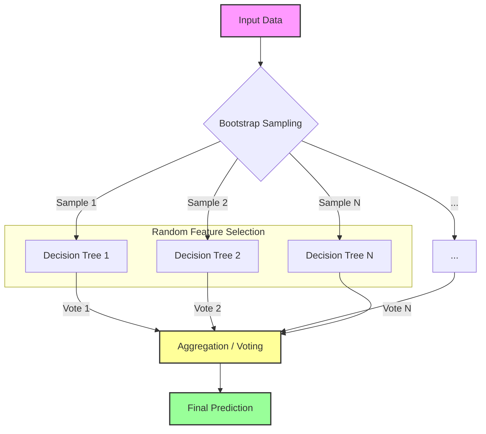
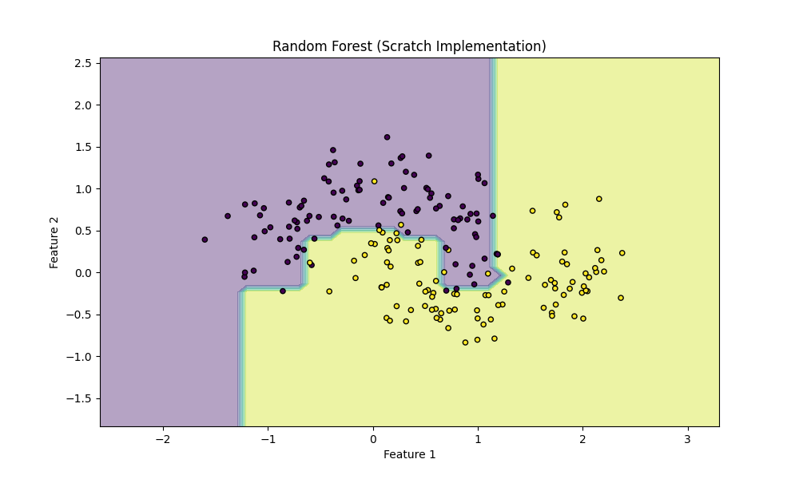
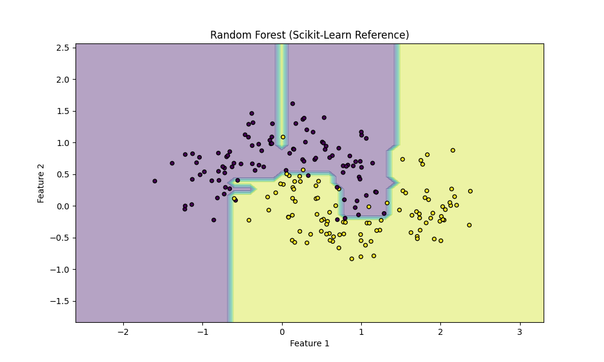

# Random Forest

## 1. Executive Summary
Random Forest is a powerful ensemble learning method used for both classification and regression tasks. It operates by constructing a multitude of decision trees at training time and outputting the class that is the mode of the classes (classification) or mean prediction (regression) of the individual trees. By combining the predictions of many trees, Random Forest corrects for the habit of decision trees to overfit to their training set, resulting in a robust and accurate model.

## 2. Historical Context
The Random Forest algorithm was developed by **Leo Breiman** and **Adele Cutler** in **2001**. It builds upon earlier work on "bagging" (Bootstrap Aggregating) by Breiman (1996) and the random subspace method by Tin Kam Ho (1998). Breiman's innovation was to combine bagging with the random selection of features at each node split, creating a method that is computationally efficient and highly accurate.

## 3. Real-World Analogy
Imagine you want to decide which movie to watch.
*   **Decision Tree**: You ask one friend who has very specific tastes. If they like action movies, they recommend "Mad Max". If they like romance, they recommend "The Notebook". Their advice is highly dependent on their specific bias.
*   **Random Forest**: You ask 100 different friends. Each friend has seen a different subset of movies (bootstrapping) and considers different criteria (random features) – some care about the director, others about the genre, others about the actors. You tally up their votes and choose the movie with the most recommendations. This "wisdom of the crowd" approach is generally more reliable than any single person's opinion.

## 4. Mathematical Foundation
Random Forest relies on two key randomization techniques to ensure diversity among trees:

### 4.1 Bagging (Bootstrap Aggregating)
Given a training set $X = x_1, ..., x_n$ with responses $Y = y_1, ..., y_n$, bagging repeatedly selects a random sample with replacement of the training set and fits trees to these samples:
For $b = 1, ..., B$:
1. Sample, with replacement, $n$ training examples from $X, Y$; call these $X_b, Y_b$.
2. Train a classification or regression tree $f_b$ on $X_b, Y_b$.

### 4.2 Feature Randomness
In standard decision trees, each node is split using the best split among all variables. In a Random Forest, each node is split using the best among a subset of predictors randomly chosen at that node. This strategy performs better than many other classifiers, including discriminant analysis, support vector machines and neural networks, and is robust against overfitting.

### 4.3 Prediction
After training $B$ trees, predictions for unseen samples $x'$ can be made by aggregating the predictions of the individual trees:

**Classification (Majority Vote):**
$$ \hat{C}_{rf}^B(x') = \text{majority vote} \{ \hat{C}_b(x') \}_{1}^{B} $$

**Regression (Averaging):**
$$ \hat{f}_{rf}^B(x') = \frac{1}{B} \sum_{b=1}^{B} \hat{f}_b(x') $$

## 5. Architecture



## 6. Implementation Details
The repository contains two implementations:

### Scratch Implementation (`00_scratch.py`)
*   **`DecisionTree` Class**: A simplified decision tree that supports:
    *   `_grow_tree`: Recursive function to build the tree.
    *   `_best_split`: Finds the optimal feature and threshold using Information Gain.
    *   `_entropy`: Calculates impurity of a node.
*   **`RandomForestScratch` Class**:
    *   `fit`: Creates `n_trees`, each trained on a bootstrap sample of the data.
    *   `predict`: Aggregates predictions from all trees using majority voting.
    *   **Feature Subsampling**: Implemented inside the tree growth process to ensure decorrelation.

### Scikit-Learn Implementation (`01_sklearn.py`)
*   Uses `sklearn.ensemble.RandomForestClassifier`.
*   Demonstrates the ease of use and efficiency of the optimized library implementation.
*   Visualizes the decision boundary on the "Moons" dataset.

## 7. How to Run
Run the scripts from the terminal:

```bash
# Run the scratch implementation
python 00_scratch.py

# Run the Scikit-Learn implementation
python 01_sklearn.py
```

## 8. Implementation Results
Both implementations are tested on the "Make Moons" dataset, which is non-linear. The Random Forest successfully captures the complex decision boundary.

### Scratch Implementation


### Scikit-Learn Implementation


## 9. References
*   Breiman, L. (2001). "Random Forests". Machine Learning, 45(1), 5-32.
*   [Scikit-Learn Documentation: Random Forest](https://scikit-learn.org/stable/modules/generated/sklearn.ensemble.RandomForestClassifier.html)
*   Hastie, T., Tibshirani, R., & Friedman, J. (2009). *The Elements of Statistical Learning*.
