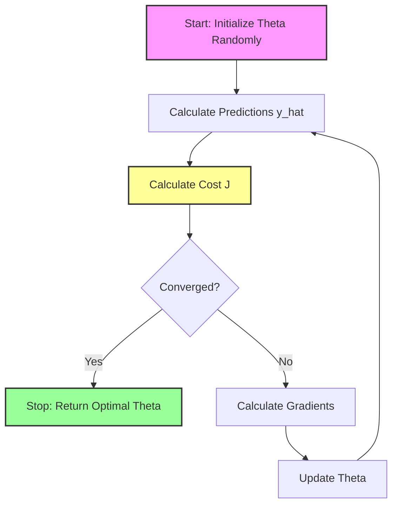
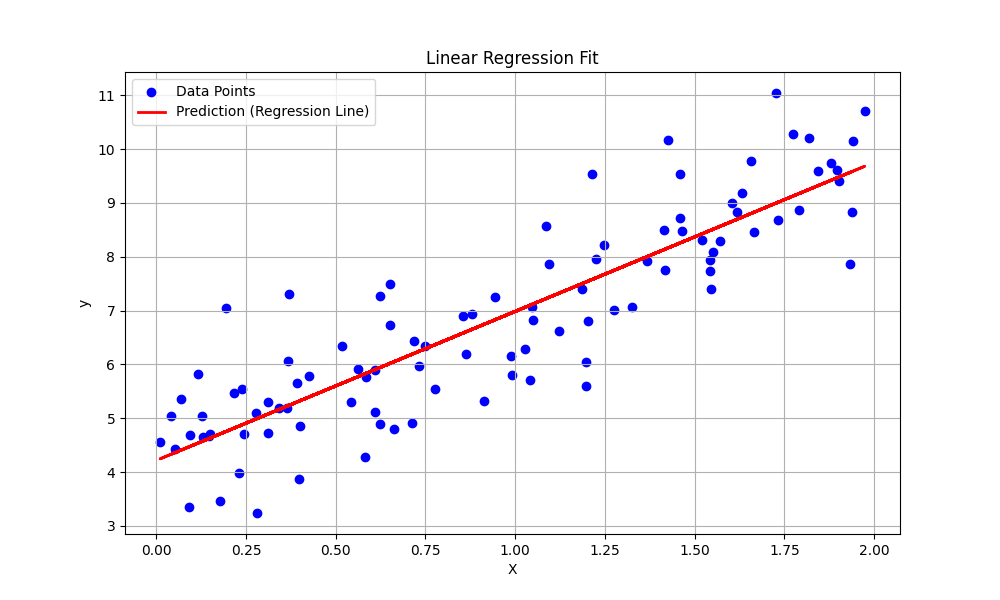
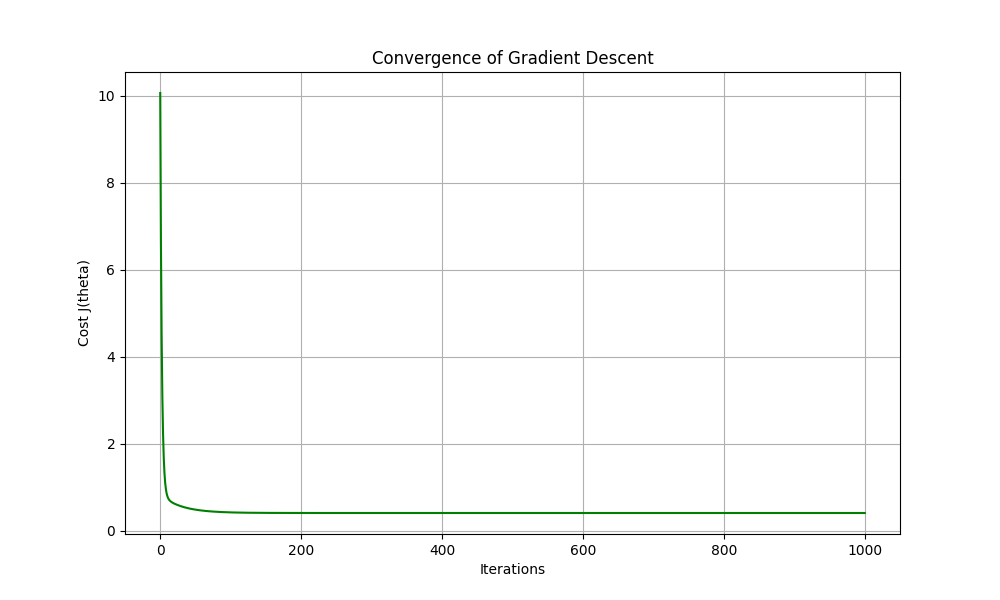
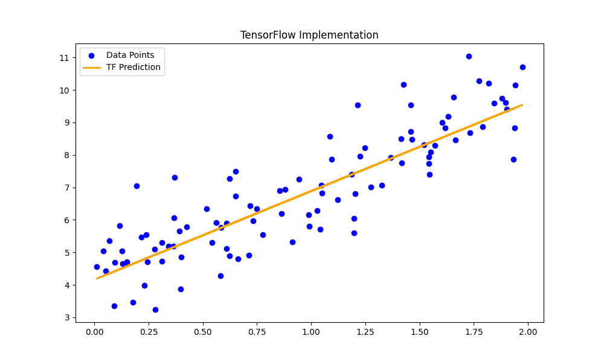
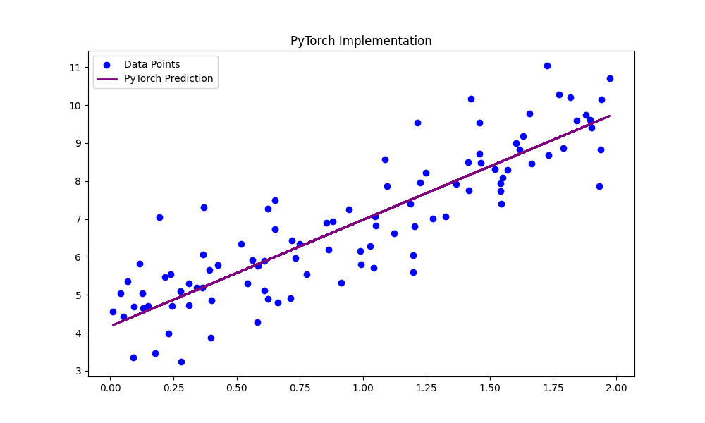

# Linear Regression with Gradient Descent

## 1. Executive Summary
**Linear Regression** is the "Hello World" of Machine Learning. It is a supervised learning algorithm used to predict a continuous output variable ($y$) based on one or more input variables ($x$). The goal is to find the straight line that best fits the data points by minimizing the error between the predicted values and the actual values. In this module, we implement Univariate Linear Regression (one input variable) using Gradient Descent optimization from scratch, alongside reference implementations in TensorFlow and PyTorch.

---

## 2. Historical Context
*   **Least Squares (1805/1809)**: The method of Least Squares, which underpins linear regression, was independently published by **Adrien-Marie Legendre** (1805) and **Carl Friedrich Gauss** (1809). Gauss claimed he had been using it since 1795 for calculating the orbits of celestial bodies.
*   **Regression (1886)**: The term "Regression" comes from **Francis Galton**, who observed "Regression to the Mean" in the heights of parents and children.

---

## 3. Real-World Analogy
### The Mountain Descent
Imagine you are standing on top of a mountain range at night. It's pitch black, and you can't see the bottom. You want to reach the lowest point (the valley) where a village is located.
*   **The Mountain**: Represents the **Cost Function** (the error). Higher altitude = higher error.
*   **Your Position**: Represents the current values of your parameters (weights).
*   **The Strategy**: You feel the slope of the ground under your feet. If it slopes down to the right, you take a step to the right.
*   **Gradient Descent**: This process of feeling the slope (calculating the gradient) and taking a step downhill (updating weights) is exactly how the algorithm finds the best line.

---

## 4. Mathematical Foundation

### A. The Model (Hypothesis)
We assume the relationship between $x$ and $y$ is linear:
$$ \hat{y} = h_\theta(x) = \theta_0 + \theta_1 x $$
*   $\theta_0$: Bias (intercept).
*   $\theta_1$: Weight (slope).

### B. The Cost Function (Mean Squared Error)
We measure the error using the average of the squared differences:
$$ J(\theta_0, \theta_1) = \frac{1}{2m} \sum_{i=1}^{m} (h_\theta(x^{(i)}) - y^{(i)})^2 $$
*   $m$: Number of training examples.

### C. Gradient Descent
We update $\theta_0, \theta_1$ to minimize $J$:
$$ \theta_j := \theta_j - \alpha \frac{\partial J}{\partial \theta_j} $$
Where the gradients are:
$$ \frac{\partial J}{\partial \theta_0} = \frac{1}{m} \sum_{i=1}^{m} (h_\theta(x^{(i)}) - y^{(i)}) $$
$$ \frac{\partial J}{\partial \theta_1} = \frac{1}{m} \sum_{i=1}^{m} (h_\theta(x^{(i)}) - y^{(i)}) \cdot x^{(i)} $$

---

## 5. Architecture Diagram



---

## 6. Implementation Details
The repository contains three implementations:

*   **Scratch (`00_scratch.py`)**:
    *   **`compute_cost`**: Calculates the Mean Squared Error.
    *   **`gradient_descent`**: The core optimization loop that updates weights based on gradients.
    *   **`main`**: Generates synthetic data, runs the training, and visualizes the results.
*   **TensorFlow (`01_tensorflow.py`)**:
    *   Uses `tf.keras.Sequential` with a single `Dense` layer (1 unit) to represent linear regression.
    *   Uses `SGD` optimizer and `mean_squared_error` loss.
*   **PyTorch (`02_pytorch.py`)**:
    *   Defines a `LinearRegressionModel` class inheriting from `nn.Module`.
    *   Uses `nn.Linear(1, 1)` layer.
    *   Manually implements the training loop with `backward()` and `optimizer.step()`.

---

## 7. How to Run
Run the scripts from the terminal:

```bash
# Run the scratch implementation
python 00_scratch.py

# Run the TensorFlow implementation
python 01_tensorflow.py

# Run the PyTorch implementation
python 02_pytorch.py
```

---

## 8. Implementation Results

### A. The Regression Fit
The goal is to find the red line that best fits the blue data points.



### B. Convergence of Gradient Descent
The "Loss Curve" shows the Mean Squared Error decreasing over iterations, indicating the model is learning.



### C. Framework Comparison
| Implementation | Final Loss (MSE) | Intercept ($\theta_0$) | Slope ($\theta_1$) | Visualization |
| :--- | :--- | :--- | :--- | :--- |
| **Scratch** | ~0.40 | 4.22 | 2.77 | [View](assets/regression_fit.png) |
| **TensorFlow** | ~0.81 | 4.29 | 2.78 |  |
| **PyTorch** | ~0.81 | 4.17 | 2.81 |  |

---

## 9. References
*   Legendre, A. M. (1805). *Nouvelles méthodes pour la détermination des orbites des comètes*.
*   Galton, F. (1886). *Regression towards mediocrity in hereditary stature*.
*   Ng, Andrew. *Machine Learning Course (Coursera/Stanford)*.
