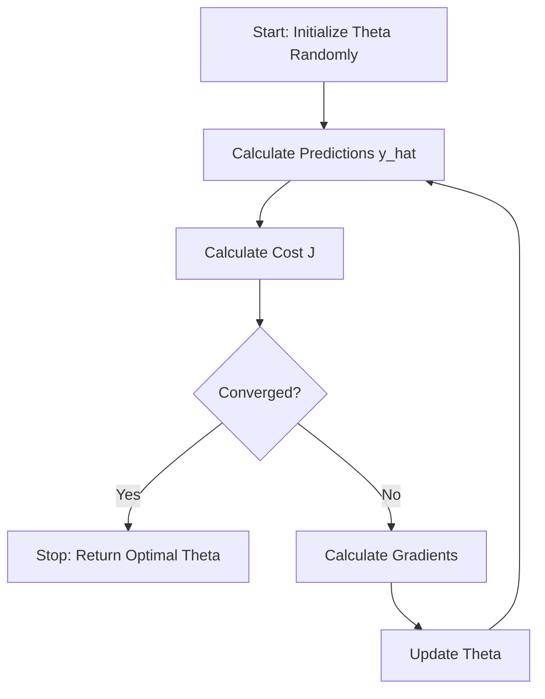

# Linear Regression with Gradient Descent

## 1. Executive Summary
**Linear Regression** is the "Hello World" of Machine Learning. It is a supervised learning algorithm used to predict a continuous output variable ($y$) based on one or more input variables ($x$).

The goal is simple: find the straight line that best fits the data points. "Best fit" means minimizing the error between the predicted values and the actual values.

In this module, we implement **Univariate Linear Regression** (one input variable) using **Gradient Descent** optimization from scratch.

---

## 2. Historical Context
*   **The Inventors:** The method of **Least Squares**, which underpins linear regression, was independently published by **Adrien-Marie Legendre** (1805) and **Carl Friedrich Gauss** (1809). Gauss claimed he had been using it since 1795 for calculating the orbits of celestial bodies.
*   **The Name:** The term "Regression" comes from **Francis Galton** (1886). While studying the heights of parents and children, he observed that tall parents tended to have children shorter than themselves (closer to the average). He called this "Regression to the Mean".
*   **Significance:** Before computers, fitting a line was a manual calculation using the Normal Equation. The iterative approach we use here (Gradient Descent) became fundamental only with the rise of large datasets where analytical solutions became computationally expensive.

---

## 3. Real-World Analogy
### The Mountain Descent
Imagine you are standing on top of a mountain range at night. It's pitch black, and you can't see the bottom. You want to reach the lowest point (the valley) where a village is located.

*   **The Mountain:** Represents the **Cost Function** (the error). Higher altitude = higher error.
*   **Your Position:** Represents the current values of your parameters (weights).
*   **The Strategy:** You feel the slope of the ground under your feet. If it slopes down to the right, you take a step to the right.
*   **Gradient Descent:** This process of feeling the slope (calculating the gradient) and taking a step downhill (updating weights) is exactly how the algorithm finds the best line.

---

## 4. Mathematical Foundation

### A. The Model (Hypothesis)
We assume the relationship between $x$ and $y$ is linear:
$$ \hat{y} = h_\theta(x) = \theta_0 + \theta_1 x $$
*   $\theta_0$: Bias (intercept).
*   $\theta_1$: Weight (slope).

### B. The Cost Function (Mean Squared Error)
We need a metric to measure how "wrong" our line is. We use the average of the squared differences between predicted and actual values:
$$ J(\theta_0, \theta_1) = \frac{1}{2m} \sum_{i=1}^{m} (h_\theta(x^{(i)}) - y^{(i)})^2 $$
*   $m$: Number of training examples.
*   The $\frac{1}{2}$ is a convenience factor to cancel out the exponent when we take the derivative.

### C. Gradient Descent (The Optimizer)
We want to find $\theta_0, \theta_1$ that minimize $J$. We do this by iteratively updating them in the opposite direction of the gradient (slope).

**Gradients (Derivatives):**
$$ \frac{\partial J}{\partial \theta_0} = \frac{1}{m} \sum_{i=1}^{m} (h_\theta(x^{(i)}) - y^{(i)}) $$
$$ \frac{\partial J}{\partial \theta_1} = \frac{1}{m} \sum_{i=1}^{m} (h_\theta(x^{(i)}) - y^{(i)}) \cdot x^{(i)} $$

**Update Rule:**
Repeat until convergence:
$$ \theta_j := \theta_j - \alpha \frac{\partial J}{\partial \theta_j} $$
*   $\alpha$ (alpha): Learning Rate (step size).

---

## 5. Architecture Diagram

---

## 6. Implementation Results & Visualization

### A. The Regression Fit
The goal of the algorithm is to find the red line that passes through the blue data points with the minimal total squared error.

*Figure 1: The red line represents our model's prediction ($\hat{y} = 4.22 + 2.77x$) after training. The blue dots are the noisy synthetic data generated from the true function $y = 4 + 3x$. The slight difference is due to the random noise added to the data.*

### B. Convergence of Gradient Descent
How do we know if the model is actually learning? We plot the Cost Function $J(\theta)$ over time.

*Figure 2: The "Loss Curve". The Y-axis shows the Mean Squared Error, and the X-axis shows the number of iterations. Notice how the error drops sharply at the beginning and then flattens out. This "elbow" shape indicates that the algorithm has converged to a minimum.*

### C. Framework Comparison
We also implemented the same logic using TensorFlow and PyTorch to verify our scratch implementation.

| Implementation | Final Loss (MSE) | Intercept ($\theta_0$) | Slope ($\theta_1$) | Visualization |
| :--- | :--- | :--- | :--- | :--- |
| **Scratch (NumPy)** | ~0.40 | 4.22 | 2.77 | [View](assets/regression_fit.png) |
| **TensorFlow** | ~0.81 | 4.29 | 2.78 |  |
| **PyTorch** | ~0.81 | 4.17 | 2.81 |  |

*Figure 3: Comparison of the decision boundaries learned by different frameworks. Note that slight differences in final parameters are expected due to different random initializations and internal optimizer implementations.*

---

## 7. References
*   Legendre, A. M. (1805). *Nouvelles méthodes pour la détermination des orbites des comètes*.
*   Galton, F. (1886). *Regression towards mediocrity in hereditary stature*.
*   Ng, Andrew. *Machine Learning Course (Coursera/Stanford)*.
