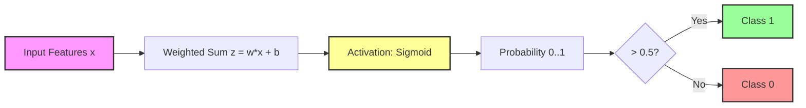

# Logistic Regression (Binary Classification)

## 1. Executive Summary
Despite its name, **Logistic Regression** is a **classification** algorithm, not a regression one. It is used to estimate the probability that an instance belongs to a particular class (e.g., "Spam" or "Not Spam"). If the estimated probability is greater than 50%, the model predicts that the instance belongs to that class (label 1), otherwise it predicts that it does not (label 0). This makes it a binary classifier. In this module, we implement Logistic Regression from scratch to separate two distinct clusters of data.

---

## 2. Historical Context
*   **Population Growth (1838)**: The **Logistic Function** was introduced by **Pierre François Verhulst** in 1838 to model population growth, correcting the exponential growth model of Malthus.
*   **Statistics (1958)**: The statistical regression model was developed by **David Cox** in 1958 and became the standard method for binary data analysis in fields like medicine. It introduced the concept of the **Sigmoid** activation function, which is foundational to modern Neural Networks.

---

## 3. Real-World Analogy
### The Club Bouncer
Imagine a bouncer at a club entrance. He looks at various features of a person (Age, Dress Code Score).
*   **The Score**: He calculates a weighted score based on these features ($z = \theta^T x$).
*   **The Probability**: He converts this score into a probability of being allowed in using a mental "S-curve" (Sigmoid). A very high score gives 99% probability, a very low score gives 1%.
*   **The Decision**: If the probability is > 50%, he opens the door (Class 1). If < 50%, he blocks entry (Class 0).

---

## 4. Mathematical Foundation

### A. The Sigmoid Activation
We need a function that squashes any output number into a range between 0 and 1 (probability).
$$ \sigma(z) = \frac{1}{1 + e^{-z}} $$

### B. The Model (Hypothesis)
$$ \hat{y} = h_\theta(x) = \sigma(\theta^T x) $$
$$ h_\theta(x) = \frac{1}{1 + e^{-(\theta_0 + \theta_1 x_1 + ...)}} $$

### C. The Cost Function (Log Loss)
We use **Log Loss** (Binary Cross-Entropy) because Mean Squared Error is non-convex for this model:
$$ J(\theta) = -\frac{1}{m} \sum_{i=1}^{m} [y^{(i)}\log(h_\theta(x^{(i)})) + (1-y^{(i)})\log(1-h_\theta(x^{(i)}))] $$

### D. Gradient Descent
The derivative of the Log Loss with respect to the Sigmoid function results in the same update rule as Linear Regression:
$$ \frac{\partial J}{\partial \theta_j} = \frac{1}{m} \sum_{i=1}^{m} (h_\theta(x^{(i)}) - y^{(i)}) x_j^{(i)} $$

---

## 5. Architecture Diagram



---

## 6. Implementation Details
The repository contains three implementations:

*   **Scratch (`00_scratch.py`)**:
    *   **`sigmoid`**: The activation function.
    *   **`compute_cost`**: Calculates Log Loss.
    *   **`gradient_descent`**: Optimizes parameters using the gradients derived from Log Loss.
    *   **`main`**: Generates two clusters of data and trains the model to separate them.
*   **TensorFlow (`01_tensorflow.py`)**:
    *   Uses `tf.keras.Sequential` with a `Dense(1)` layer and `activation='sigmoid'`.
    *   Uses `binary_crossentropy` loss.
*   **PyTorch (`02_pytorch.py`)**:
    *   Defines `LogisticRegressionModel` with `nn.Linear(2, 1)`.
    *   Uses `torch.sigmoid` in the forward pass and `nn.BCELoss` for training.

---

## 7. How to Run
Run the scripts from the terminal:

```bash
# Run the scratch implementation
python 00_scratch.py

# Run the TensorFlow implementation
python 01_tensorflow.py

# Run the PyTorch implementation
python 02_pytorch.py
```

---

## 8. Implementation Results

### A. The Decision Boundary
The line separates the two classes (Blue vs Red). The boundary represents where the probability is exactly 0.5.


### B. The Sigmoid Function
The function responsible for the "S" shape probability curve.


### C. Convergence
The Log Loss decreases over time as the model learns to separate the classes.


### D. Framework Comparison
| Implementation | Final Loss | Accuracy | Visualization |
| :--- | :--- | :--- | :--- |
| **Scratch** | ~0.10 | 100% | [View](assets/decision_boundary.png) |
| **TensorFlow** | ~0.10 | 100% |  |
| **PyTorch** | ~0.10 | 100% |  |

---

## 9. References
*   Cox, D. R. (1958). *The regression analysis of binary sequences*.
*   Verhulst, P. F. (1838). *Notice sur la loi que la population suit dans son accroissement*.
