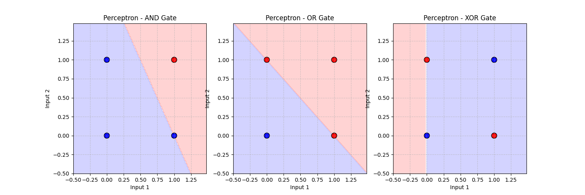

# The Perceptron

## 1. Teoria (Theory)

**Perceptron** to najprostszy model sztucznego neuronu, opracowany przez Franka Rosenblatta w 1957 roku. Jest to algorytm uczenia nadzorowanego dla klasyfikatorów binarnych.

### Budowa Neuronu

1.  **Wejścia ($x$)**: Wektor cech wejściowych.
2.  **Wagi ($w$)**: Wagi przypisane do każdego wejścia, określające jego ważność.
3.  **Bias ($b$)**: Przesunięcie, pozwalające na aktywację neuronu nawet przy zerowych wejściach.
4.  **Suma ważona ($z$)**:
    $$ z = w \cdot x + b = \sum_{i=1}^{n} w_i x_i + b $$
5.  **Funkcja Aktywacji ($\phi$)**: W klasycznym perceptronie jest to funkcja skokowa (Heaviside step function).
    $$ \hat{y} = \begin{cases} 1 & \text{jeśli } z \ge 0 \\ 0 & \text{w przeciwnym razie} \end{cases} $$

### Reguła Uczenia Perceptronu (Perceptron Learning Rule)

Dla każdego przykładu treningowego $(x, y)$:
1.  Oblicz predykcję $\hat{y}$.
2.  Zaktualizuj wagi i bias:
    $$ w = w + \alpha (y - \hat{y}) x $$
    $$ b = b + \alpha (y - \hat{y}) $$
    Gdzie $\alpha$ to współczynnik uczenia (learning rate).

### Problem XOR

Perceptron jest **klasyfikatorem liniowym**. Oznacza to, że może rozwiązywać tylko problemy, w których klasy są liniowo separowalne (np. bramki AND, OR). Nie jest w stanie rozwiązać problemu XOR (Exclusive OR), co wykazali Minsky i Papert w 1969 roku, co doprowadziło do pierwszej "zimy AI".

## 2. Implementacja (Implementation)

1.  **`00_scratch.py`**: Implementacja Perceptronu od zera. Uczymy go bramek logicznych AND, OR oraz próbujemy nauczyć XOR (co powinno się nie udać).
2.  **`01_pytorch.py`**: Implementacja pojedynczego neuronu w PyTorch (`nn.Linear` + `Sigmoid`).

### Wyniki

#### Scratch Implementation (Logic Gates Boundaries)


*Zauważ, że dla XOR (po prawej) perceptron nie jest w stanie znaleźć linii oddzielającej klasy.*

## 3. Uruchomienie

```bash
python 00_scratch.py
python 01_pytorch.py
```
