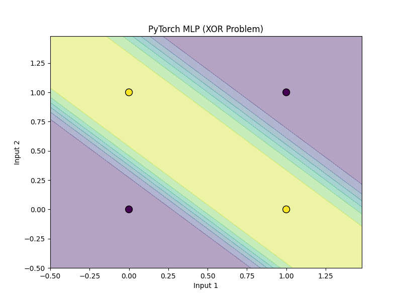

# Multi-Layer Perceptron (MLP) - Binary Classification

## 1. Teoria (Theory)

**Multi-Layer Perceptron (MLP)** to sieć neuronowa typu Feed-Forward, która składa się z co najmniej trzech warstw neuronów: wejściowej, ukrytej (jednej lub więcej) i wyjściowej.

### Rozwiązanie problemu XOR

Pojedynczy perceptron nie radzi sobie z problemami nieliniowo separowalnymi (jak XOR). Dodanie **warstwy ukrytej (hidden layer)** z nieliniową funkcją aktywacji pozwala sieci nauczyć się bardziej złożonych granic decyzyjnych.

### Architektura

Dla problemu XOR (2 wejścia, 1 wyjście):
*   **Warstwa Wejściowa**: 2 neurony ($x_1, x_2$).
*   **Warstwa Ukryta**: Np. 2-4 neurony. Każdy neuron uczy się innej liniowej granicy.
*   **Warstwa Wyjściowa**: 1 neuron (łączy wyniki z warstwy ukrytej).

### Wsteczna Propagacja (Backpropagation)

To algorytm uczenia sieci wielowarstwowych. Opiera się na **Regule Łańcuchowej (Chain Rule)** rachunku różniczkowego, aby obliczyć gradient funkcji kosztu względem każdej wagi w sieci.

$$ \frac{\partial L}{\partial w} = \frac{\partial L}{\partial \hat{y}} \cdot \frac{\partial \hat{y}}{\partial z} \cdot \frac{\partial z}{\partial w} $$

Gdzie:
*   $L$ - Funkcja kosztu (np. MSE lub Binary Cross Entropy).
*   $\hat{y}$ - Wyjście sieci (po aktywacji).
*   $z$ - Suma ważona (przed aktywacją).
*   $w$ - Waga.

## 2. Implementacja (Implementation)

1.  **`00_scratch.py`**: Implementacja MLP od zera z jedną warstwą ukrytą. Ręczna implementacja Forward Pass i Backpropagation (obliczanie pochodnych).
2.  **`01_pytorch.py`**: Implementacja przy użyciu `torch.nn.Sequential`, `nn.Linear` i `nn.ReLU`/`nn.Sigmoid`.

### Wyniki

#### Scratch Implementation (XOR Solution)


#### PyTorch Implementation (XOR Solution)


## 3. Uruchomienie

```bash
python 00_scratch.py
python 01_pytorch.py
```
