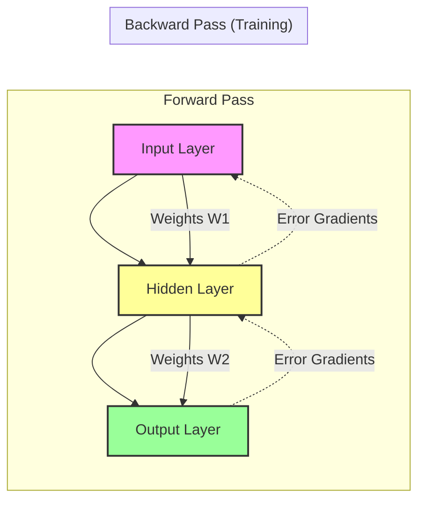
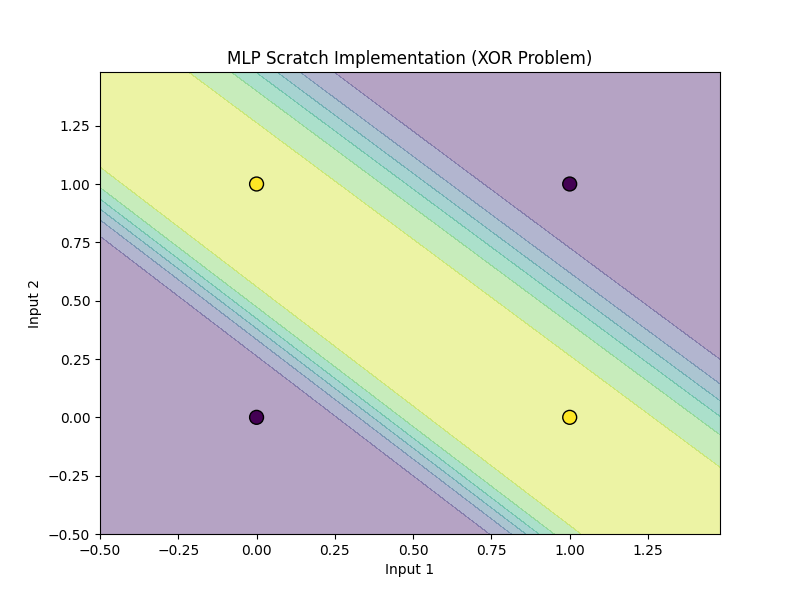

# Multi-Layer Perceptron (MLP) - Binary Classification

## 1. Executive Summary
The **Multi-Layer Perceptron (MLP)** is a Feed-Forward Neural Network that overcomes the limitations of the simple Perceptron. By adding one or more **hidden layers** with non-linear activation functions, MLPs can learn complex, non-linear decision boundaries, such as solving the XOR problem. This module demonstrates how to build a simple neural network to solve binary classification tasks that are not linearly separable.

## 2. Historical Context
After the "AI Winter" caused by the limitations of the Perceptron, the field was revitalized in **1986**. **David Rumelhart, Geoffrey Hinton, and Ronald Williams** published the seminal paper on **Backpropagation**. This algorithm provided a mathematically sound way to train multi-layer networks by efficiently calculating gradients, enabling the "Deep Learning" revolution decades later.

## 3. Real-World Analogy
Think of a **Corporate Hierarchy** or an **Assembly Line**.
*   **Input Layer**: Raw data (Junior employees reporting raw facts).
*   **Hidden Layers**: Middle Managers. They don't see the raw data directly but process the reports from juniors, synthesizing them into higher-level insights (features).
*   **Output Layer**: The CEO. Makes the final decision based on the synthesized reports from the managers, not the raw data.
*   **Backpropagation**: If the CEO makes a bad decision (error), the blame flows down the hierarchy, adjusting how each manager and employee operates to avoid the mistake next time.

## 4. Mathematical Foundation

### 4.1 Forward Pass
For a network with one hidden layer:
1.  **Hidden Layer**:
    $$ z^{[1]} = W^{[1]} x + b^{[1]} $$
    $$ a^{[1]} = \sigma(z^{[1]}) $$
2.  **Output Layer**:
    $$ z^{[2]} = W^{[2]} a^{[1]} + b^{[2]} $$
    $$ \hat{y} = a^{[2]} = \sigma(z^{[2]}) $$

### 4.2 Backpropagation
We use the **Chain Rule** of calculus to find how the error $L$ changes with respect to each weight $W$.

$$ \frac{\partial L}{\partial W} = \frac{\partial L}{\partial \hat{y}} \cdot \frac{\partial \hat{y}}{\partial z} \cdot \frac{\partial z}{\partial W} $$

Where:
*   $L$: Loss Function (e.g., MSE or Binary Cross Entropy).
*   $\hat{y}$: Network output (after activation).
*   $z$: Weighted sum (before activation).
*   $W$: Weight.

## 5. Architecture



## 6. Implementation Details
The repository contains two implementations:

### Scratch Implementation (`00_scratch.py`)
*   **`MLPScratch` Class**: Implements a 2-layer neural network (Input -> Hidden -> Output).
*   **`forward`**: Computes the activations layer by layer.
*   **`backward`**: Manually implements the chain rule to calculate gradients and update weights.
*   **`sigmoid` & `sigmoid_derivative`**: Used for activation and gradient calculation.

### PyTorch Implementation (`01_pytorch.py`)
*   **`XORModel` Class**: Uses `nn.Linear` for layers and `nn.Sigmoid` for activation.
*   **Autograd**: PyTorch automatically handles the backward pass (`loss.backward()`), removing the need to manually derive gradients.
*   **Optimizer**: Uses `optim.SGD` to update weights.

## 7. How to Run
Run the scripts from the terminal:

```bash
# Run the scratch implementation
python 00_scratch.py

# Run the PyTorch implementation
python 01_pytorch.py
```

## 8. Implementation Results

### Scratch Implementation (XOR Solution)
The scratch implementation successfully learns the non-linear XOR boundary.


### PyTorch Implementation (XOR Solution)
The PyTorch implementation achieves similar results with significantly less code.


## 9. References
*   Rumelhart, D. E., Hinton, G. E., & Williams, R. J. (1986). *Learning representations by back-propagating errors*. Nature, 323(6088), 533-536.
*   Goodfellow, I., Bengio, Y., & Courville, A. (2016). *Deep Learning*. MIT Press.
