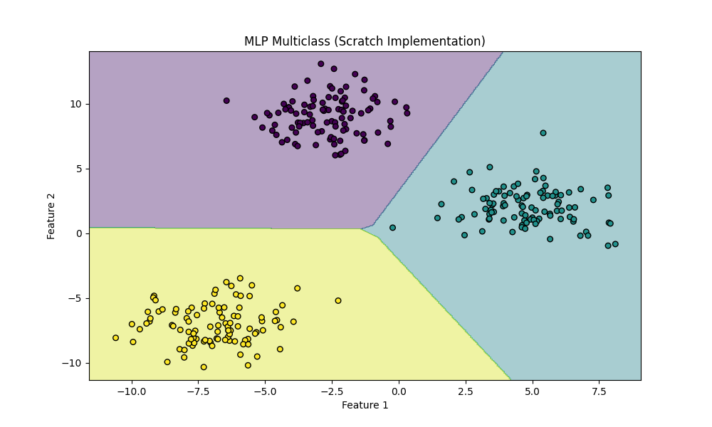
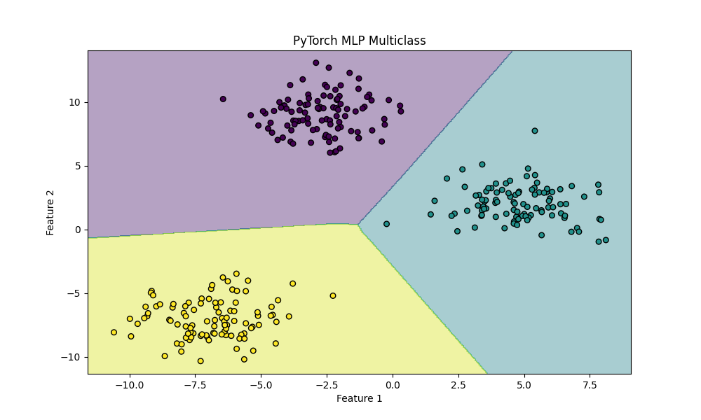

# Multi-Layer Perceptron (MLP) - Multiclass Classification

## 1. Executive Summary
**Multiclass classification** is the task of classifying instances into one of three or more classes. While binary classification answers "Yes/No", multiclass classification answers "Which one?". This requires specific changes to the network architecture, specifically the output layer (using **Softmax**) and the loss function (using **Categorical Cross-Entropy**).

## 2. Historical Context
The generalization of binary classification to multiple classes using the **Softmax** function (a generalization of the logistic function) became a standard component of neural network training in the 1990s. This enabled the application of neural networks to tasks like handwritten digit recognition (MNIST, 10 classes) and later ImageNet (1000 classes), which fueled the modern computer vision boom.

## 3. Real-World Analogy
Think of a **Mail Sorting Center**.
*   **Binary Classification**: A worker deciding if a letter is "Spam" or "Not Spam".
*   **Multiclass Classification**: A worker sorting letters into specific bins: "Bills", "Personal Letters", "Advertisements", "Magazines".
*   The worker (Network) looks at the envelope (Input), evaluates the features, and assigns a probability to each bin. The letter goes into the bin with the highest probability.

## 4. Mathematical Foundation

### 4.1 Softmax Activation
For the output layer, we need a probability distribution over $C$ classes. The Softmax function squashes a vector of real numbers (logits) into a vector of probabilities that sum to 1.

$$ \text{Softmax}(z_i) = \frac{e^{z_i}}{\sum_{j=1}^{C} e^{z_j}} $$

### 4.2 Categorical Cross-Entropy Loss
This loss function measures the dissimilarity between the predicted probability distribution and the true distribution (one-hot encoded).

$$ L = - \sum_{i=1}^{C} y_i \log(\hat{y}_i) $$

Where:
*   $y_i$: True label (1 for the correct class, 0 otherwise).
*   $\hat{y}_i$: Predicted probability for class $i$.

## 5. Architecture

```mermaid
graph LR
    Input[Input Layer] --> Hidden[Hidden Layer (ReLU)]
    Hidden --> Output[Output Layer (Softmax)]
    
    subgraph "Output Layer Details"
    Output --> Class1[Class 1 Prob]
    Output --> Class2[Class 2 Prob]
    Output --> Class3[Class 3 Prob]
    end
    
    style Input fill:#f9f,stroke:#333,stroke-width:2px
    style Output fill:#9f9,stroke:#333,stroke-width:2px
    style Hidden fill:#ff9,stroke:#333,stroke-width:2px
```

## 6. Implementation Details
The repository contains two implementations:

### Scratch Implementation (`00_scratch.py`)
*   **`MLP_Multiclass_Scratch` Class**:
    *   **`softmax`**: Implements the stable softmax function.
    *   **`backward`**: Implements the gradient of Cross-Entropy combined with Softmax, which simplifies to `predicted - actual`.
    *   **One-Hot Encoding**: Manually converts integer labels to one-hot vectors for training.

### PyTorch Implementation (`01_pytorch.py`)
*   **`MulticlassMLP` Class**:
    *   Uses `nn.Linear` layers.
    *   **Note**: Does NOT apply Softmax in `forward`.
*   **Loss Function**: Uses `nn.CrossEntropyLoss`. In PyTorch, this function combines `LogSoftmax` and `NLLLoss` (Negative Log Likelihood) in one step for numerical stability. Therefore, the network output should be raw logits, not probabilities.

## 7. How to Run
Run the scripts from the terminal:

```bash
# Run the scratch implementation
python 00_scratch.py

# Run the PyTorch implementation
python 01_pytorch.py
```

## 8. Implementation Results

### Scratch Implementation
The model successfully separates the three blobs of data.


### PyTorch Implementation
The PyTorch model achieves similar separation using the Adam optimizer.


## 9. References
*   Bridle, J. S. (1990). *Probabilistic Interpretation of Feedforward Classification Network Outputs*.
*   Bishop, C. M. (2006). *Pattern Recognition and Machine Learning*.
