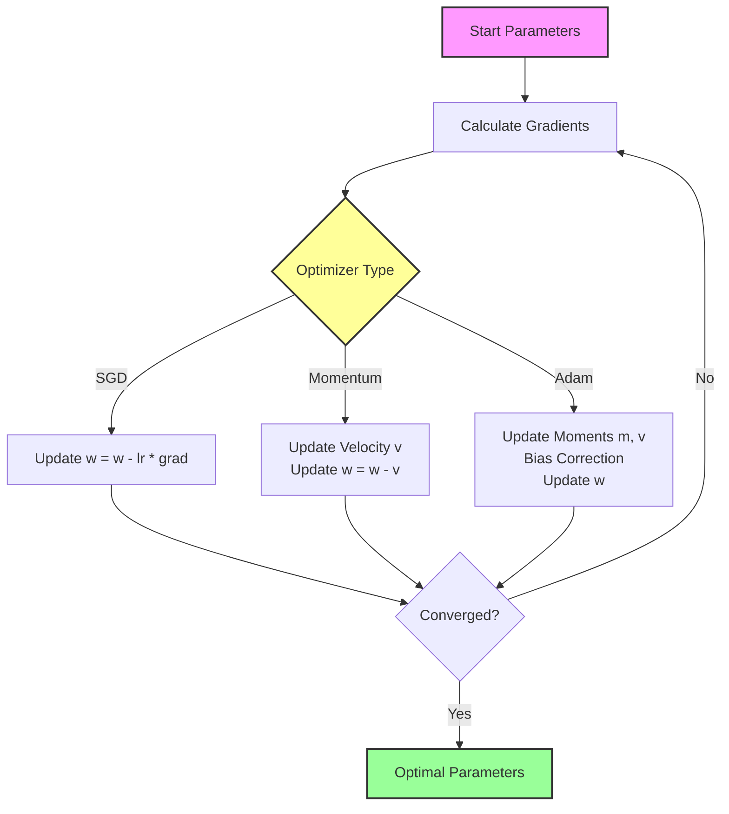
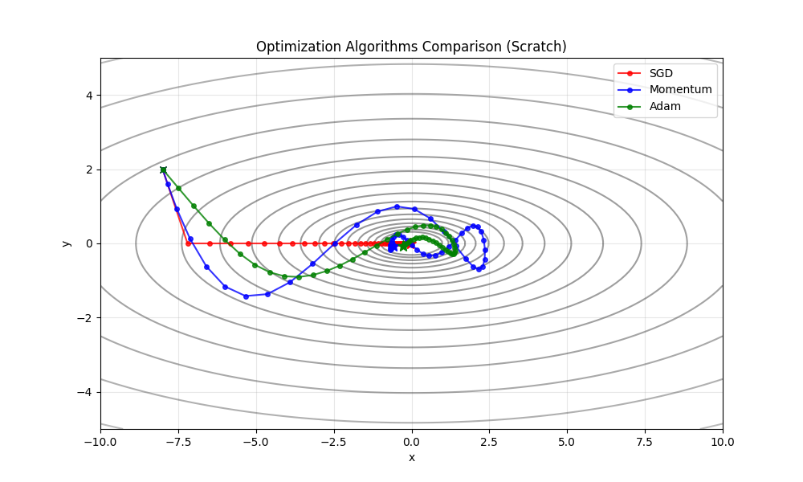

# Optimization Algorithms: SGD, Momentum, Adam

## 1. Executive Summary
Optimization algorithms are the engines of neural network training. Their goal is to find the set of parameters (weights) that minimize the Loss Function. While **Gradient Descent** is the foundation, modern deep learning relies on more advanced variants like **Momentum** and **Adam** to navigate complex loss landscapes efficiently and avoid getting stuck in local minima. This module compares the behavior of these three optimizers on a non-convex surface.

## 2. Historical Context
*   **Stochastic Gradient Descent (SGD)**: Roots trace back to **Robbins and Monro (1951)**. It became the standard for training neural networks in the 1980s with the popularization of Backpropagation.
*   **Momentum**: Introduced by **Boris Polyak** in **1964** to accelerate convergence in areas where the gradient is small or oscillates.
*   **Adam (Adaptive Moment Estimation)**: Proposed by **Diederik Kingma and Jimmy Ba** in **2014**. It combines the benefits of Momentum and RMSProp (adaptive learning rates) and is currently the default optimizer for most deep learning tasks.

## 3. Real-World Analogy
Imagine you are trying to get to the bottom of a dark valley (Loss Function).
*   **SGD**: You take a step, look at the slope, and take another step. If the ground is bumpy, you jitter around a lot (like a **drunk person walking**).
*   **Momentum**: You roll a **heavy ball** down the hill. It gains speed. If there's a small bump, the momentum carries it over. It doesn't turn sharply, smoothing out the path.
*   **Adam**: You are in a **smart rover**. It has separate speed controls for each wheel (parameter). If the terrain is steep in one direction (high gradient), it slows down to be careful. If it's flat (low gradient), it speeds up. It also remembers its previous speed (momentum).

## 4. Mathematical Foundation

### 4.1 Stochastic Gradient Descent (SGD)
Standard update rule based on the negative gradient:
$$ w_{t+1} = w_t - \eta \nabla J(w_t) $$

### 4.2 SGD with Momentum
We introduce velocity $v$ to accumulate past gradients:
$$ v_{t+1} = \gamma v_t + \eta \nabla J(w_t) $$
$$ w_{t+1} = w_t - v_{t+1} $$
*   $\gamma$: Momentum coefficient (usually 0.9).

### 4.3 Adam
Adam maintains moving averages of the gradients ($m$) and squared gradients ($v$).

$$ m_t = \beta_1 m_{t-1} + (1 - \beta_1) g_t $$
$$ v_t = \beta_2 v_{t-1} + (1 - \beta_2) g_t^2 $$

Bias correction:
$$ \hat{m}_t = \frac{m_t}{1 - \beta_1^t}, \quad \hat{v}_t = \frac{v_t}{1 - \beta_2^t} $$

Update:
$$ w_{t+1} = w_t - \frac{\eta}{\sqrt{\hat{v}_t} + \epsilon} \hat{m}_t $$

## 5. Architecture



## 6. Implementation Details
The repository contains two implementations:

### Scratch Implementation (`00_scratch.py`)
*   **Objective Function**: $f(x, y) = x^2 + 10y^2$. This is an "elongated bowl" where gradients are much steeper in the $y$ direction than $x$.
*   **`SGD` Class**: Basic gradient descent.
*   **`Momentum` Class**: Tracks velocity vector.
*   **`Adam` Class**: Tracks first and second moments with bias correction.

### PyTorch Implementation (`01_pytorch.py`)
*   Uses `torch.optim.SGD` (with and without momentum) and `torch.optim.Adam`.
*   Demonstrates how to use PyTorch's built-in optimizers on a custom function by manually computing gradients (`loss.backward()`) and calling `optimizer.step()`.

## 7. How to Run
Run the scripts from the terminal:

```bash
# Run the scratch implementation
python 00_scratch.py

# Run the PyTorch implementation
python 01_pytorch.py
```

## 8. Implementation Results

### Scratch Implementation
The visualization shows the path taken by each optimizer starting from $(-8, 2)$.



*   **SGD (Red)**: Oscillates heavily along the steep y-axis and moves slowly along the flat x-axis.
*   **Momentum (Blue)**: Dampens oscillations and accelerates towards the minimum, overshooting slightly but converging faster.
*   **Adam (Green)**: Takes a direct path, adjusting for the different scales of x and y gradients.

### PyTorch Implementation
The PyTorch implementation confirms the behavior observed in the scratch implementation.


## 9. References
*   Kingma, D. P., & Ba, J. (2014). *Adam: A Method for Stochastic Optimization*.
*   Polyak, B. T. (1964). *Some methods of speeding up the convergence of iteration methods*.
*   Robbins, H., & Monro, S. (1951). *A Stochastic Approximation Method*.
