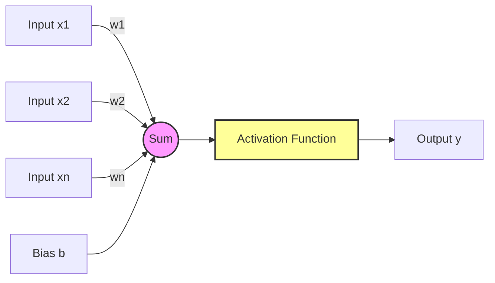

# The Perceptron

## 1. Executive Summary
The **Perceptron** is the fundamental building block of deep learning. It is the simplest model of a biological neuron, acting as a linear binary classifier. While limited in its capabilities (it can only solve linearly separable problems), understanding the Perceptron is essential for understanding how modern massive neural networks function. It takes multiple inputs, weights them, sums them up, adds a bias, and passes the result through an activation function to produce an output.

## 2. Historical Context
The Perceptron was invented by **Frank Rosenblatt** in **1957** at the Cornell Aeronautical Laboratory. He built the **Mark I Perceptron**, a physical machine designed for image recognition, which created a wave of optimism for AI. However, in **1969**, Marvin Minsky and Seymour Papert published the book *"Perceptrons"*, mathematically proving that a single-layer perceptron could not solve the **XOR problem**. This revelation cooled funding and interest in neural networks, leading to the first "AI Winter".

## 3. Real-World Analogy
Think of a **Thermostat** or a simple voting system.
*   **Inputs**: Several sensors (Temperature, Humidity, User Presence).
*   **Weights**: How important is each sensor? (Temperature is very important, Humidity less so).
*   **Bias**: The threshold setting (e.g., "Turn on if sum > 20").
*   **Activation**: If the weighted sum of inputs exceeds the threshold, the heater turns **ON** (1); otherwise, it stays **OFF** (0).

## 4. Mathematical Foundation

### 4.1 The Model
The perceptron computes a weighted sum of its inputs and applies a step function.

$$ z = \sum_{i=1}^{n} w_i x_i + b = w \cdot x + b $$

### 4.2 Activation Function
The original perceptron uses the **Heaviside Step Function**:

$$ \hat{y} = \phi(z) = \begin{cases} 1 & \text{if } z \ge 0 \\ 0 & \text{otherwise} \end{cases} $$

### 4.3 Learning Rule
The weights are updated based on the error:
$$ w_i := w_i + \Delta w_i $$
$$ \Delta w_i = \eta (y - \hat{y}) x_i $$
*   $\eta$: Learning rate.
*   $y$: True label.
*   $\hat{y}$: Predicted label.

## 5. Architecture



## 6. Implementation Details
The repository contains two implementations:

### Scratch Implementation (`00_scratch.py`)
*   **`Perceptron` Class**: Implements the mathematical model.
*   **`fit`**: Updates weights using the Perceptron Learning Rule.
*   **`predict`**: Computes the dot product and applies the step function.
*   **Tests**: Trains on AND, OR, and XOR gates to demonstrate capabilities and limitations.

### PyTorch Implementation (`01_pytorch.py`)
*   **`PyTorchPerceptron` Class**: Uses `nn.Linear(2, 1)` to represent the weighted sum and bias.
*   **Activation**: Uses `nn.Sigmoid()` instead of a step function to allow for gradient-based optimization (Gradient Descent), which is standard in modern frameworks.
*   **Training**: Uses `BCELoss` (Binary Cross Entropy) and `SGD` optimizer.

## 7. How to Run
Run the scripts from the terminal:

```bash
# Run the scratch implementation
python 00_scratch.py

# Run the PyTorch implementation
python 01_pytorch.py
```

## 8. Implementation Results

### Scratch Implementation (Logic Gates)
The Perceptron successfully learns the linear boundaries for AND and OR gates but fails for XOR because it is not linearly separable.


### PyTorch Implementation
The PyTorch model (using Sigmoid) behaves similarly, creating a smooth decision boundary. It also fails to solve XOR with a single neuron.


## 9. References
*   Rosenblatt, F. (1958). *The Perceptron: A Probabilistic Model for Information Storage and Organization in the Brain*.
*   Minsky, M., & Papert, S. (1969). *Perceptrons: An Introduction to Computational Geometry*.
