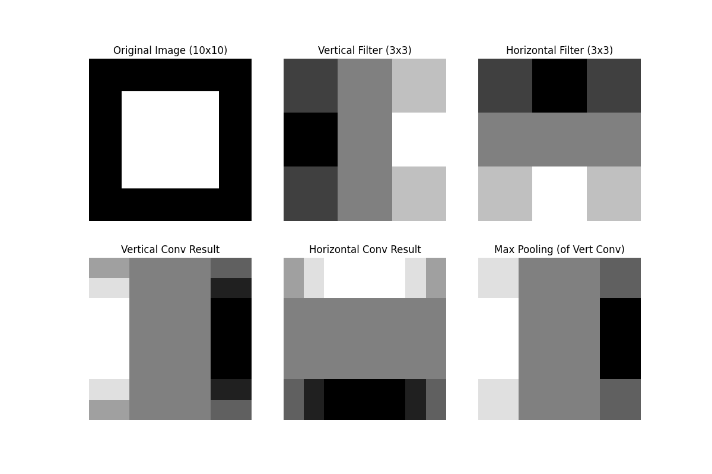
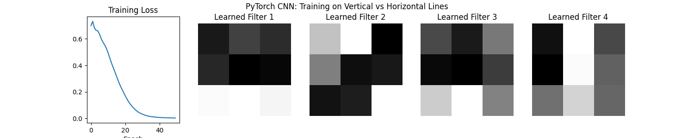

# Convolutional Neural Networks (CNN)

## 1. Teoria (Theory)

**Konwolucyjne Sieci Neuronowe (CNN)** to fundament współczesnego widzenia komputerowego. Zamiast przetwarzać obraz jako płaski wektor (jak w MLP), CNN zachowuje strukturę przestrzenną obrazu (wysokość, szerokość, kanały).

### Kluczowe operacje:

1.  **Konwolucja (Convolution)**:
    *   Przesuwanie małego okna (filtra/jądra, ang. *kernel*) po obrazie.
    *   W każdym kroku wykonujemy iloczyn skalarny między filtrem a fragmentem obrazu.
    *   **Cel**: Wykrywanie lokalnych cech (krawędzie, rogi, tekstury).
    *   Wzór (dla 2D):
        $$ (I * K)(i, j) = \sum_m \sum_n I(i+m, j+n) K(m, n) $$

2.  **Pooling (Warstwa Łącząca)**:
    *   Zmniejszanie wymiarów map cech (downsampling).
    *   **Max Pooling**: Wybiera maksymalną wartość z okna (najbardziej znaczącą cechę).
    *   **Cel**: Redukcja obliczeń i zapewnienie inwariantności na małe przesunięcia.

3.  **Flattening**:
    *   Spłaszczenie map cech do wektora przed podaniem ich do warstw gęstych (Fully Connected) w celu klasyfikacji.

### Parametry:
*   **Kernel Size**: Rozmiar filtra (np. 3x3).
*   **Stride**: Krok przesunięcia filtra (zazwyczaj 1 lub 2).
*   **Padding**: Dodawanie zer wokół obrazu, aby zachować jego wymiary po konwolucji.

## 2. Implementacja (Implementation)

1.  **`00_scratch.py`**: Demonstracja operacji "Forward Pass".
    *   Tworzymy syntetyczny obraz.
    *   Ręcznie implementujemy funkcję `convolve2d` i `max_pool`.
    *   Aplikujemy filtry wykrywające krawędzie (Sobel).
    *   **Cel**: Zrozumienie, jak matematycznie działa splot.

2.  **`01_pytorch.py`**: Pełny trening prostej sieci CNN.
    *   Zbiór danych: Syntetyczne obrazy linii pionowych i poziomych.
    *   Sieć uczy się rozróżniać te wzorce.
    *   Wizualizujemy wagi wyuczonych filtrów (powinny przypominać detektory krawędzi).

### Wyniki

#### Scratch Convolution (Edge Detection)


#### PyTorch Learned Filters


## 3. Uruchomienie

```bash
python 00_scratch.py
python 01_pytorch.py
```
