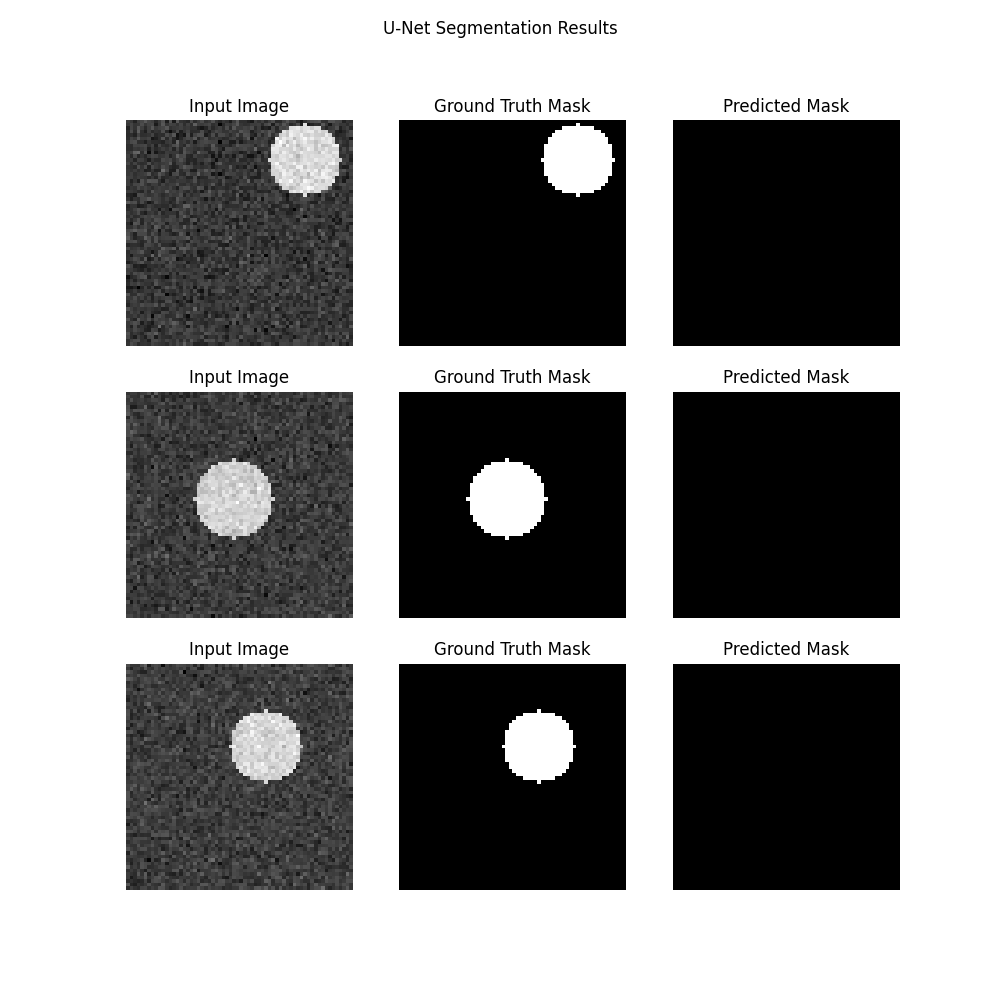

# U-Net (Semantic Segmentation)

## 1. Teoria (Theory)

**U-Net** to architektura konwolucyjnej sieci neuronowej zaprojektowana do segmentacji obrazów (przypisywania etykiety każdemu pikselowi). Została pierwotnie stworzona do segmentacji obrazów biomedycznych.

### Architektura "U"

Sieć składa się z dwóch głównych części, tworzących kształt litery "U":

1.  **Ścieżka Zwężająca (Encoder / Contracting Path)**:
    *   Typowa sieć CNN (Conv -> ReLU -> MaxPool).
    *   Zmniejsza wymiary przestrzenne (H, W), ale zwiększa liczbę kanałów (cech).
    *   Wydobywa kontekst i cechy wysokiego poziomu ("co" jest na obrazie).

2.  **Ścieżka Rozszerzająca (Decoder / Expanding Path)**:
    *   Operacje Up-Convolution (Transposed Convolution) lub Upsampling.
    *   Zwiększa wymiary przestrzenne z powrotem do oryginalnego rozmiaru.
    *   Precyzuje lokalizację ("gdzie" to jest).

### Połączenia Skrótowe (Skip Connections)

Kluczowy element U-Net. Łączymy (konkatenujemy) mapy cech z Encodera z odpowiednimi mapami w Decoderze.
*   Pozwala to Decoderowi odzyskać utracone informacje przestrzenne (szczegóły) z wcześniejszych warstw.
*   Umożliwia precyzyjną segmentację krawędzi.

## 2. Implementacja (Implementation)

1.  **`00_scratch.py`**: Symulacja "Forward Pass" w czystym NumPy.
    *   Pokazuje, jak zmieniają się wymiary tensora (Shapes) w trakcie przechodzenia przez sieć.
    *   Demonstruje mechanizm Skip Connections (konkatenację).

2.  **`01_pytorch.py`**: Pełny trening uproszczonego U-Netu.
    *   **Dane**: Syntetyczne obrazy z losowymi kołami.
    *   **Zadanie**: Wygenerować maskę binarną (gdzie jest koło, a gdzie tło).
    *   **Loss**: BCEWithLogitsLoss (Binary Cross Entropy dla każdego piksela).

### Wyniki

#### PyTorch Segmentation Results


*(Obraz wejściowy | Prawdziwa Maska | Przewidziana Maska)*

## 3. Uruchomienie

```bash
python 00_scratch.py
python 01_pytorch.py
```
