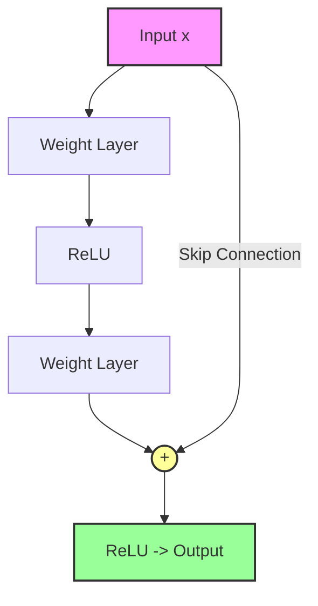
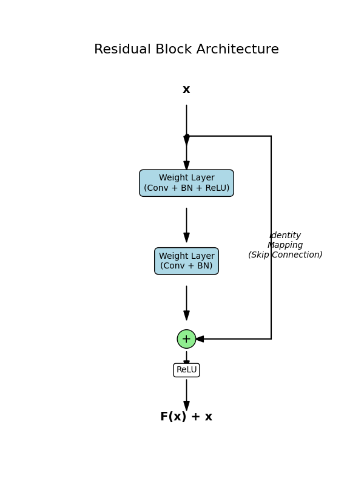

# ResNet (Residual Networks)

## 1. Executive Summary
**ResNet (Residual Network)** is a deep convolutional neural network architecture that revolutionized deep learning by enabling the training of extremely deep networks (hundreds or thousands of layers). It introduced the concept of **Residual Learning** using skip connections, which allow gradients to flow more easily during backpropagation, effectively solving the vanishing gradient problem.

## 2. Historical Context
Introduced by **Kaiming He, Xiangyu Zhang, Shaoqing Ren, and Jian Sun** (Microsoft Research) in **2015**. ResNet won the ILSVRC 2015 (ImageNet) competition with an error rate of 3.57%, beating human performance. Before ResNet, training networks deeper than ~20 layers was difficult due to degradation; ResNet successfully trained networks with 152 layers and even 1001 layers.

## 3. Real-World Analogy
Imagine a **Telephone Game** (Chinese Whispers).
*   **Standard Network**: You whisper a message to the next person, who whispers it to the next. By the time it reaches the 100th person, the message is completely distorted (Vanishing Gradient).
*   **ResNet**: Each person passes the message to the next person *but also writes it down on a piece of paper* and passes it to the person after the next one (Skip Connection). Even if the whisper is distorted, the written note ensures the original information is preserved and can be added back to the conversation.

## 4. Mathematical Foundation

### 4.1 The Degradation Problem
Ideally, adding more layers should not increase training error. A deeper model should be able to learn the identity function $H(x) = x$ if that is optimal. However, in practice, solvers struggle to approximate identity mappings with multiple non-linear layers.

### 4.2 Residual Learning
Instead of trying to learn the underlying mapping $H(x)$ directly, ResNet tries to learn the **residual function**:
$$ F(x) = H(x) - x $$
The original mapping is then recast as:
$$ H(x) = F(x) + x $$

*   **Hypothesis**: It is easier to optimize the residual mapping $F(x)$ to be zero (driving weights to zero) than to optimize $H(x)$ to be the identity matrix.
*   **Backpropagation**: The gradient of $x$ flows directly through the skip connection: $\frac{\partial H}{\partial x} = \frac{\partial F}{\partial x} + 1$. The "+1" term ensures the gradient doesn't vanish.

## 5. Architecture

### Residual Block
The fundamental building block.



### Bottleneck Architecture (ResNet-50/101/152)
To reduce computational cost for deeper networks, a "Bottleneck" design is used:
1.  $1 \times 1$ Conv (Reduces dimensions, e.g., 256 -> 64)
2.  $3 \times 3$ Conv (Processes features, 64 -> 64)
3.  $1 \times 1$ Conv (Restores dimensions, 64 -> 256)

## 6. Implementation Details
The repository contains:

### PyTorch Implementation (`00_model.py`)
*   **`Block` Class**: Implements the Bottleneck Residual Block.
    *   Handles the $1 \times 1$, $3 \times 3$, $1 \times 1$ convolution sequence.
    *   Manages the skip connection, including downsampling if dimensions change (stride > 1).
*   **`ResNet` Class**: Assembles the blocks into the full architecture (Stages 1-4).
*   **Factory Functions**: `ResNet50`, `ResNet101`, `ResNet152` for easy instantiation.

### Visualization Script (`01_visualize_block.py`)
*   Generates a diagram of the Residual Block using Matplotlib.

## 7. How to Run
Run the script to verify the model architecture:

```bash
python 00_model.py
```

## 8. Implementation Results

### Residual Block Diagram
The skip connection allows the input $x$ to bypass the weight layers and be added directly to the output.



### Model Verification
Running `00_model.py` confirms that the input tensor shape `(2, 3, 224, 224)` is correctly processed into the output class scores `(2, 1000)`.

## 9. References
*   He, K., Zhang, X., Ren, S., & Sun, J. (2016). *Deep Residual Learning for Image Recognition*. CVPR.
*   He, K., Zhang, X., Ren, S., & Sun, J. (2016). *Identity Mappings in Deep Residual Networks*. ECCV.
