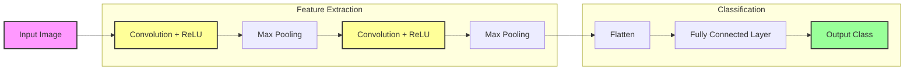

# Convolutional Neural Networks (CNN)

## 1. Executive Summary
**Convolutional Neural Networks (CNNs)** are the foundation of modern Computer Vision. Unlike Multi-Layer Perceptrons (MLPs) that flatten images into a single vector (losing spatial information), CNNs process images as 2D or 3D grids. They use learnable filters to automatically detect features like edges, textures, and shapes, preserving the spatial hierarchy of the data.

## 2. Historical Context
CNNs were inspired by biological research on the visual cortex by **Hubel and Wiesel** (1959), who discovered simple and complex cells. **Yann LeCun** pioneered the practical application of CNNs with **LeNet-5** in **1998**, used for reading zip codes on mail. However, the true revolution arrived in **2012** with **AlexNet**, which dominated the ImageNet competition, proving that deep CNNs could outperform traditional computer vision techniques by a large margin.

## 3. Real-World Analogy
Think of **scanning a document with a magnifying glass**.
*   **Convolution**: You don't read the whole page at once. You slide a small window (the magnifying glass/kernel) over the text, focusing on one small area at a time.
*   **Feature Detection**: In that small window, you recognize simple patterns (lines, curves).
*   **Hierarchy**: As you process more, your brain combines these lines into letters, letters into words, and words into sentences. CNNs work similarly: early layers see edges, deeper layers see objects (eyes, wheels, faces).

## 4. Mathematical Foundation

### 4.1 Convolution Operation
The core operation is the discrete convolution (technically cross-correlation) of an input image $I$ with a kernel $K$.
$$ (I * K)(i, j) = \sum_m \sum_n I(i+m, j+n) K(m, n) $$
Where $(i, j)$ is the position in the output feature map, and $(m, n)$ iterates over the kernel dimensions.

### 4.2 Pooling
Pooling reduces the spatial dimensions $(H, W)$ of the input volume. Max pooling is the most common:
$$ O(i, j) = \max_{(m, n) \in \text{window}} I(i \cdot s + m, j \cdot s + n) $$
Where $s$ is the stride.

### 4.3 Output Dimensions
For an input of size $W$, kernel size $K$, padding $P$, and stride $S$:
$$ W_{out} = \frac{W - K + 2P}{S} + 1 $$

## 5. Architecture



## 6. Implementation Details
The repository contains two implementations:

### Scratch Implementation (`00_scratch.py`)
*   **`convolve2d`**: Manually implements the sliding window operation using nested loops.
*   **`max_pooling`**: Manually implements downsampling.
*   **Edge Detection**: Demonstrates how fixed kernels (Sobel filters) can detect vertical and horizontal edges without training.

### PyTorch Implementation (`01_pytorch.py`)
*   **`SimpleCNN` Class**: Uses `nn.Conv2d` and `nn.MaxPool2d`.
*   **Training**: The network is trained on a synthetic dataset of vertical and horizontal lines.
*   **Learned Filters**: Visualizes the weights of the first convolutional layer to show how the network learns to act like an edge detector.

## 7. How to Run
Run the scripts from the terminal:

```bash
# Run the scratch implementation
python 00_scratch.py

# Run the PyTorch implementation
python 01_pytorch.py
```

## 8. Implementation Results

### Scratch Convolution (Edge Detection)
Applying Sobel filters manually highlights the edges in the image.


### PyTorch Learned Filters
After training, the filters in the first layer often resemble edge detectors (bright/dark bars), showing that the network "discovered" edge detection on its own.


## 9. References
*   LeCun, Y., et al. (1998). *Gradient-based learning applied to document recognition*.
*   Krizhevsky, A., Sutskever, I., & Hinton, G. E. (2012). *ImageNet Classification with Deep Convolutional Neural Networks*.
*   Goodfellow, I., Bengio, Y., & Courville, A. (2016). *Deep Learning*. MIT Press.
