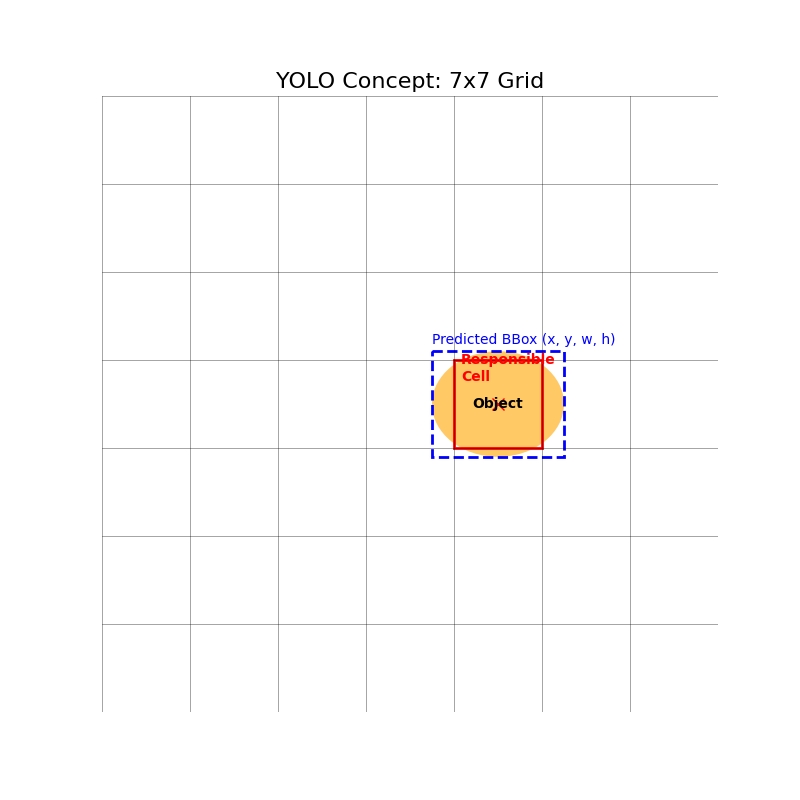

# YOLO v1 (You Only Look Once)

## 1. Executive Summary
**YOLO (You Only Look Once)** is a unified architecture for real-time object detection. Unlike prior systems (like R-CNN) that repurpose classifiers to perform detection by running them on thousands of region proposals, YOLO frames object detection as a single **regression problem**. It predicts bounding boxes and class probabilities directly from full images in one evaluation, making it extremely fast (45 fps on a Titan X GPU in 2015).

## 2. Historical Context
Proposed by **Joseph Redmon, Santosh Divvala, Ross Girshick, and Ali Farhadi** in **2015**. Before YOLO, the state-of-the-art was **Faster R-CNN**, which was accurate but slow due to its two-stage nature (Region Proposal Network + Classifier). YOLO sacrificed a small amount of accuracy (especially on small objects) for a massive gain in speed, enabling real-time applications like video analysis and autonomous driving.

## 3. Real-World Analogy
*   **R-CNN (Old Way)**: Like a security guard checking every single person in a crowd individually to see if they are on a watchlist. Very thorough, but very slow.
*   **YOLO (New Way)**: Like a security guard glancing at the entire crowd at once and immediately pointing out "There's a person there, a bag there, and a car there". It's a holistic, instant assessment.

## 4. Mathematical Foundation

### 4.1 The Grid System
The input image is divided into an $S \times S$ grid. If the center of an object falls into a grid cell, that grid cell is responsible for detecting that object.

### 4.2 Output Tensor
Each grid cell predicts $B$ bounding boxes and $C$ conditional class probabilities.
The output tensor size is $S \times S \times (B \times 5 + C)$.
For PASCAL VOC ($S=7, B=2, C=20$), the output is $7 \times 7 \times 30$.

Each bounding box consists of 5 predictions: $x, y, w, h, \text{confidence}$.
*   $(x, y)$: Center of the box relative to the bounds of the grid cell.
*   $(w, h)$: Width and height relative to the whole image.
*   $\text{confidence}$: $\text{Pr(Object)} \times \text{IOU}_{\text{pred}}^{\text{truth}}$.

### 4.3 Loss Function
A multi-part loss function (Sum-Squared Error) that combines:
1.  **Coordinate Loss**: Penalizes errors in box position/size. (Weighted higher, $\lambda_{coord}=5$).
2.  **Object Loss**: Penalizes confidence error if an object is present.
3.  **No-Object Loss**: Penalizes confidence error if NO object is present. (Weighted lower, $\lambda_{noobj}=0.5$).
4.  **Class Loss**: Penalizes classification errors.

## 5. Architecture

```mermaid
graph LR
    Input[Input Image 448x448] --> ConvLayers[Convolutional Layers (Darknet)]
    ConvLayers --> FC[Fully Connected Layers]
    FC --> Reshape[Reshape]
    Reshape --> Output[Output Tensor 7x7x30]
    
    subgraph "Output Tensor (per cell)"
    Output --> Class[Class Probs (20)]
    Output --> Box1[BBox 1 (x,y,w,h,c)]
    Output --> Box2[BBox 2 (x,y,w,h,c)]
    end
    
    style Input fill:#f9f,stroke:#333,stroke-width:2px
    style Output fill:#9f9,stroke:#333,stroke-width:2px
    style ConvLayers fill:#ff9,stroke:#333,stroke-width:2px
```

## 6. Implementation Details
The repository contains:

### PyTorch Implementation (`00_model.py`)
*   **`Yolov1` Class**: Implements the architecture inspired by GoogLeNet (24 convolutional layers followed by 2 fully connected layers).
*   **`YoloLoss` Class**: Implements the complex custom loss function described in the paper.
*   **`CNNBlock`**: Helper class for Conv+BatchNorm+LeakyReLU blocks.

### Visualization Script (`01_visualize_grid.py`)
*   Generates a diagram showing the $S \times S$ grid and how a specific cell is responsible for an object centered within it.

## 7. How to Run
Run the script to verify the model architecture:

```bash
python 00_model.py
```

## 8. Implementation Results

### The Grid Concept
The image is divided into a 7x7 grid. The red cell is responsible for detecting the object because the object's center (red x) falls inside it.



### Model Verification
Running `00_model.py` confirms that the input tensor shape `(2, 3, 448, 448)` is correctly processed into the output tensor `(2, 1470)`, which corresponds to $7 \times 7 \times 30$.

## 9. References
*   Redmon, J., Divvala, S., Girshick, R., & Farhadi, A. (2016). *You Only Look Once: Unified, Real-Time Object Detection*. CVPR.
