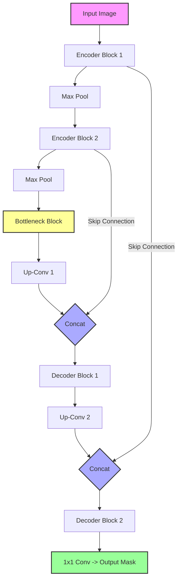

# U-Net (Semantic Segmentation)

## 1. Executive Summary
**U-Net** is a specialized Convolutional Neural Network architecture designed for **Semantic Segmentation**—the task of assigning a class label to every single pixel in an image (e.g., "this pixel is a car", "this pixel is the road"). It is famous for its symmetric "U" shape, consisting of a contracting path (encoder) to capture context and an expanding path (decoder) to enable precise localization.

## 2. Historical Context
U-Net was introduced by **Olaf Ronneberger, Philipp Fischer, and Thomas Brox** in **2015** at the University of Freiburg. It was originally designed for **biomedical image segmentation** (e.g., detecting cells in microscopy images) where labeled data is scarce. Its ability to work with few training images and produce precise segmentations made it a standard in the field and later adopted for general computer vision tasks like satellite imagery analysis and autonomous driving.

## 3. Real-World Analogy
Think of an **Art Restoration Expert**.
*   **Encoder (Analysis)**: The expert studies the painting, understanding the high-level composition ("This is a portrait of a woman"). They might squint or step back to see the big picture, losing some fine details.
*   **Decoder (Restoration)**: The expert starts repainting the damaged areas. They need to fill in the details.
*   **Skip Connections**: To do this accurately, the expert constantly refers back to the original high-resolution sketches or photos (features from the encoder) to ensure the edges of the eyes or the texture of the hair are placed exactly right. Without these "peeks" at the original details, the restoration would be blurry.

## 4. Mathematical Foundation

### 4.1 Encoder (Contracting Path)
Standard CNN operations to extract features and reduce spatial dimensions.
$$ x_{l+1} = \text{MaxPool}(\sigma(\text{Conv}(x_l))) $$

### 4.2 Decoder (Expanding Path)
Uses **Transposed Convolution** (or Up-Sampling) to increase spatial dimensions.
$$ x_{up} = \text{UpConv}(x_{bottleneck}) $$

### 4.3 Skip Connections
The key innovation. Features from the encoder ($x_{enc}$) are concatenated with the upsampled features from the decoder ($x_{up}$) along the channel dimension.
$$ x_{combined} = \text{Concat}(x_{up}, \text{Crop}(x_{enc})) $$
This preserves high-frequency details (edges) lost during pooling.

### 4.4 Pixel-wise Loss
The loss is calculated for every pixel. For binary segmentation:
$$ L = - \sum_{i,j} [y_{i,j} \log(\hat{y}_{i,j}) + (1-y_{i,j}) \log(1-\hat{y}_{i,j})] $$

## 5. Architecture



## 6. Implementation Details
The repository contains two implementations:

### Scratch Simulation (`00_scratch.py`)
*   Simulates the **Forward Pass** using NumPy to demonstrate tensor shape transformations.
*   Prints the shape of tensors at each stage (Encoder, Bottleneck, Decoder) to verify the "U" structure and concatenation logic.

### PyTorch Implementation (`01_pytorch.py`)
*   **`SimpleUNet` Class**: A simplified version of U-Net.
    *   Uses `nn.ConvTranspose2d` for upsampling.
    *   Uses `torch.cat` for skip connections.
*   **Training**: Trains on a synthetic dataset of noisy circles to learn binary segmentation.
*   **Loss**: Uses `BCEWithLogitsLoss` for numerical stability.

## 7. How to Run
Run the scripts from the terminal:

```bash
# Run the scratch simulation
python 00_scratch.py

# Run the PyTorch implementation
python 01_pytorch.py
```

## 8. Implementation Results

### PyTorch Segmentation Results
The model successfully learns to segment the circles from the noisy background.


*(Left: Input Image | Center: Ground Truth Mask | Right: Predicted Mask)*

## 9. References
*   Ronneberger, O., Fischer, P., & Brox, T. (2015). *U-Net: Convolutional Networks for Biomedical Image Segmentation*. MICCAI.
