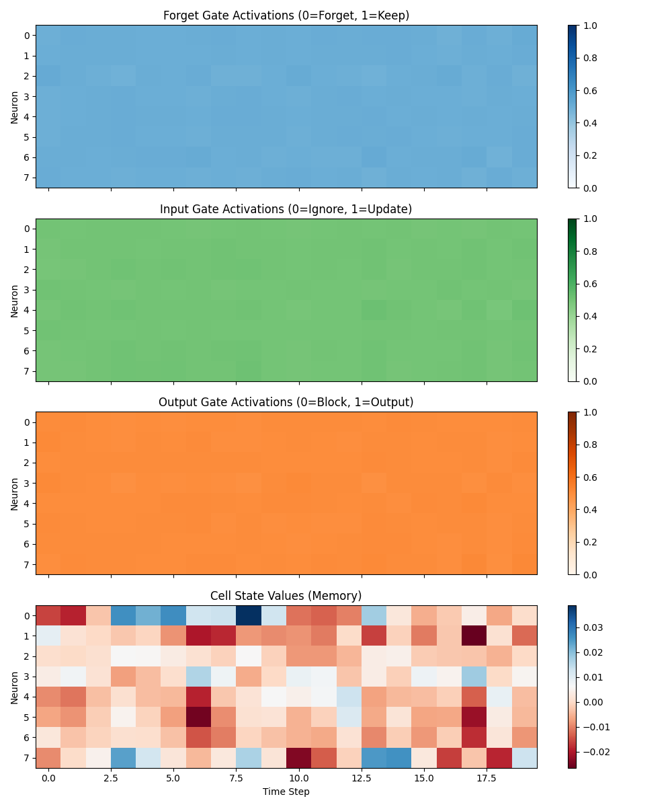
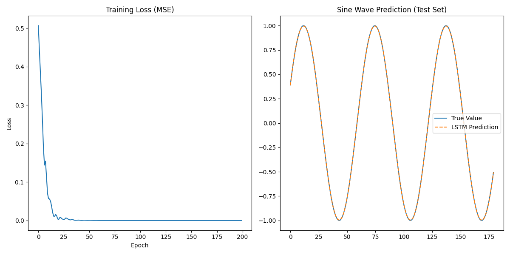

# Long Short-Term Memory (LSTM)

## 1. Overview
Long Short-Term Memory (LSTM) networks are a special kind of RNN, capable of learning long-term dependencies. They were explicitly designed to avoid the long-term dependency problem (vanishing gradients) that plagues standard RNNs.

### Key Concepts
*   **Cell State ($C_t$):** The "conveyor belt" that runs straight down the entire chain, with only minor linear interactions. It's very easy for information to flow along it unchanged.
*   **Gates:** Mechanisms that regulate the flow of information. They are composed of a sigmoid neural net layer and a pointwise multiplication operation.
    *   **Forget Gate:** Decides what information to throw away from the cell state.
    *   **Input Gate:** Decides what new information to store in the cell state.
    *   **Output Gate:** Decides what to output based on the cell state.

## 2. Historical Context
*   **Invention (1997):** Introduced by Sepp Hochreiter and Jürgen Schmidhuber in their seminal paper "Long Short-Term Memory".
*   **Impact:** LSTMs revolutionized fields like speech recognition, machine translation, and time series forecasting, becoming the dominant sequence model until the rise of Transformers in 2017.
*   **Forget Gate (2000):** The "forget gate" was actually added later by Gers, Schmidhuber, and Cummins (2000), which allowed the LSTM to reset its own state.

## 3. Real-World Analogy
**The News Editor:**
Imagine an editor managing a breaking news story (the Cell State).
1.  **Forget Gate:** As new reports come in, the editor decides what old information is no longer relevant (e.g., "The suspect is in a red car" -> Forget this if the car was found empty).
2.  **Input Gate:** The editor decides what new information is important enough to add to the story (e.g., "Suspect switched to a blue van" -> Add this).
3.  **Output Gate:** When a reporter asks for an update, the editor doesn't read the whole file. They summarize the current situation based on the most relevant parts of the story (e.g., "Current status: Suspect in blue van, heading north").

## 4. Mathematical Foundation
The LSTM cell has four interacting layers:

1.  **Forget Gate:**
    $$ f_t = \sigma(W_f \cdot [h_{t-1}, x_t] + b_f) $$
2.  **Input Gate:**
    $$ i_t = \sigma(W_i \cdot [h_{t-1}, x_t] + b_i) $$
    $$ \tilde{C}_t = \tanh(W_C \cdot [h_{t-1}, x_t] + b_C) $$
3.  **Cell State Update:**
    $$ C_t = f_t * C_{t-1} + i_t * \tilde{C}_t $$
4.  **Output Gate:**
    $$ o_t = \sigma(W_o \cdot [h_{t-1}, x_t] + b_o) $$
    $$ h_t = o_t * \tanh(C_t) $$

## 5. Implementation Details
*   **`00_scratch.py`**: A NumPy implementation of a single LSTM cell. It explicitly calculates each gate (Forget, Input, Output) and updates the Cell State and Hidden State. It includes a visualization of gate activations over time.
*   **`01_pytorch.py`**: A PyTorch implementation using `nn.LSTM` to predict a sine wave. This demonstrates how LSTMs are used for time-series forecasting.

## 6. Advantages over Vanilla RNN
*   **Gradient Flow:** The additive nature of the cell state update ($C_t = f_t * C_{t-1} + ...$) allows gradients to flow backwards through time without vanishing as quickly as in the multiplicative structure of standard RNNs.
*   **Long-Term Memory:** Can bridge time lags of more than 1000 steps (theoretically).

## 7. Results

### Gate Activations (Scratch)

*Visualization of the Forget, Input, and Output gates over time steps. Darker colors indicate higher activation (closer to 1).*

### Sine Wave Prediction (PyTorch)

*The LSTM successfully learns to predict the next value in a sine wave sequence.*

