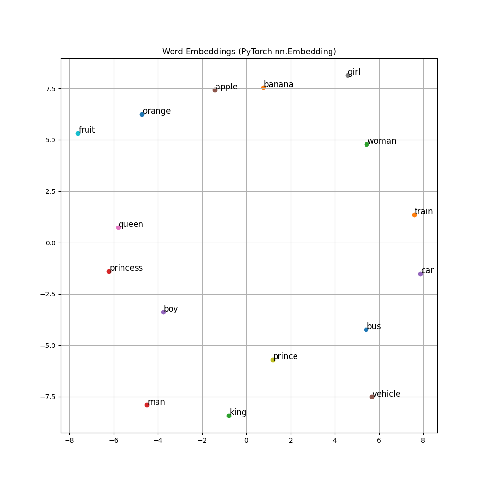

# Word Embeddings: Word2Vec

## 1. Executive Summary
**Word Embeddings** are a technique to represent words as dense vectors of real numbers. Unlike sparse representations (like One-Hot Encoding) where every word is equidistant from every other word, embeddings capture semantic relationships: words with similar meanings are close to each other in the vector space. **Word2Vec** is one of the most popular algorithms for learning these embeddings from raw text.

## 2. Historical Context
**Word2Vec** was introduced by **Tomas Mikolov** and his team at Google in **2013**. It was a breakthrough because it allowed for the efficient training of high-quality embeddings on massive datasets. It popularized the idea that "King - Man + Woman = Queen", showing that simple algebraic operations on these vectors could reveal semantic analogies.

## 3. Real-World Analogy
Think of **Map Coordinates**.
*   **One-Hot**: Saying "Paris is City #45" and "Berlin is City #92". It tells you nothing about where they are relative to each other.
*   **Embeddings**: Giving the GPS coordinates (Latitude, Longitude).
    *   Paris: [48.85, 2.35]
    *   Berlin: [52.52, 13.40]
    *   Now you can calculate the distance. You can see that Paris is closer to Berlin than to Tokyo.
    *   Word2Vec learns these "coordinates" for words based on how they are used in sentences.

## 4. Mathematical Foundation

### 4.1 Skip-Gram Model
The goal is to predict context words ($w_{t-j}, ..., w_{t+j}$) given a center word $w_t$.
We maximize the average log probability:
$$ \frac{1}{T} \sum_{t=1}^{T} \sum_{-c \le j \le c, j \ne 0} \log P(w_{t+j} | w_t) $$

### 4.2 Probability Calculation (Softmax)
$$ P(w_O | w_I) = \frac{\exp(v'_{w_O}{}^T v_{w_I})}{\sum_{w=1}^{W} \exp(v'_w{}^T v_{w_I})} $$
Where:
*   $v_{w_I}$: Input vector representation of the center word.
*   $v'_{w_O}$: Output vector representation of the context word.
*   $W$: Vocabulary size.

### 4.3 Training
The network has two weight matrices:
1.  $W_{in}$ (Input -> Hidden): Contains the input embeddings.
2.  $W_{out}$ (Hidden -> Output): Contains the context vectors.
We update these weights using Gradient Descent to maximize the probability of actual context words appearing.

## 5. Architecture

```mermaid
graph LR
    Input[Input Word (One-Hot)] --> Hidden[Hidden Layer (Embedding)]
    Hidden --> Output[Output Layer (Softmax)]
    
    subgraph "Weight Matrices"
    Input -- Win (Embedding Matrix) --> Hidden
    Hidden -- Wout (Context Matrix) --> Output
    end
    
    Output --> Prob[Probability Distribution over Vocab]
    
    style Input fill:#f9f,stroke:#333,stroke-width:2px
    style Output fill:#9f9,stroke:#333,stroke-width:2px
    style Hidden fill:#ff9,stroke:#333,stroke-width:2px
```

## 6. Implementation Details
The repository contains two implementations:

### Scratch Implementation (`00_scratch.py`)
*   **Manual Backpropagation**: Implements the Skip-Gram model using pure NumPy.
*   **Training Loop**: Iterates through word pairs, computes the forward pass (dot product + softmax), calculates gradients, and updates the embedding matrix $W_{in}$ and context matrix $W_{out}$.

### PyTorch Implementation (`01_pytorch.py`)
*   **`nn.Embedding`**: Uses PyTorch's optimized embedding layer.
*   **`nn.Linear`**: Acts as the context matrix $W_{out}$.
*   **Visualization**: Plots the learned 2D embeddings to show how semantically similar words (e.g., "king", "queen", "prince") cluster together.

## 7. How to Run
Run the scripts from the terminal:

```bash
# Run the scratch implementation
python 00_scratch.py

# Run the PyTorch implementation
python 01_pytorch.py
```

## 8. Implementation Results

### PyTorch Word Embeddings
The visualization shows the learned vector space. Words with similar contexts appear closer together.


*Note: In the visualization, words like "king", "queen", "prince" should cluster together, separate from "apple", "orange".*

## 9. References
*   Mikolov, T., Chen, K., Corrado, G., & Dean, J. (2013). *Efficient Estimation of Word Representations in Vector Space*.
*   Mikolov, T., Sutskever, I., Chen, K., Corrado, G. S., & Dean, J. (2013). *Distributed Representations of Words and Phrases and their Compositionality*.
