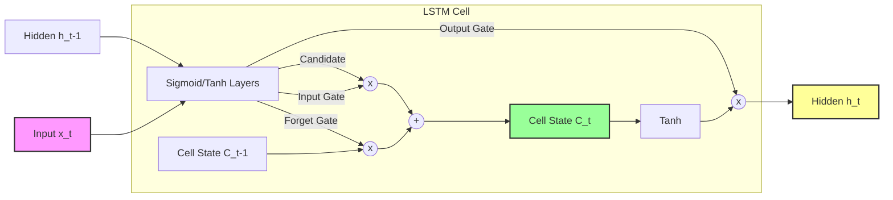

# Long Short-Term Memory (LSTM)

## 1. Executive Summary
**Long Short-Term Memory (LSTM)** networks are a specialized type of Recurrent Neural Network (RNN) capable of learning long-term dependencies. They were explicitly designed to solve the vanishing gradient problem that plagues standard RNNs, allowing them to remember information for long periods. This makes them highly effective for complex sequence tasks like machine translation, speech recognition, and time series forecasting.

## 2. Historical Context
*   **Invention (1997)**: Introduced by **Sepp Hochreiter** and **Jürgen Schmidhuber** in their seminal paper "Long Short-Term Memory".
*   **Forget Gate (2000)**: The "forget gate" was added later by Gers, Schmidhuber, and Cummins, which allowed the LSTM to learn to reset its own state, a crucial improvement for continuous tasks.
*   **Impact**: LSTMs became the dominant architecture for sequence modeling in the 2010s, powering Google Translate, Siri, and Alexa before the rise of Transformers in 2017.

## 3. Real-World Analogy
**The News Editor**
Imagine an editor managing a breaking news story (the Cell State).
1.  **Forget Gate**: As new reports come in, the editor decides what old information is no longer relevant (e.g., "The suspect is in a red car" -> Forget this if the car was found empty).
2.  **Input Gate**: The editor decides what new information is important enough to add to the story (e.g., "Suspect switched to a blue van" -> Add this).
3.  **Output Gate**: When a reporter asks for an update, the editor doesn't read the whole file. They summarize the current situation based on the most relevant parts of the story (e.g., "Current status: Suspect in blue van, heading north").

## 4. Mathematical Foundation
The LSTM cell has four interacting layers (gates):

1.  **Forget Gate ($f_t$)**: Decides what to throw away.
    $$ f_t = \sigma(W_f \cdot [h_{t-1}, x_t] + b_f) $$
2.  **Input Gate ($i_t$)**: Decides what new information to store.
    $$ i_t = \sigma(W_i \cdot [h_{t-1}, x_t] + b_i) $$
    $$ \tilde{C}_t = \tanh(W_C \cdot [h_{t-1}, x_t] + b_C) $$
3.  **Cell State Update ($C_t$)**: The core memory update.
    $$ C_t = f_t * C_{t-1} + i_t * \tilde{C}_t $$
4.  **Output Gate ($o_t$)**: Decides what to output.
    $$ o_t = \sigma(W_o \cdot [h_{t-1}, x_t] + b_o) $$
    $$ h_t = o_t * \tanh(C_t) $$

Where $\sigma$ is the sigmoid function (0 to 1) and $*$ denotes element-wise multiplication.

## 5. Architecture



## 6. Implementation Details
The repository contains two implementations:

### Scratch Implementation (`00_scratch.py`)
*   **Manual Gate Calculation**: Explicitly implements the four gate equations using NumPy.
*   **Gate Visualization**: Visualizes the activation levels of the Forget, Input, and Output gates over time, showing how the network decides to store or discard information.
*   **Forward Pass Only**: Focuses on the cell architecture.

### PyTorch Implementation (`01_pytorch.py`)
*   **`nn.LSTM`**: Uses PyTorch's optimized LSTM layer.
*   **Time Series Forecasting**: Trains the model to predict a sine wave sequence.
*   **Sequence-to-One**: Takes a sequence of past values to predict the next single value.

## 7. How to Run
Run the scripts from the terminal:

```bash
# Run the scratch implementation
python 00_scratch.py

# Run the PyTorch implementation
python 01_pytorch.py
```

## 8. Implementation Results

### Gate Activations (Scratch)

*Visualization of the Forget, Input, and Output gates over time steps. Darker colors indicate higher activation (closer to 1).*

### Sine Wave Prediction (PyTorch)

*The LSTM successfully learns to predict the next value in a sine wave sequence.*

## 9. References
*   Hochreiter, S., & Schmidhuber, J. (1997). *Long Short-Term Memory*. Neural Computation, 9(8), 1735-1780.
*   Gers, F. A., Schmidhuber, J., & Cummins, F. (2000). *Learning to Forget: Continual Prediction with LSTM*.

