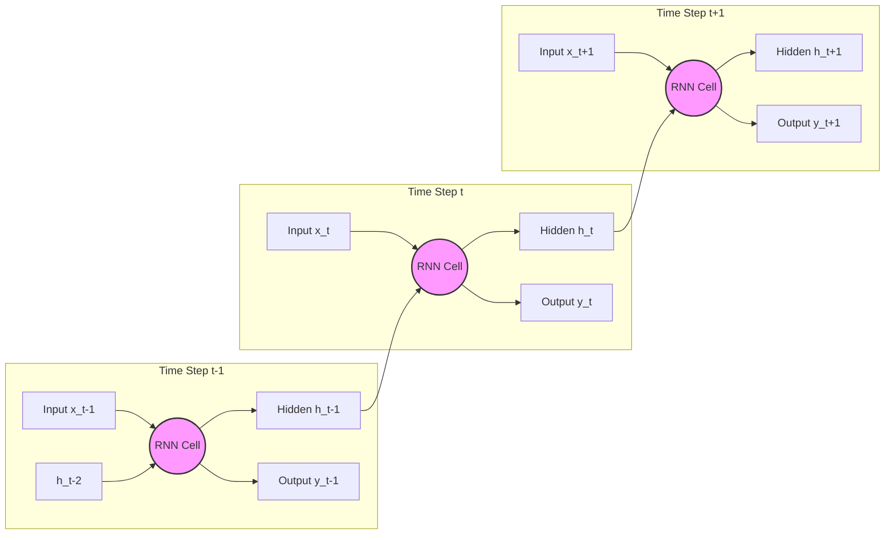
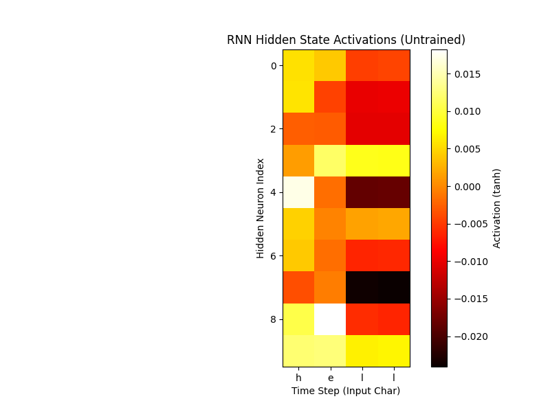
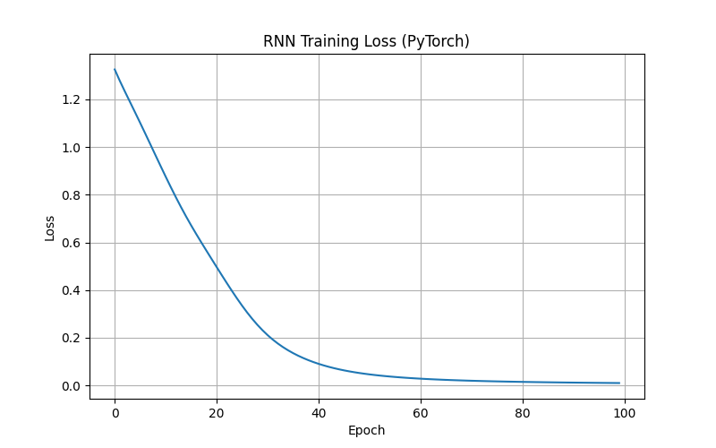

# Recurrent Neural Networks (RNN)

## 1. Executive Summary
**Recurrent Neural Networks (RNNs)** are a class of neural networks designed for processing sequential data. Unlike Feed-Forward networks, RNNs have a "memory" (hidden state) that captures information about what has been calculated so far. This makes them ideal for tasks like language modeling, time series prediction, and speech recognition where the order of data points matters.

## 2. Historical Context
*   **Origins (1980s)**: The concept of recurrent connections in neural networks dates back to the 1980s (e.g., Hopfield Networks, 1982).
*   **Elman Networks (1990)**: Jeffrey Elman introduced the "Simple Recurrent Network" (SRN), which is the standard "Vanilla RNN" architecture we use today. He demonstrated that these networks could learn temporal structure in language.
*   **The Vanishing Gradient Problem (1990s)**: Researchers like Sepp Hochreiter and Yoshua Bengio discovered that training standard RNNs on long sequences was difficult because gradients would either vanish (go to zero) or explode (go to infinity) as they were propagated back through many time steps. This led to the development of LSTMs (1997).

## 3. Real-World Analogy
**Reading a Sentence**
Imagine reading a sentence word by word. You don't understand the sentence by looking at each word in isolation.
*   When you read the word "bank", your understanding depends on the previous words.
*   If the previous words were "I sat by the river", you know "bank" means a river bank.
*   If the previous words were "I deposited money in the", you know "bank" means a financial institution.
*   Your brain maintains a "context" (hidden state) that is updated with every new word you read, allowing you to make sense of the sequence as a whole.

## 4. Mathematical Foundation
The core update equation for a Vanilla RNN cell is:

$$ h_t = \tanh(W_{xh} x_t + W_{hh} h_{t-1} + b_h) $$

$$ y_t = W_{hy} h_t + b_y $$

Where:
*   $x_t$: Input at time $t$.
*   $h_t$: Hidden state at time $t$ (the memory).
*   $h_{t-1}$: Hidden state from the previous time step.
*   $y_t$: Output at time $t$.
*   $\tanh$: Activation function (squashes values between -1 and 1).
*   $W_{xh}, W_{hh}, W_{hy}$: Weight matrices shared across all time steps.

## 5. Architecture



## 6. Implementation Details
The repository contains two implementations:

### Scratch Implementation (`00_scratch.py`)
*   **Manual Forward Pass**: Implements the Vanilla RNN cell using NumPy.
*   **Hidden State Visualization**: Visualizes how the hidden state vector changes as the RNN processes the sequence "hello".
*   **No Training**: Focuses on the architecture and data flow, not the backpropagation algorithm (BPTT).

### PyTorch Implementation (`01_pytorch.py`)
*   **`nn.RNN`**: Uses PyTorch's built-in RNN layer.
*   **Sequence Learning**: Trains the network to predict the next character in the sequence "hell" -> "ello".
*   **Training Loop**: Implements a standard training loop with CrossEntropyLoss and Adam optimizer.

## 7. How to Run
Run the scripts from the terminal:

```bash
# Run the scratch implementation
python 00_scratch.py

# Run the PyTorch implementation
python 01_pytorch.py
```

## 8. Implementation Results

### Hidden State Visualization (Scratch)

*Visualization of how the hidden state vector changes as the RNN processes the sequence "hello".*

### Training Loss (PyTorch)

*Loss curve showing the model learning to predict the next character.*

## 9. References
*   Elman, J. L. (1990). *Finding Structure in Time*. Cognitive Science, 14(2), 179-211.
*   Rumelhart, D. E., Hinton, G. E., & Williams, R. J. (1986). *Learning representations by back-propagating errors*. Nature, 323(6088), 533-536.

