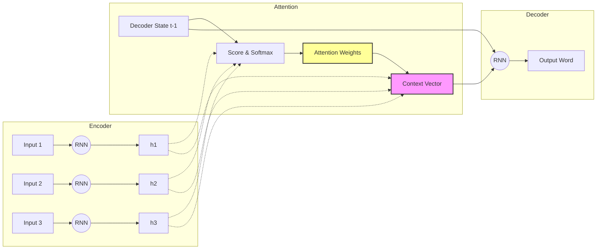
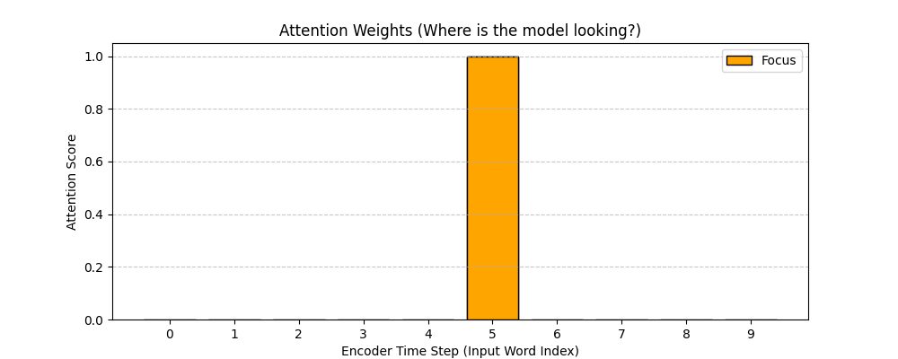
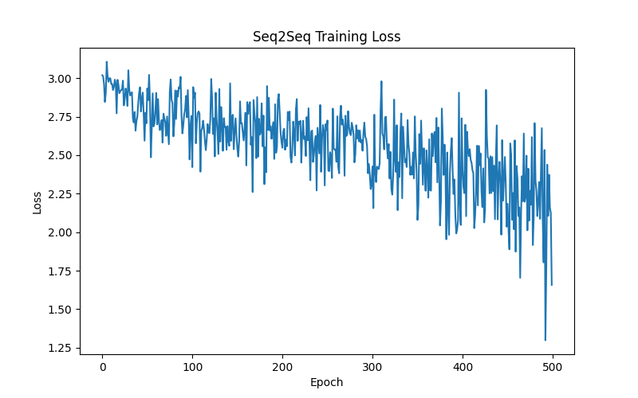
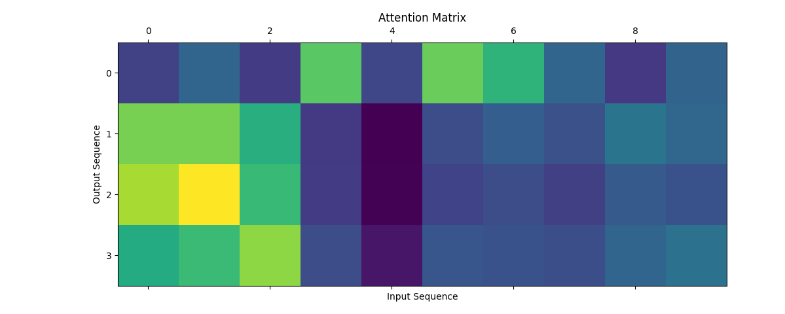

# Sequence-to-Sequence with Attention

## 1. Executive Summary
**Sequence-to-Sequence (Seq2Seq)** models are designed to map a fixed-length input sequence to a fixed-length output sequence, where the lengths can differ (e.g., translating "I love you" [3 words] to "Je t'aime" [2 words]). The **Attention Mechanism** solves the "bottleneck problem" of standard Seq2Seq models by allowing the Decoder to "look back" at specific parts of the source sentence at each step of generation, rather than relying on a single compressed vector.

## 2. Historical Context
*   **Seq2Seq (2014)**: Sutskever et al. introduced the Encoder-Decoder architecture using LSTMs for machine translation. It relied on a single final hidden state to carry all information.
*   **The Bottleneck**: For long sentences, performance degraded because the fixed-size vector couldn't hold all the nuances.
*   **Bahdanau Attention (2015)**: Bahdanau et al. introduced "Neural Machine Translation by Jointly Learning to Align and Translate". They proposed that the model should learn to align the source and target words dynamically (Additive Attention).
*   **Luong Attention (2015)**: Luong et al. proposed "Effective Approaches to Attention-based Neural Machine Translation", introducing "Dot-Product Attention" (Multiplicative), which is simpler and faster.

## 3. Real-World Analogy
**The Interpreter**
*   **Standard Seq2Seq**: An interpreter listens to a whole speech, memorizes it perfectly in their head (single vector), and then translates it. If the speech is long, they might forget the beginning.
*   **Seq2Seq with Attention**: An interpreter takes detailed notes (Encoder outputs) while listening. When translating a specific part, they look back at their notes (Attention) to find the exact words the speaker used, ensuring accuracy even for long speeches.

## 4. Mathematical Foundation (Dot-Product Attention)
1.  **Alignment Score**: How relevant is Encoder state $h_s$ to the current Decoder state $h_t$?
    $$ \text{score}(h_t, h_s) = h_t^T \cdot h_s $$
2.  **Attention Weights**: Normalize scores to probabilities using Softmax.
    $$ \alpha_{ts} = \frac{\exp(\text{score}(h_t, h_s))}{\sum_{s'} \exp(\text{score}(h_t, h_{s'}))} $$
3.  **Context Vector**: Weighted sum of Encoder states.
    $$ c_t = \sum_s \alpha_{ts} h_s $$
4.  **Final Output**: Combine context vector with decoder state to predict the next word.
    $$ \tilde{h}_t = \tanh(W_c [c_t; h_t]) $$

## 5. Architecture



## 6. Implementation Details
The repository contains two implementations:

### Scratch Implementation (`00_scratch.py`)
*   **Attention Simulation**: A NumPy simulation of the Attention Mechanism.
*   **Visualization**: Visualizes how the "Context Vector" is formed by taking a weighted sum of "Encoder Outputs" based on a "Decoder Query".
*   **Focus**: Demonstrates the math of the dot product and softmax without the complexity of a full training loop.

### PyTorch Implementation (`01_pytorch.py`)
*   **Full Seq2Seq Model**: Implements `EncoderRNN` and `AttnDecoderRNN` using GRUs.
*   **Task**: Reverses a sequence of numbers (e.g., `[2, 5, 9]` -> `[9, 5, 2]`).
*   **Teacher Forcing**: Uses the actual target output as the next input during training to speed up convergence.
*   **Attention Matrix**: Visualizes the alignment between input and output sequences.

## 7. How to Run
Run the scripts from the terminal:

```bash
# Run the scratch implementation
python 00_scratch.py

# Run the PyTorch implementation
python 01_pytorch.py
```

## 8. Implementation Results

### Attention Weights (Scratch)

*Visualization of how much attention the decoder pays to each encoder time step.*

### Training Loss (PyTorch)

*Loss curve for the sequence reversal task.*

### Attention Matrix (PyTorch)

*Heatmap showing the alignment between input and output sequences. The diagonal pattern indicates that the model has learned to reverse the sequence correctly.*

## 9. References
*   Bahdanau, D., Cho, K., & Bengio, Y. (2014). *Neural Machine Translation by Jointly Learning to Align and Translate*.
*   Luong, M. T., Pham, H., & Manning, C. D. (2015). *Effective Approaches to Attention-based Neural Machine Translation*.

