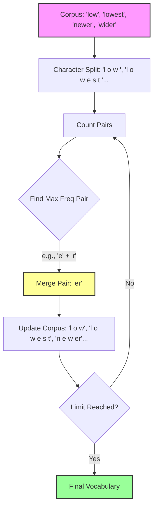

# Byte Pair Encoding (BPE)

## 1. Executive Summary
**Byte Pair Encoding (BPE)** is a subword tokenization algorithm that strikes a balance between character-level and word-level representations. It iteratively merges the most frequent pairs of adjacent characters or subwords into new, larger subwords. This allows the model to handle rare words by breaking them down into meaningful components (e.g., "unhappiness" -> "un" + "happi" + "ness") while keeping common words as single tokens. It is the standard tokenization method for modern LLMs like GPT-2, GPT-3, and RoBERTa.

## 2. Historical Context
*   **Origins (1994)**: Originally a data compression algorithm invented by **Philip Gage**.
*   **NLP Adoption (2016)**: Sennrich et al. adapted it for Neural Machine Translation in the paper "Neural Machine Translation of Rare Words with Subword Units".
*   **Impact**: It solved the "Out-Of-Vocabulary" (OOV) problem effectively, enabling models to process any text string without needing a massive, fixed vocabulary of whole words.

## 3. Real-World Analogy
**LEGO Bricks**
*   **Word-Level**: Having a pre-molded plastic toy for every single object in the world (Car, House, Dog). If you need a "Spaceship", and you don't have that specific mold, you can't build it.
*   **Character-Level**: Having only 1x1 single bricks. You can build anything, but it takes forever and the structure is fragile.
*   **Subword (BPE)**: Having a set of common pre-assembled chunks (Wheels, Windows, Roofs) along with single bricks.
    *   Common object (House): Use the "House" chunk.
    *   Rare object (Spaceship): Build it from "Space" + "ship" chunks.
    *   Unknown object: Build it from single bricks.

## 4. Mathematical Foundation
BPE is a greedy algorithm that maximizes the reduction in sequence length (or maximizes the likelihood of the training data) by iteratively merging the most frequent adjacent pair.

Let $V$ be the vocabulary.
1.  Initialize $V$ with all unique characters in the corpus $C$.
2.  Repeat $k$ times:
    *   Count all symbol pairs $(A, B)$ in $C$.
    *   Find the pair $(A, B)_{max}$ with the highest frequency.
    *   Add new symbol $AB$ to $V$.
    *   Replace all occurrences of $(A, B)$ in $C$ with $AB$.

## 5. Architecture (Process Flow)



## 6. Implementation Details
The repository contains a scratch implementation:

### Scratch Implementation (`00_scratch.py`)
*   **`get_stats`**: Scans the current vocabulary to count the frequency of every adjacent character pair.
*   **`merge_vocab`**: Takes the most frequent pair and merges it into a single symbol using Regex.
*   **Training Loop**: Iteratively performs these steps on a sample corpus ("low low low...").

## 7. How to Run
Run the script from the terminal:

```bash
python 00_scratch.py
```

## 8. Implementation Results

### Sample Output
The script demonstrates how the vocabulary evolves. Starting with single characters, it learns common subwords like `es`, `est`, `lo`, `low`.

```text
Starting BPE Training (Target merges: 20)...
Merge #1: ('e', 's') -> es
Merge #2: ('es', 't') -> est
Merge #3: ('est', '</w>') -> est</w>
Merge #4: ('l', 'o') -> lo
Merge #5: ('lo', 'w') -> low
Merge #6: ('n', 'e') -> ne
Merge #7: ('ne', 'w') -> new
Merge #8: ('new', 'est</w>') -> newest</w>
...
```

## 9. References
*   Gage, P. (1994). *A New Algorithm for Data Compression*. C Users Journal.
*   Sennrich, R., Haddow, B., & Birch, A. (2016). *Neural Machine Translation of Rare Words with Subword Units*.
