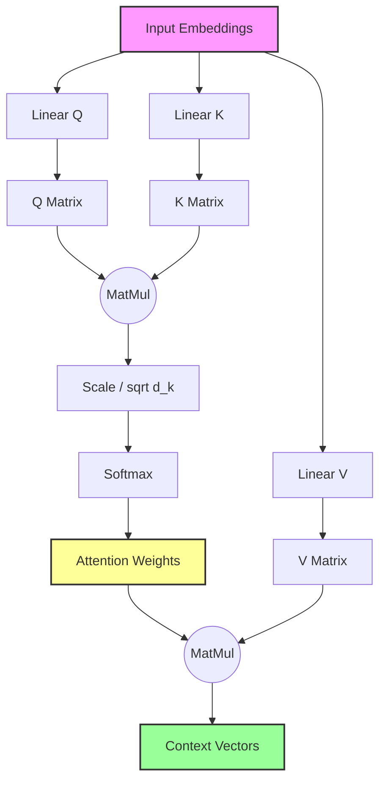

# Self-Attention Mechanism

## 1. Executive Summary
**Self-Attention** is the core mechanism of the Transformer architecture. It allows a model to process a sequence of data (like words in a sentence) and decide, for each word, which other words in the sequence are relevant. Unlike RNNs which process words sequentially, Self-Attention processes all words in parallel and allows each word to "attend" to every other word, capturing long-range dependencies and context effectively.

## 2. Historical Context
*   **Invention (2017)**: Introduced by **Ashish Vaswani et al.** (Google Brain) in the landmark paper **"Attention Is All You Need"**.
*   **The Shift**: This paper proposed the **Transformer** architecture, which dispensed with recurrence and convolutions entirely, relying solely on attention mechanisms.
*   **Impact**: This shift led to the development of massive language models like BERT, GPT-3, and ChatGPT, which have revolutionized NLP.

## 3. Real-World Analogy
**The Cocktail Party Effect**
*   **Scenario**: You are at a noisy party (the input sequence).
*   **Query**: You want to listen to a specific friend (what you are focusing on).
*   **Keys**: You scan the room, looking at everyone's faces (matching your focus against available sources).
*   **Attention Score**: When you see your friend, the match is high. For a stranger, the match is low.
*   **Value**: You focus your hearing on your friend's voice (the information you extract), tuning out the background noise.
*   **Self-Attention**: Does this for *every word simultaneously*, allowing each word to "listen" to every other word to understand the full context.

## 4. Mathematical Foundation
The core operation is **Scaled Dot-Product Attention**:

$$ \text{Attention}(Q, K, V) = \text{softmax}\left(\frac{QK^T}{\sqrt{d_k}}\right)V $$

Where:
*   **$Q$ (Query)**: Matrix of query vectors.
*   **$K$ (Key)**: Matrix of key vectors.
*   **$V$ (Value)**: Matrix of value vectors.
*   **$d_k$**: Dimension of the key vectors (used for scaling to prevent vanishing gradients in softmax).

The process involves:
1.  **MatMul**: $QK^T$ computes similarity scores between every pair of words.
2.  **Scale**: Divide by $\sqrt{d_k}$ for stability.
3.  **Softmax**: Convert scores to probabilities (weights summing to 1).
4.  **MatMul**: Multiply weights by $V$ to get the weighted sum of values.

## 5. Architecture



## 6. Implementation Details
The repository contains two implementations:

### Scratch Implementation (`00_scratch.py`)
*   **NumPy Only**: Implements the mechanism step-by-step using basic matrix operations.
*   **Manual Calculation**: Explicitly computes $Q, K, V$, the dot product scores, scaling, softmax, and the final weighted sum.
*   **Visualization**: Generates a heatmap of the attention weights for a simple 3-word sentence.

### PyTorch Implementation (`01_pytorch.py`)
*   **`nn.Module`**: Defines a custom `SimpleSelfAttention` class inheriting from PyTorch's base class.
*   **`nn.Linear`**: Uses linear layers to learn the projection matrices $W_q, W_k, W_v$.
*   **Comparison**: Compares the custom implementation with PyTorch's built-in `nn.MultiheadAttention`.

## 7. How to Run
Run the scripts from the terminal:

```bash
# Run the scratch implementation
python 00_scratch.py

# Run the PyTorch implementation
python 01_pytorch.py
```

## 8. Implementation Results

### Attention Heatmap (PyTorch)

*The heatmap shows how much attention each word pays to every other word. Darker colors indicate higher attention scores, meaning those words are considered more relevant to each other.*

## 9. References
*   Vaswani, A., Shazeer, N., Parmar, N., Uszkoreit, J., Jones, L., Gomez, A. N., ... & Polosukhin, I. (2017). *Attention Is All You Need*. Advances in Neural Information Processing Systems.
