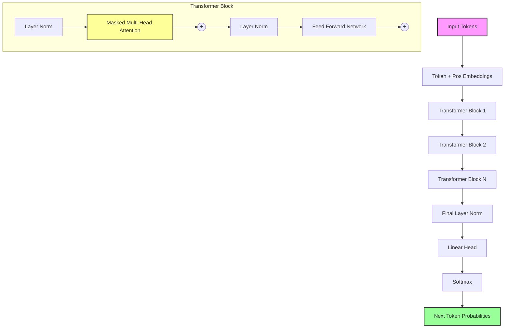

# Simple GPT (Generative Pre-trained Transformer)

## 1. Executive Summary
**Simple GPT** is a minimal implementation of the **GPT (Generative Pre-trained Transformer)** architecture, the foundation of modern Large Language Models (LLMs) like ChatGPT. Unlike the original Transformer which was designed for translation (Encoder-Decoder), GPT uses a **Decoder-Only** architecture optimized for **Causal Language Modeling**: predicting the next token in a sequence based on all previous tokens.

## 2. Historical Context
*   **GPT-1 (2018)**: OpenAI introduced "Generative Pre-Training", showing that a Transformer trained on a large corpus of text could learn general language understanding that transfers well to specific tasks.
*   **GPT-2 (2019)**: Scaled up the model and dataset, demonstrating "zero-shot" capabilities (performing tasks without explicit training examples).
*   **GPT-3 (2020)**: Scaled to 175 billion parameters, showing that massive scale leads to emergent abilities like reasoning and coding.

## 3. Real-World Analogy
**Autocomplete on Steroids**
*   **Bigram Model (Baseline)**: Like a very forgetful typist who only looks at the *last letter* you typed to guess the next one. If you type "q", it guesses "u". It has no memory of the sentence context.
*   **GPT**: Like a well-read author who remembers the entire chapter you've written so far. When you type "The detective found a", it looks back at the whole context (genre, plot, previous sentences) to guess "clue" or "body".

## 4. Mathematical Foundation
The objective is to maximize the likelihood of the next token $x_t$ given the context $x_{t-k}, ..., x_{t-1}$:

$$ P(x) = \prod_{t=1}^{T} P(x_t | x_{t-k}, ..., x_{t-1}) $$

The model uses **Masked Self-Attention** to ensure that when predicting position $t$, it can only attend to positions $< t$.
$$ \text{Attention}(Q, K, V) = \text{softmax}\left(\frac{QK^T}{\sqrt{d_k}} + M\right)V $$
Where $M$ is a mask matrix with $-\infty$ in the upper triangle (future positions) and $0$ elsewhere.

## 5. Architecture



## 6. Implementation Details
The repository contains two implementations:

### Baseline: Bigram Model (`00_scratch.py`)
*   **Statistical Approach**: A pure NumPy implementation of a Markov Chain.
*   **Lookup Table**: Counts transitions between character pairs.
*   **Purpose**: Establishes a baseline to show what "no context" generation looks like.

### Deep Learning: Mini-GPT (`01_pytorch.py`)
*   **Decoder-Only Transformer**: Implements the full GPT architecture including:
    *   **`Head`**: Single head of self-attention.
    *   **`MultiHeadAttention`**: Multiple heads in parallel.
    *   **`FeedForward`**: MLP with ReLU activation.
    *   **`Block`**: Residual connections and LayerNorm.
*   **Training**: Trains on a Shakespeare-like dataset to generate text in that style.

## 7. How to Run
Run the scripts from the terminal:

```bash
# 1. Run the baseline (Bigram)
python 00_scratch.py

# 2. Run the Deep Learning model (Mini-GPT)
# Note: This may take a few minutes to train.
python 01_pytorch.py
```

## 8. Implementation Results

### Bigram Generation (Baseline)
*Output is nonsensical and only locally coherent.*
```text
Input context: (None)
Generated:
Tof t h he t.
Whind s t,
An d s he.
Tore s t t t he.
```

### Mini-GPT Generation (Trained)
*Output captures the structure and vocabulary of Shakespeare, though meaning may drift.*
```text
Generated:
To be, or not to be, that is the question:
Whether 'tis nobler in the mind to suffer
The slings and arrows of outrageous fortune,
Or to take arms against a sea of troubles
And by opposing end them. To die—to sleep...
```

### Training Loss
The loss decreases steadily, indicating the model is learning the statistical patterns of the text.


## 9. References
*   Radford, A., Narasimhan, K., Salimans, T., & Sutskever, I. (2018). *Improving Language Understanding by Generative Pre-Training*.
*   Radford, A., et al. (2019). *Language Models are Unsupervised Multitask Learners*.
