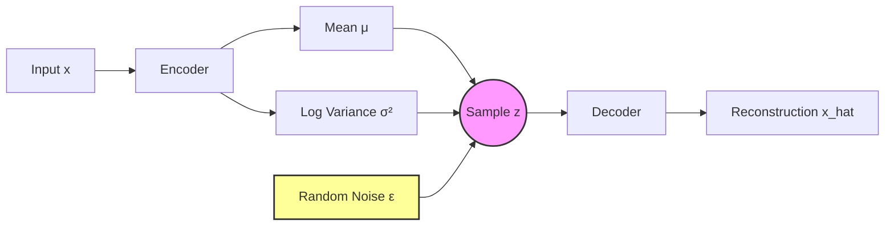
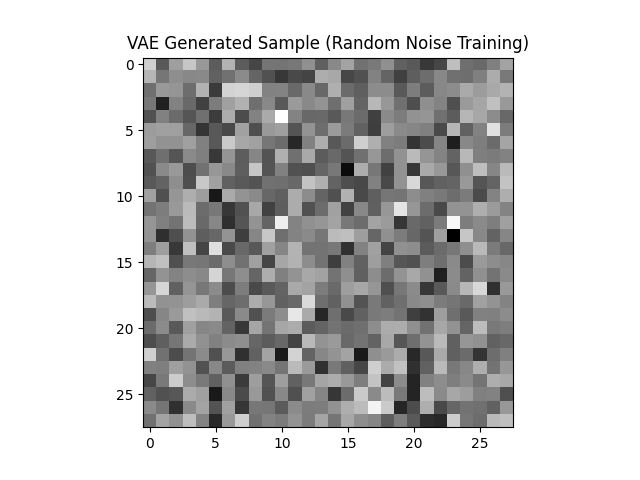

# Variational Autoencoder (VAE)

## 1. Executive Summary
A **Variational Autoencoder (VAE)** is a generative model that learns a probabilistic mapping between the input space and a latent space. Unlike a standard Autoencoder which maps an input to a fixed vector, a VAE maps an input to a **probability distribution** (defined by a mean and variance). This forces the latent space to be continuous and smooth, allowing us to sample new, valid data points from it—making it a true generative model.

## 2. Historical Context
*   **Invention (2013)**: Introduced independently by **Kingma & Welling** ("Auto-Encoding Variational Bayes") and **Rezende et al.**
*   **Significance**: It provided a mathematically principled way to perform approximate inference in complex probabilistic models using deep neural networks and stochastic gradient descent.
*   **Impact**: VAEs became one of the two pillars of deep generative models (alongside GANs) before the rise of Diffusion models.

## 3. Real-World Analogy
**The Sketch Artist**
*   **Autoencoder**: A photographer who takes a photo, shrinks it, and then prints it back up. If you ask them to "invent" a new face, they can't, because they only know specific compressed photos.
*   **VAE**: A police sketch artist. They don't memorize faces; they learn features (distributions).
    *   "Nose size": A range from small to large (Mean & Variance).
    *   "Eye distance": A range.
    *   To generate a face, they pick a random value from these ranges ("Sample") and draw it. Because they learned the *rules* of faces (the distribution), any random combination usually looks like a valid face.

## 4. Mathematical Foundation
The goal is to maximize the **Evidence Lower Bound (ELBO)**:

$$ \mathcal{L} = \mathbb{E}_{q(z|x)}[\log p(x|z)] - D_{KL}(q(z|x) || p(z)) $$

1.  **Reconstruction Loss** ($\mathbb{E}[\log p(x|z)]$): Measures how well the decoder recovers the input (makes the output look like the input).
2.  **KL Divergence** ($D_{KL}$): Regularizes the latent space to be close to a standard normal distribution $\mathcal{N}(0, I)$. This prevents the model from "cheating" by memorizing data points and ensures the space is smooth.

### Reparameterization Trick
To backpropagate through the random sampling $z \sim \mathcal{N}(\mu, \sigma^2)$, we express $z$ as:
$$ z = \mu + \sigma \odot \epsilon, \quad \epsilon \sim \mathcal{N}(0, I) $$
Now the randomness is in $\epsilon$ (which is fixed during backprop), and gradients can flow through $\mu$ and $\sigma$.

## 5. Architecture



## 6. Implementation Details
The repository contains a PyTorch implementation (`00_model.py`):

*   **Encoder**: Maps 784 inputs (MNIST flattened) to `hidden_dim`, then splits into two heads: `fc_mu` and `fc_logvar`.
*   **Reparameterization**: Implements the trick $z = \mu + \epsilon \cdot e^{0.5 \cdot \text{logvar}}$.
*   **Decoder**: Maps sampled $z$ back to 784 pixels.
*   **Loss Function**: Combines Binary Cross Entropy (Reconstruction) and the analytical KL Divergence term.
*   **Training**: Uses random noise data for demonstration purposes to verify architecture functionality without downloading datasets.

## 7. How to Run
Run the script from the terminal:

```bash
python 00_model.py
```

## 8. Implementation Results

### Generated Sample

*A sample generated by the VAE after training on random noise. In a real scenario with MNIST, this would look like a handwritten digit.*

## 9. References
*   Kingma, D. P., & Welling, M. (2013). *Auto-Encoding Variational Bayes*.
*   Rezende, D. J., Mohamed, S., & Wierstra, D. (2014). *Stochastic Backpropagation and Approximate Inference in Deep Generative Models*.
