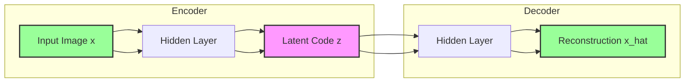

# Vanilla Autoencoder

## 1. Executive Summary
A **Vanilla Autoencoder** is a type of unsupervised neural network trained to reconstruct its input. It works by compressing the input data into a lower-dimensional representation (encoding) and then reconstructing the original input from this compressed representation (decoding). This process forces the network to learn the most efficient and meaningful features of the data, effectively performing dimensionality reduction and feature extraction.

## 2. Historical Context
*   **Origins (1980s)**: Autoencoders were introduced by the PDP group (Rumelhart, Hinton, Williams) as a way to learn internal representations.
*   **Deep Learning Revolution (2006)**: Geoffrey Hinton and Ruslan Salakhutdinov showed that stacking autoencoders (Deep Belief Networks) and pre-training them layer-by-layer could solve the vanishing gradient problem, a key moment in the history of Deep Learning.
*   **Modern Usage**: While less common for pre-training now, they are foundational for VAEs, GANs, and diffusion models.

## 3. Real-World Analogy
**MP3 Compression**
*   **Input**: A large raw audio file (WAV).
*   **Encoder**: The MP3 algorithm removes frequencies humans can't hear and compresses the data into a small file.
*   **Latent Code**: The `.mp3` file itself. It's much smaller than the original but contains the "essence" of the song.
*   **Decoder**: The music player reads the MP3 and plays back the sound.
*   **Reconstruction**: The sound isn't *exactly* the same as the original studio recording (it's "lossy"), but it's close enough that you recognize the song perfectly.

## 4. Mathematical Foundation
The goal is to minimize the reconstruction loss $L(x, \hat{x})$.

1.  **Encoder**: Maps input $x$ to a latent vector $z$.
    $$ z = f(W_e x + b_e) $$
2.  **Decoder**: Maps latent vector $z$ back to reconstruction $\hat{x}$.
    $$ \hat{x} = g(W_d z + b_d) $$
3.  **Loss Function**: Typically Mean Squared Error (MSE) for continuous data.
    $$ L = ||x - \hat{x}||^2 $$

If the activation functions $f$ and $g$ are linear, the autoencoder learns the same subspace as **Principal Component Analysis (PCA)**.

## 5. Architecture



## 6. Implementation Details
The repository contains two implementations:

### Scratch Implementation (`00_scratch.py`)
*   **Linear Autoencoder**: Uses Singular Value Decomposition (SVD) in NumPy to perform linear compression.
*   **PCA Equivalence**: Demonstrates that a linear autoencoder is mathematically equivalent to PCA.
*   **Visualization**: Plots the latent space and reconstructions.

### PyTorch Implementation (`01_pytorch.py`)
*   **Non-Linear Autoencoder**: Uses `nn.Linear` layers with `ReLU` activations.
*   **Bottleneck**: Compresses 64-dimensional input (8x8 digits) down to 2 dimensions.
*   **Training**: Minimizes MSE Loss using the Adam optimizer.

## 7. How to Run
Run the scripts from the terminal:

```bash
# Run the scratch implementation
python 00_scratch.py

# Run the PyTorch implementation
python 01_pytorch.py
```

## 8. Implementation Results

### Latent Space Visualization (PyTorch)

*The 2D representation of the 64-dimensional digits. Note how similar digits (same colors) cluster together, even though the model was never told the labels.*

### Reconstruction Quality (PyTorch)

*Top: Original images. Bottom: Reconstructed images after being compressed to just 2 numbers and expanded back.*

## 9. References
*   Rumelhart, D. E., Hinton, G. E., & Williams, R. J. (1986). *Learning internal representations by error propagation*.
*   Hinton, G. E., & Salakhutdinov, R. R. (2006). *Reducing the dimensionality of data with neural networks*. Science.
