# Denoising Diffusion Probabilistic Models (DDPM)

## 1. Executive Summary
**Diffusion Models** are a class of generative models that learn to generate data by reversing a gradual noise addition process. Unlike GANs (which use adversarial training) or VAEs (which use variational inference), Diffusion models learn to systematically "denoise" an image step-by-step. They have recently surpassed GANs in image synthesis quality, powering state-of-the-art systems like DALL-E 2, Stable Diffusion, and Midjourney.

## 2. Historical Context
*   **Origins (2015)**: The concept was introduced by **Sohl-Dickstein et al.** in "Deep Unsupervised Learning using Nonequilibrium Thermodynamics", inspired by physics.
*   **The Breakthrough (2020)**: **Jonathan Ho et al.** published "Denoising Diffusion Probabilistic Models" (DDPM), showing that a specific parameterization (predicting the noise) allowed these models to generate high-quality images, sparking the current generative AI boom.

## 3. Real-World Analogy
**Rewinding the Ink Drop**
Imagine dropping a single drop of blue ink into a glass of clear water.
*   **Forward Process (Diffusion)**: Over time, the ink spreads out until the water is uniformly pale blue. The structure of the drop is lost to entropy. This is easy to simulate (adding noise).
*   **Reverse Process (Generation)**: Now, imagine watching a video of this process in reverse. You see the pale blue water spontaneously gathering molecules together to form a sharp, defined drop. This is what the model learns: how to take "chaos" (random noise) and carefully push it back into "order" (an image).

## 4. Mathematical Foundation
The model consists of two processes:

### 4.1 Forward Process (Diffusion)
A fixed Markov chain that gradually adds Gaussian noise to the data $x_0$ over $T$ steps.
$$ q(x_t | x_{t-1}) = \mathcal{N}(x_t; \sqrt{1 - \beta_t} x_{t-1}, \beta_t \mathbf{I}) $$
We can sample $x_t$ directly from $x_0$:
$$ x_t = \sqrt{\bar{\alpha}_t} x_0 + \sqrt{1 - \bar{\alpha}_t} \epsilon $$

### 4.2 Reverse Process (Denoising)
A learned Markov chain where a neural network predicts the noise to remove.
$$ p_\theta(x_{t-1} | x_t) = \mathcal{N}(x_{t-1}; \mu_\theta(x_t, t), \Sigma_\theta(x_t, t)) $$

### 4.3 Objective
We train a network $\epsilon_\theta(x_t, t)$ to predict the noise $\epsilon$ that was added to $x_0$. The loss is simply Mean Squared Error (MSE):
$$ L = || \epsilon - \epsilon_\theta(x_t, t) ||^2 $$

## 5. Architecture (U-Net)

```mermaid
graph TD
    Input[Noisy Image x_t] --> Down1[Downsample Block 1]
    Time[Time Embedding t] --> Down1
    Down1 --> Down2[Downsample Block 2]
    Time --> Down2
    Down2 --> Bottleneck[Bottleneck]
    Bottleneck --> Up1[Upsample Block 1]
    Time --> Up1
    Down2 -. Skip Connection .-> Up1
    Up1 --> Up2[Upsample Block 2]
    Time --> Up2
    Down1 -. Skip Connection .-> Up2
    Up2 --> Output[Predicted Noise ε]
    
    style Input fill:#f9f,stroke:#333,stroke-width:2px
    style Output fill:#9f9,stroke:#333,stroke-width:2px
    style Time fill:#ff9,stroke:#333,stroke-width:2px
```



## 6. Implementation Details
The repository contains a PyTorch implementation (`01_ddpm_mnist.py`):

*   **`Diffusion` Class**: Handles the noise schedule ($\beta_t$), forward diffusion sampling, and the reverse sampling loop.
*   **`SimpleUNet`**: A simplified U-Net architecture with:
    *   **Sinusoidal Time Embeddings**: Injected into each block so the network knows *how much* noise to remove.
    *   **Residual Blocks**: For stable training.
    *   **Skip Connections**: To preserve spatial information.
*   **Training**: Trains on MNIST to generate handwritten digits.

## 7. How to Run
Run the script from the terminal:

```bash
python 01_ddpm_mnist.py
```

## 8. Implementation Results

### Generated Samples

*Images generated by the DDPM model after training on MNIST. Starting from pure noise, the model iteratively refines the image over 300 timesteps to produce coherent digits.*

## 9. References
*   Sohl-Dickstein, J., Weiss, E., Maheswaranathan, N., & Ganguli, S. (2015). *Deep Unsupervised Learning using Nonequilibrium Thermodynamics*.
*   Ho, J., Jain, A., & Abbeel, P. (2020). *Denoising Diffusion Probabilistic Models*.
