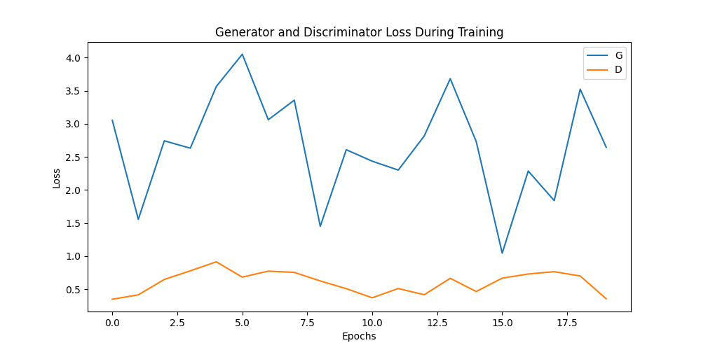
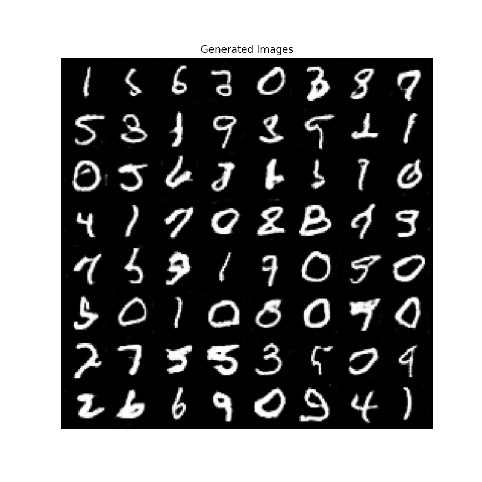

# Deep Convolutional GAN (DCGAN)

## 1. Executive Summary
**Generative Adversarial Networks (GANs)** consist of two neural networks competing against each other in a zero-sum game: a **Generator** that tries to create fake data, and a **Discriminator** that tries to distinguish real data from fake. **DCGAN** (Deep Convolutional GAN) was the first architecture to successfully apply Convolutional Neural Networks (CNNs) to this framework in a stable way, enabling the generation of high-quality images.

## 2. Historical Context
*   **Invention (2014)**: Ian Goodfellow introduced the original GAN concept.
*   **The Problem**: Early GANs were notoriously unstable, often suffering from "mode collapse" (generating the same image over and over) or failing to converge.
*   **The Solution (2015)**: **Radford, Metz, and Chintala** introduced DCGAN. They proposed a set of architectural constraints (like Batch Normalization and strided convolutions) that stabilized training, launching the era of modern AI image generation.

## 3. Real-World Analogy
**The Art Forger and the Detective**
*   **The Generator (The Forger)**: Tries to paint a fake Picasso. At first, he is terrible and just splashes paint randomly.
*   **The Discriminator (The Detective)**: Tries to determine if a painting is a real Picasso or a fake.
*   **The Game**:
    1.  The Forger shows a painting.
    2.  The Detective says "Fake! The brushstrokes are wrong."
    3.  The Forger learns from this feedback and tries again.
    4.  Over time, the Forger becomes so good that the Detective can no longer tell the difference (50% guess rate).

## 4. Mathematical Foundation
The training is a **Minimax Game** with the following value function $V(D, G)$:

$$ \min_G \max_D V(D, G) = \mathbb{E}_{x \sim p_{data}(x)} [\log D(x)] + \mathbb{E}_{z \sim p_{z}(z)} [\log (1 - D(G(z)))] $$

*   **Discriminator ($D$)**: Wants to maximize the probability of assigning 1 to real data ($D(x) \approx 1$) and 0 to fake data ($D(G(z)) \approx 0$).
*   **Generator ($G$)**: Wants to minimize $\log(1 - D(G(z)))$, which is equivalent to maximizing $\log D(G(z))$ (fooling the discriminator into thinking the fake data is real).

## 5. Architecture

```mermaid
graph LR
    subgraph Generator
    Noise[Latent Vector z] --> ConvT1[ConvTranspose]
    ConvT1 --> ConvT2[ConvTranspose]
    ConvT2 --> FakeImg[Fake Image G(z)]
    end
    
    subgraph Discriminator
    FakeImg --> Conv1[Conv]
    RealImg[Real Image x] --> Conv1
    Conv1 --> Conv2[Conv]
    Conv2 --> Prob[Probability Real/Fake]
    end
    
    Prob -. Backprop Error .-> Generator
    Prob -. Backprop Error .-> Discriminator
    
    style Noise fill:#f9f,stroke:#333,stroke-width:2px
    style FakeImg fill:#ff9,stroke:#333,stroke-width:2px
    style RealImg fill:#9f9,stroke:#333,stroke-width:2px
```

## 6. Implementation Details
The repository contains two implementations:

### Scratch Simulation (`00_scratch.py`)
*   **1D Simulation**: A simplified NumPy simulation where a Generator tries to transform uniform noise into a Gaussian distribution.
*   **Visualization**: Shows how the "fake" distribution moves to overlap with the "real" distribution over time.

### PyTorch DCGAN (`01_pytorch.py`)
*   **Full Architecture**: Implements the specific DCGAN guidelines:
    *   No pooling layers (strided convolutions instead).
    *   Batch Normalization in both G and D.
    *   ReLU in G, LeakyReLU in D.
    *   Tanh output for G (images scaled to [-1, 1]).
*   **Training**: Trains on MNIST to generate handwritten digits.

## 7. How to Run
Run the scripts from the terminal:

```bash
# Run the scratch simulation
python 00_scratch.py

# Run the PyTorch DCGAN
python 01_pytorch.py
```

## 8. Implementation Results

### Training Loss

*The Generator and Discriminator losses oscillate, which is typical for GANs. Ideally, they reach an equilibrium.*

### Generated Images

*Images generated by the DCGAN after 20 epochs. The model has learned to produce recognizable digits from random noise.*

## 9. References
*   Goodfellow, I., et al. (2014). *Generative Adversarial Nets*.
*   Radford, A., Metz, L., & Chintala, S. (2015). *Unsupervised Representation Learning with Deep Convolutional Generative Adversarial Networks*.
