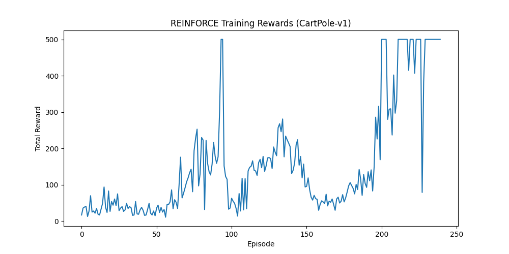

# REINFORCE (Monte Carlo Policy Gradient)

## 1. Executive Summary
**REINFORCE** is a fundamental **Policy Gradient** algorithm. Unlike Value-Based methods (like Q-Learning) that learn a value function to indirectly infer a policy, REINFORCE learns the policy *directly*. It uses a neural network to output a probability distribution over actions and adjusts the network weights to increase the probability of actions that lead to high rewards.

## 2. Historical Context
*   **Invention (1992)**: Introduced by **Ronald Williams** in the paper "Simple Statistical Gradient-Following Algorithms for Connectionist Reinforcement Learning".
*   **Significance**: It established the mathematical framework for training neural networks to make decisions in reinforcement learning settings using gradient ascent on expected reward.

## 3. Real-World Analogy
**The Trial-and-Error Athlete**
Imagine a high jumper trying to clear a bar.
*   **Attempt**: The jumper tries a specific technique (Action).
*   **Result**: They either clear the bar (Reward +1) or knock it down (Reward 0).
*   **REINFORCE**: If they clear the bar, they mentally "reinforce" every muscle movement they just made, making it more likely they'll do it again. If they fail, they slightly decrease the likelihood of doing those specific movements again. They don't calculate the physics (Value Function); they just adjust their "muscle memory" (Policy) based on the final outcome.

## 4. Mathematical Foundation
The goal is to maximize the expected return $J(\theta)$. The gradient of the objective function is given by the **Policy Gradient Theorem**:

$$ \nabla_\theta J(\theta) = \mathbb{E}_{\tau \sim \pi_\theta} \left[ \sum_{t=0}^{T} \nabla_\theta \log \pi_\theta(a_t | s_t) \cdot G_t \right] $$

Where:
*   $\pi_\theta(a_t | s_t)$: The probability of taking action $a_t$ in state $s_t$ given parameters $\theta$.
*   $G_t$: The return (cumulative discounted reward) from time step $t$ onwards.
*   $\nabla_\theta \log \pi_\theta(a_t | s_t)$: The "score function" (direction to move weights to increase probability of action).

## 5. Architecture


## 6. Implementation Details
The repository contains a PyTorch implementation (`01_reinforce_cartpole.py`) solving the **CartPole-v1** environment.

*   **Monte Carlo Updates**: The agent plays a *full episode* before updating. It stores all (State, Action, Reward) tuples.
*   **Return Calculation**: After the episode ends, it calculates the discounted return $G_t$ for every step backwards from the end.
*   **Normalization**: Returns are normalized (mean 0, std 1) to reduce variance and stabilize training.
*   **Loss**: $L = - \sum (\log \pi(a|s) \cdot G_t)$. We minimize this loss (which is equivalent to maximizing expected reward).

## 7. How to Run
Run the script from the terminal:

```bash
python 01_reinforce_cartpole.py
```

## 8. Implementation Results

### Training Performance
The agent solves the environment (Average Reward > 475) within 500 episodes. Note that REINFORCE can be more unstable (high variance) compared to DQN.



## 9. References
*   Williams, R. J. (1992). *Simple statistical gradient-following algorithms for connectionist reinforcement learning*. Machine Learning.
*   Sutton, R. S., & Barto, A. G. (2018). *Reinforcement Learning: An Introduction*.
