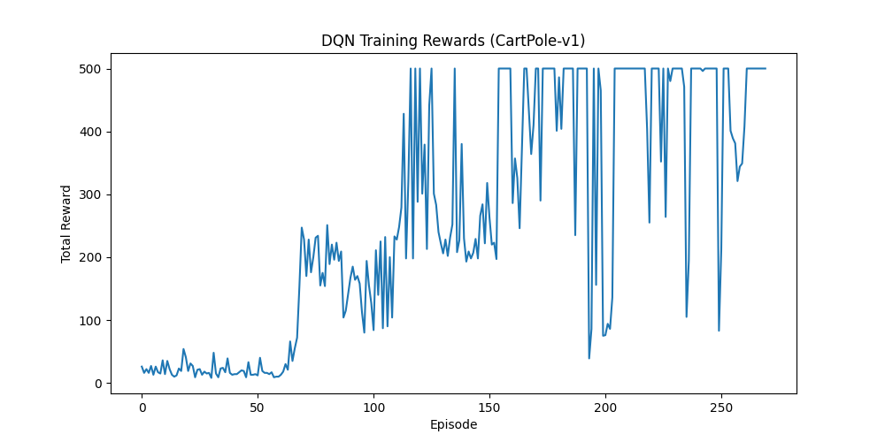

# Deep Q-Network (DQN)

## 1. Executive Summary
**Deep Q-Network (DQN)** combines Q-Learning with Deep Neural Networks. While standard Q-Learning uses a table to store values for every state-action pair, DQN uses a neural network to *approximate* these values. This allows it to handle environments with continuous or very large state spaces (like video game pixels or robot sensors) where a table would be impossibly large.

## 2. Historical Context
*   **Invention (2013/2015)**: Introduced by **DeepMind** (Mnih et al.) in the paper "Playing Atari with Deep Reinforcement Learning".
*   **Significance**: It was the first algorithm to demonstrate human-level performance across a wide variety of Atari 2600 games using the *same* architecture and hyperparameters, effectively launching the field of Deep Reinforcement Learning.

## 3. Real-World Analogy
**The Video Game Coach**
Imagine a coach watching a player play a video game.
*   **Q-Table**: The coach has a notebook with a page for *every single possible screen* of the game, writing down "Jump" or "Duck". This is impossible for complex games.
*   **DQN**: The coach learns general rules ("If a goomba is close, jump"). The coach (Neural Network) looks at the screen (State) and predicts how good each button press (Action) would be. It generalizes from similar situations rather than memorizing every pixel configuration.

## 4. Mathematical Foundation
DQN minimizes the **Temporal Difference (TD) Error** between the predicted Q-value and the target Q-value.

The Loss Function is:
$$ L(\theta) = \mathbb{E} \left[ \left( \underbrace{r + \gamma \max_{a'} Q(s', a'; \theta^-)}_{\text{Target}} - \underbrace{Q(s, a; \theta)}_{\text{Prediction}} \right)^2 \right] $$

Where:
*   $\theta$: Weights of the Policy Network (being trained).
*   $\theta^-$: Weights of the Target Network (frozen for stability).
*   $s, a, r, s'$: State, Action, Reward, Next State tuple from the Replay Buffer.

## 5. Architecture

```mermaid
graph LR
    State[State Vector] --> InputLayer[Input Layer]
    InputLayer --> Hidden1[FC Layer + ReLU]
    Hidden1 --> Hidden2[FC Layer + ReLU]
    Hidden2 --> OutputLayer[Output Layer]
    OutputLayer --> QValues[Q-Values (One per Action)]
    
    style State fill:#f9f,stroke:#333,stroke-width:2px
    style QValues fill:#ff9,stroke:#333,stroke-width:2px
```

## 6. Implementation Details
The repository contains a PyTorch implementation (`01_dqn_cartpole.py`) solving the **CartPole-v1** environment.

*   **Experience Replay**: Stores transitions $(s, a, r, s', done)$ in a buffer. Random batches are sampled for training to break correlation between consecutive steps.
*   **Target Network**: A separate network used to calculate target values. Its weights are updated to match the policy network only every $N$ steps. This stabilizes training.
*   **Epsilon-Greedy**: Used for exploration.

## 7. How to Run
Run the script from the terminal:

```bash
python 01_dqn_cartpole.py
```

## 8. Implementation Results

### Training Performance
The agent solves the environment (Average Reward > 475) within 300 episodes.



## 9. References
*   Mnih, V., et al. (2015). *Human-level control through deep reinforcement learning*. Nature.
*   Sutton, R. S., & Barto, A. G. (2018). *Reinforcement Learning: An Introduction*.
