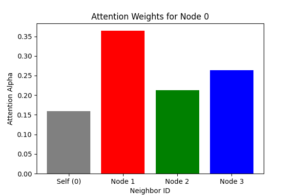
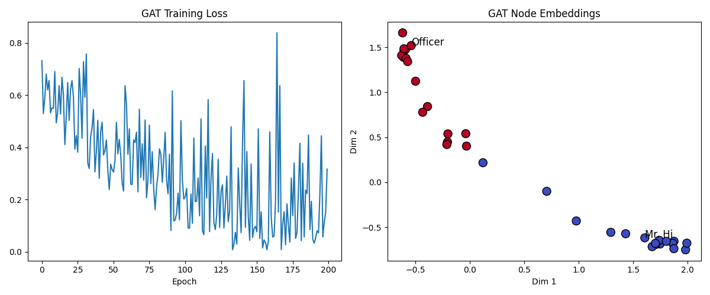

# Graph Attention Networks (GAT)

## 1. Introduction
Graph Attention Networks (GATs) improve upon GCNs by introducing the **Attention Mechanism** to graphs. While GCNs treat all neighbors as equally important (or determined solely by graph structure), GATs learn to assign different importance weights (attention coefficients) to different neighbors.

## 2. Historical Context
*   **The Inventors:** Petar Veličković et al. (2018) in the paper "Graph Attention Networks".
*   **The Motivation:** GCNs depend on the fixed graph structure (Laplacian). GATs allow the model to focus on the most relevant neighbors for a specific task, making them more flexible and capable of inductive learning (generalizing to unseen graphs).

## 3. Real-World Analogy
### The Selective Listener
*   **GCN (The Democrat):** You ask all your friends for advice and take the exact average of their opinions.
*   **GAT (The Strategist):** You ask all your friends. You know Alice is an expert in this topic, so you give her opinion 80% weight. Bob knows nothing, so you give him 5%. You synthesize a final decision based on this weighted advice.

## 4. Mathematical Foundation
1.  **Linear Transformation:** Apply $W$ to every node feature $\vec{h}$.
2.  **Attention Mechanism:** Compute importance of node $j$ to node $i$:
    $$ e_{ij} = \text{LeakyReLU}(\vec{a}^T [W\vec{h}_i || W\vec{h}_j]) $$
3.  **Normalization (Softmax):**
    $$ \alpha_{ij} = \frac{\exp(e_{ij})}{\sum_{k \in \mathcal{N}_i} \exp(e_{ik})} $$
4.  **Aggregation:**
    $$ \vec{h}'_i = \sigma\left( \sum_{j \in \mathcal{N}_i} \alpha_{ij} W\vec{h}_j \right) $$

## 5. Implementation Details
*   **`00_scratch.py`**: A NumPy simulation of the attention mechanism for a single node and its neighbors. It visualizes how the attention weights ($\alpha$) are distributed.
*   **`01_pytorch.py`**: A PyTorch implementation of a GAT layer applied to the Karate Club dataset. It demonstrates that GAT can also solve the semi-supervised classification task effectively.

## 6. Advantages over GCN
*   **Weighted Neighbors:** Can ignore noisy neighbors.
*   **Inductive Learning:** Doesn't require the full graph Laplacian during training; can work on dynamic graphs.

## 7. Results

### Attention Coefficients (Scratch)

*Visualization of the attention weights assigned by Node 0 to its neighbors. Unlike GCN, these weights are learned and data-dependent.*

### Karate Club Embeddings (PyTorch)

*The GAT model also successfully separates the two communities, often producing cleaner boundaries than GCN due to the ability to weigh edges differently.*

