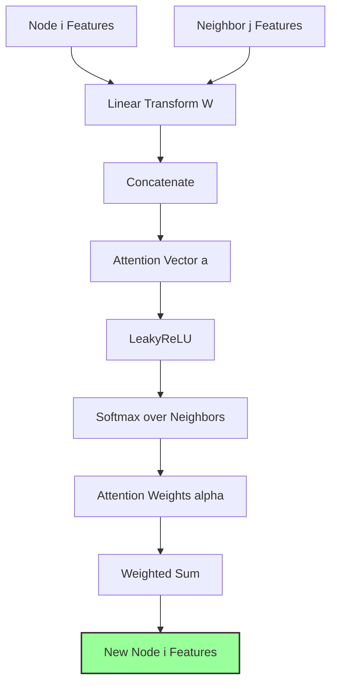
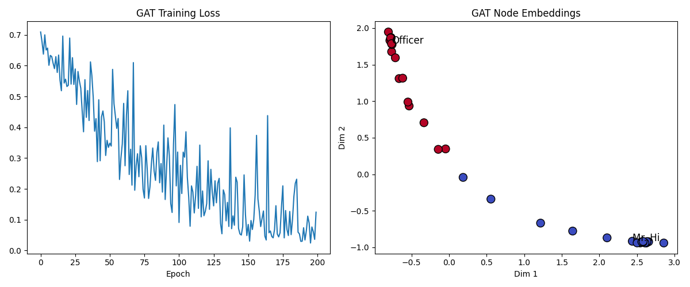

# Graph Attention Networks (GAT)

## 1. Executive Summary
**Graph Attention Networks (GATs)** improve upon GCNs by introducing an **attention mechanism**. Instead of treating all neighbors as equal (or normalizing by degree), GAT learns to assign different "importance weights" to different neighbors. This allows the model to focus on the most relevant parts of the graph structure for the task at hand.

## 2. Historical Context
*   **Attention Mechanisms (2014-2017)**: Revolutionized NLP (Bahdanau et al., Transformer by Vaswani et al.).
*   **Veličković et al. (2017)**: Introduced GAT, bringing the power of attention to graph data. It solved the issue of GCNs relying on a fixed graph structure and allowed for inductive learning.

## 3. Real-World Analogy
**The Cocktail Party**
*   **GCN**: You are at a party and you listen to everyone around you equally to form an opinion. It's noisy and you might hear irrelevant chatter.
*   **GAT**: You are at the same party, but you focus your attention (hearing) specifically on the experts or the people you trust. You ignore the background noise. You weigh the input of your "neighbors" based on how relevant they are to you.

## 4. Mathematical Foundation
The attention coefficient $e_{ij}$ indicates the importance of node $j$'s features to node $i$:
$$ e_{ij} = \text{LeakyReLU}(\vec{a}^T [W \vec{h}_i || W \vec{h}_j]) $$
*   $W$: Weight matrix applied to every node.
*   $||$: Concatenation operation.
*   $\vec{a}$: Attention vector.

These coefficients are normalized using Softmax:
$$ \alpha_{ij} = \text{softmax}_j(e_{ij}) = \frac{\exp(e_{ij})}{\sum_{k \in \mathcal{N}_i} \exp(e_{ik})} $$

The final output feature for node $i$ is a weighted sum:
$$ \vec{h}'_i = \sigma \left( \sum_{j \in \mathcal{N}_i} \alpha_{ij} W \vec{h}_j \right) $$

## 5. Architecture



## 6. Implementation Details
The repository contains two implementations:

1.  `00_scratch.py`: Implements the attention mechanism math from scratch using NumPy.
2.  `01_pytorch.py`: Uses PyTorch to implement a GAT layer on the **Zachary's Karate Club** dataset.

## 7. How to Run
Run the scripts from the terminal:

```bash
# Run the scratch implementation
python 00_scratch.py

# Run the PyTorch implementation
python 01_pytorch.py
```

## 8. Implementation Results

### Attention Weights (Scratch)
The visualization shows the attention matrix, indicating which nodes are attending to which other nodes.


### Karate Club Classification (PyTorch)
The GAT model successfully separates the club members.



## 9. References
*   Veličković, P., Cucurull, G., Casanova, A., Romero, A., Lio, P., & Bengio, Y. (2017). *Graph Attention Networks*. ICLR.
