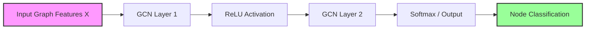

# Spectral Graph Convolutional Networks (GCN)

## 1. Executive Summary
**Graph Convolutional Networks (GCNs)** generalize the operation of convolution from traditional image processing to graph-structured data. The "Spectral" approach relies on the Eigen-decomposition of the graph Laplacian to define convolution in the Fourier domain. In practice, we use an efficient approximation (Chebyshev polynomials or the First-Order approximation proposed by Kipf & Welling) to avoid expensive matrix computations.

## 2. Historical Context
*   **Spectral Graph Theory**: The mathematical foundation connecting graph properties to the eigenvalues of the Laplacian matrix.
*   **Bruna et al. (2013)**: First formulation of spectral graph convolutions.
*   **Kipf & Welling (2016)**: Introduced the famous "Semi-Supervised Classification with Graph Convolutional Networks", simplifying the spectral convolution to a localized first-order approximation, making GNNs scalable.

## 3. Real-World Analogy
**The Rumor Mill**
Imagine a social network.
*   **Node**: A person.
*   **Feature**: The person's opinion.
*   **Convolution**: To update your opinion, you average the opinions of all your friends (neighbors) and yourself.
*   **Layers**:
    *   Layer 1: You know what your friends think.
    *   Layer 2: You know what your friends' friends think.
    *   Layer K: You aggregate information from K-hops away.

## 4. Mathematical Foundation
The layer-wise propagation rule for GCN is:
$$ H^{(l+1)} = \sigma(\tilde{D}^{-\frac{1}{2}} \tilde{A} \tilde{D}^{-\frac{1}{2}} H^{(l)} W^{(l)}) $$
*   $\tilde{A} = A + I_N$: Adjacency matrix with self-loops.
*   $\tilde{D}$: Degree matrix of $\tilde{A}$.
*   $H^{(l)}$: Matrix of activations in the $l$-th layer.
*   $W^{(l)}$: Trainable weight matrix.
*   $\sigma$: Activation function (e.g., ReLU).

## 5. Architecture



## 6. Implementation Details
The repository contains two implementations:

1.  `00_scratch.py`: Implements the spectral graph convolution math using NumPy. It calculates the Laplacian, eigenvectors, and performs convolution in the spectral domain.
2.  `01_pytorch.py`: Uses PyTorch to implement the Kipf & Welling GCN layer on the **Zachary's Karate Club** dataset.

## 7. How to Run
Run the scripts from the terminal:

```bash
# Run the scratch implementation
python 00_scratch.py

# Run the PyTorch implementation
python 01_pytorch.py
```

## 8. Implementation Results

### Spectral Filtering (Scratch)
The plot shows the signal on the graph before and after applying a spectral filter (heat kernel).


### Karate Club Classification (PyTorch)
The GCN learns to classify the members of the Karate Club into factions based on the network structure.


## 9. References
*   Kipf, T. N., & Welling, M. (2016). *Semi-supervised classification with graph convolutional networks*. ICLR.
*   Hammond, D. K., et al. (2011). *Wavelets on graphs via spectral graph theory*.
