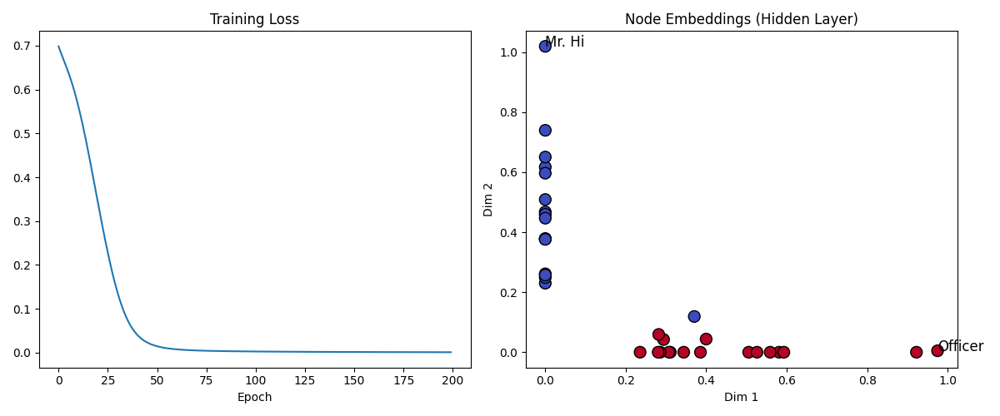

# Graph Convolutional Networks (GCN)

## 1. Introduction
Graph Convolutional Networks (GCNs) are a powerful type of neural network designed to work directly on graph-structured data (social networks, molecular structures, citation networks). Unlike standard CNNs which operate on regular grids (images), GCNs operate on irregular connections.

## 2. Historical Context
*   **The Inventors:** Thomas Kipf and Max Welling (2017) in their paper "Semi-Supervised Classification with Graph Convolutional Networks".
*   **The Breakthrough:** They introduced a simple and efficient layer-wise propagation rule that approximated spectral graph convolutions. This made it feasible to train deep networks on large graphs, sparking the GNN explosion.

## 3. Real-World Analogy
### The Rumor Mill
Imagine a social network.
*   **Node Features:** Each person has some opinions (features).
*   **Graph Convolution:** In each step, every person updates their opinion by taking the average of their friends' opinions (Aggregation) and then processing it with their own logic (Transformation).
*   **Deep GCN:** After several steps (layers), you are influenced not just by your friends, but by your friends' friends, and so on. Information propagates through the network.

## 4. Mathematical Foundation
The core propagation rule for a GCN layer is:

$$ H^{(l+1)} = \sigma\left( \tilde{D}^{-\frac{1}{2}} \tilde{A} \tilde{D}^{-\frac{1}{2}} H^{(l)} W^{(l)} \right) $$

Where:
*   $\tilde{A} = A + I$: Adjacency matrix with self-loops (so you don't forget your own features).
*   $\tilde{D}$: Degree matrix of $\tilde{A}$.
*   $\tilde{D}^{-\frac{1}{2}} \tilde{A} \tilde{D}^{-\frac{1}{2}}$: Symmetric normalized adjacency matrix. It ensures that nodes with many neighbors don't explode in value (averaging instead of summing).
*   $H^{(l)}$: Matrix of node features at layer $l$.
*   $W^{(l)}$: Learnable weight matrix.
*   $\sigma$: Activation function (e.g., ReLU).

## 5. Implementation Details
*   **`00_scratch.py`**: A NumPy implementation of the GCN propagation rule. It creates a tiny 4-node graph and demonstrates how features are aggregated and transformed.
*   **`01_pytorch.py`**: A PyTorch implementation applied to **Zachary's Karate Club** dataset.
    *   **Task:** Semi-supervised classification. We only label the Instructor and the Administrator.
    *   **Result:** The GCN learns to cluster all other members correctly based on the graph structure alone, even without rich node features.

## 6. Applications
*   **Social Networks:** Friend recommendation, fake news detection.
*   **Chemistry:** Predicting molecular properties (drug discovery).
*   **Recommender Systems:** Pinterest's PinSage.

## 7. Results

### Graph Structure & Embedding (Scratch)

*Left: The input graph structure. Right: The output feature space after 2 GCN layers. Structurally similar nodes are mapped close together.*

### Karate Club Classification (PyTorch)

*Left: Training loss. Right: Learned node embeddings. The model successfully separates the two factions (Mr. Hi vs. Officer) using only the graph structure and two labeled nodes.*

